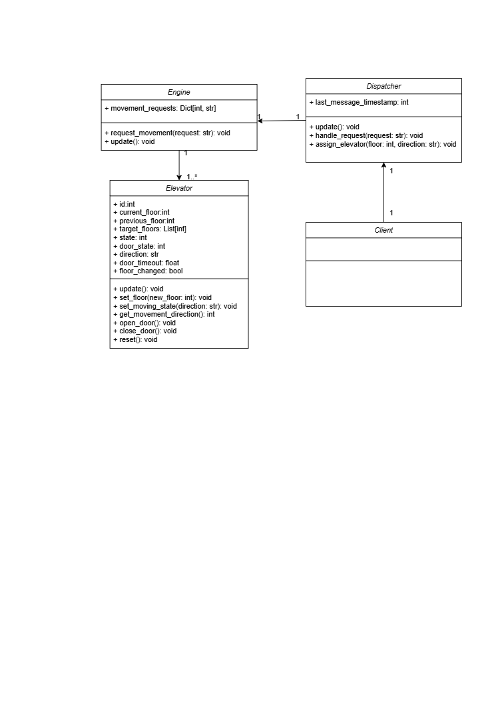

### UML Class Diagram

- The system consists of four classes, dispatcher, client, elevator, and engine.
- In the elevator's lifecycle, each blocks are update and evaluate the current status information, in the order of client -> dispatcher -> every
elevator -> engine
- The elevator class mimics the elevator compartment, which needs to be pulled up or down by the tie rope system controlled by the engine.

- The dispatcher processes the requests received through the client, decides the optimal elevator to dispatch and order the engine accordingly.

