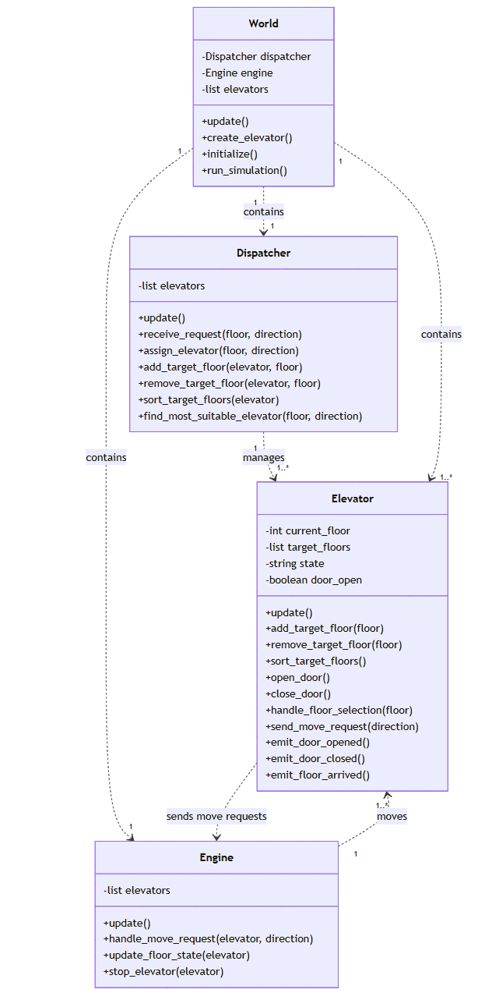

# Specification Documentation

- Team: 17
- Project: Elevator

## Elevator System 

This documentation shows the specific development process, project structure and software APIs of the elevator system.

## Content

- [Project Introduction](#project-introduction)
- [System Class Structure](#system-class-structure)

### Project Introduction

This project aims to develop an application that simulates the real life usage of two elevators, which is capable of vertical movement on four floors (-1F to 3F). 

The backend APIs are developed in python, the user interface is implemented with PyQt, the design and implementation detail will be described in the sections below.

### States Specification

The User interacts the elevator compartment and its door directly, their possible states are defined below:

- For a single elevator compartment, it has to be in one of the following states:
  - **IDLE**: The elevator is stationary and waiting    or requests
  - **MOVING_UP**: The elevator is moving upward to    each a requested floor
  - **MOVING_DOWN**: The elevator is moving downward    o reach a requested floor
  - **DOOR_OPENING**: The elevator doors are in the    rocess of opening
  - **DOOR_OPEN**: The elevator doors are fully open
  - **DOOR_CLOSING**: The elevator doors are in the    rocess of closing
  - **DOOR_CLOSED**: The elevator doors are fully    losed

- For a single elevator door, it has to be in one of the following states:
  - **OPEN**: The door is completely open
  - **CLOSED**: The door is completely closed
  - **OPENING**: The door is in the process of opening
  - **CLOSING**: The door is in the process of closing

- Both elevators initially idle at the ground floor with doors closed.  
- Doors open automatically when the elevator is called via "up" or "down" button.  
- Inside each elevator, floor buttons light up when pressed, indicating the target floor.
- Upon reaching the target floor, floor buttons reset, doors open, and the trip ends.

### System Class Structure

The system consists of four classes, dispatcher, client, elevator, and engine. In the system's lifecycle, each block will update and evaluate the current status information. The detailed design will be shown through the UML class diagram below

#### General class design

- A `Elevator` class: 
  - It will handle its own operation itself, including:
    - Handling user indoor floor selection.
    - Open and close door automatically besides manual control when target floor arrived.
  - It will execute transporting process according to a `target_floor` like list which is manipulated by the dispatcher.
    - In this part, the elevator should perform strictly follow the order of the floors in the list.
  - The elevator can't move itself, it has to sending moving request to the `Engine` class, the `Engine` class will handling the changes of the state indicates which floor the elevator are currently being.
  - It will sends event signal to the user test server, including:
    - `door_opened`
    - `door_closed`
    - `floor_arrived`

- A `Dispatcher` class:
  - It will receive and parse the request from the user test server, and assign the target called floor task to the most suitable elevator.
  - It will iterate the `target_floor` in `List[Elevator]`, including:
    - Adding floor
    - Removing floor
    - Sorting floor (Not neccessarily to be sorted numerically, for example [4, 5, 1] should be faster than [4, 1, 5], if 2 user calls the elevator in the floor 4 and want to get floor 1 and 5 separately)
  - All the decision should targeting making the system more efficently.
  
- A `Engine` class:
  - `Engine` will determine the changes of next floor state of each elevator according to a state like `MOVING_UP` or `STOPPED`.
  - The update of the floor state of each elevator should be floor by floor.

- A `World` class:
  - Simluate the world.
  - Call the `update` method of each instances. 

 
