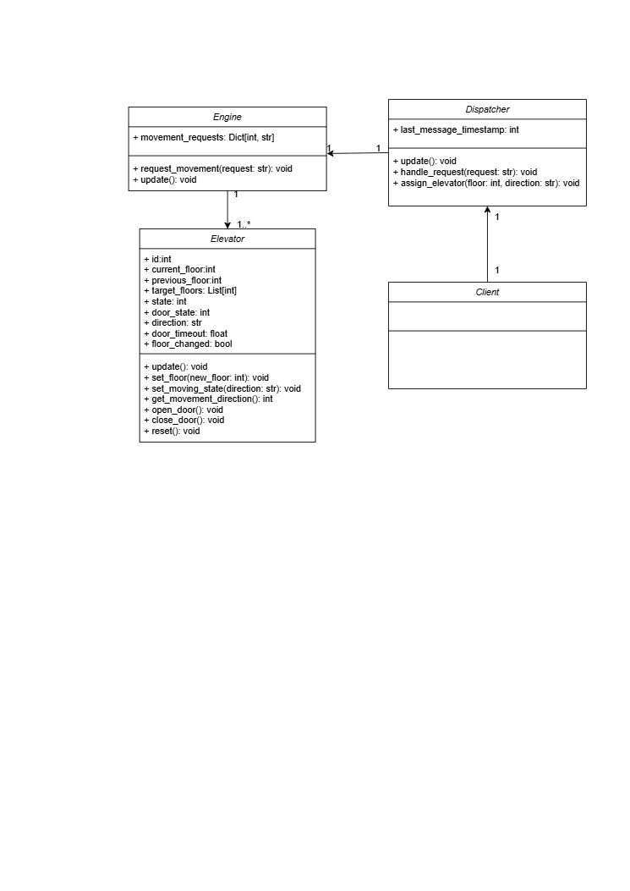

# Requirement Document

Team 18 Project：Elevator

Made by : Guo YU

---

## Table of Contents

- [Introduction](#introduction)
  - [Overview](#overview)
  - [Basic Requirements](#basic-requirements)
  - [Product Line Analysis](#product-line-analysis)
- [UML](#uml)
  - [Use Case Diagram](#use-case-diagram)
  - [UML Activity Diagram](#uml-activity-diagram)
  - [UML Class Diagram](#uml-class-diagram)
- [Detailed Requirement](#detailed-requirement)
  - [General Requirement](#general-requirement)
  - [Passengers’ Requirement](#passengers-requirement)
  - [Elevator Compartment’s Requirement](#elevator-compartments-requirement)
  - [Elevator Control System’s Requirement](#elevator-control-systems-requirement)
  - [Visual Components](#visual-components)

---

## Introduction

### Overview

This project aims to develop a software which controls two elevators' movement under various user operations and system events. 

### Basic Requirements

- Both elevators start at the ground floor with doors closed.  
- Doors open automatically when the elevator is called via "up" or "down" button.  
- Inside each elevator, floor buttons light up when pressed, indicating the target floor.  
- The control panel displays current floor and direction.  
- Upon reaching the target floor, floor buttons reset, doors open, and the trip ends.  

### Product Line Analysis

The domain focuses on managing two elevators as they respond to user commands (open/close doors, call floors, select floors) and system events (door opened/closed, floor arrivals). Each elevator must track its state (location, door status) and handle incoming requests efficiently. The system must ensure correct scheduling of elevator movements, resolve conflicts when multiple commands are issued, and reset to first-floor-closed-door mode on demand.

---

## UML 

### Use Case Diagram

The use case diagram consists of the following functions:
- **Enter Elevator**: The interaction starts when a user steps inside the elevator.
- **Exit Elevator**: The ride concludes once the user reaches their desired floor and exits the elevator.
- **Press Up/Down Button**: A passenger selects a floor by pressing the corresponding button to go up or down.
- **Press Open/Close Button**: The user manually opens or closes the elevator doors by pressing the respective button.
- **Open Door**: The system automatically or manually opens the doors upon arrival at a floor or in response to a user request.
- **Close Door**: The system automatically or manually closes the doors after a set delay or in response to a user request.
- **Move Up**: The elevator ascends to a higher targeted floor.
- **Move Down**: The elevator descends to a lower targeted floor.
- **Stop**: The elevator halts either at the initial state or when it reaches the target floor and the user steps out.

### UML Activity Diagram

- **Start**: The process begins when the user starts interacting with the elevator.
- **Which Direction?**: The user selects the direction by pressing either the Up or Down button.
- **Enter The Elevator?**: The user decides whether to enter the elevator.
  - **Yes**: The user enters the elevator and selects a floor.
  - **No**: The user does not enter the elevator, and the process circles back to chosing direction.
- **Select Floor**: The user selects the desired floor.
- **Is current floor the target floor?**: The elevator checks if it has reached the target floor.
  - **Yes**: The elevator opens the door.
  - **No**: The elevator moves to the target floor.
- **Is currently stop**: The elevator only opens the door when it stops.
- **Exit?**: The user decides whether to exit the elevator.
  - **Yes**: The user exits the elevator, process ends.
  - **No**: The user remains in the elevator, and the process circles back to chosing floor.
- **Waiting for the door to open/close**: The user waits for the door to open or close.

### UML Class Diagram

- The system consists of four classes, dispatcher, client, elevator, and engine.
- In the elevator's lifecycle, each blocks are update and evaluate the current status information, in the order of client -> dispatcher -> every
elevator -> engine
- The elevator class mimics the elevator compartment, which needs to be pulled up or down by the tie rope system controlled by the engine.

- The dispatcher processes the requests received through the client, decides the optimal elevator to dispatch and order the engine accordingly.

## Detailed Requirement

### General Requirement

The elevator system primarily involves two key entities: passengers and the elevator itself. Their interaction occurs through two main interfaces: the control panels (both inside the elevator and at floor landings) and the underlying elevator control system that manages movement and scheduling.

### Passengers’ Requirement

A passengers should be able to:  

- View the current elevator location.
- See the elevator's current movement direction.
- Request elevator service by pressing up/down buttons on external floor panels.
- Control doors at their current floor by pressing door open/close buttons (such commands outrankautomated door operations).
- Select their destination floor using the internalelevator panel once inside.  

### Elevator Compartment’s Requirement

An elevator compartment should be able to:

- Recieve commands from the passengers through buttons (i.e. open/close door, designate floors)
- Automatically close/open door when passenger enters/exits the elevator
- Take order from the control system and move to the target floor

### Elevator Control System’s Requirement

The system should be able to:  

- Recieve signals from elevator compartments (i.e. open/close door, designate floors)
- Dispatch and order the elevator compartments:
   - Send the nearest idle elevator for time saving purposes.
   - Resolve the conflict when multiple passengers request elevator service
   - Optimal elevator route scheduling.

### Visual Components
