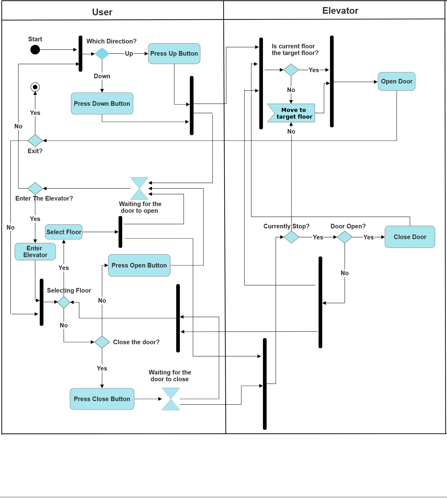

# Requirement Document

Team 18 Project：Elevator
Made by : Guo YU

---

## Table of Contents
- [Requirement Document](#requirement-document)
  - [Table of Contents](#table-of-contents)
  - [Introduction](#introduction)
    - [Overview](#overview)
    - [Basic Requirements](#basic-requirements)
    - [Product Line Analysis](#product-line-analysis)
  - [UML](#uml)
    - [Use Case Diagram](#use-case-diagram)
    - [UML Activity Diagram](#uml-activity-diagram)
    - [UML Sequence Diagram](#uml-sequence-diagram)
  - [Detailed Requirement](#detailed-requirement)
    - [Overview](#overview-1)
    - [Passengers’ Perspective](#passengers-perspective)
    - [Visual Components](#visual-components)
    - [Elevator’s Perspective](#elevators-perspective)
    - [Control System](#control-system)

---

## Introduction

### Overview
This project aims to develop a software which controls two elevators' movement under various user operations and system events. 

### Basic Requirements
- Both elevators start at the ground floor with doors closed.  
- Doors open automatically when the elevator is called via "up" or "down" button.  
- Inside each elevator, floor buttons light up when pressed, indicating the target floor.  
- The control panel displays current floor and direction.  
- Upon reaching the target floor, floor buttons reset, doors open, and the trip ends.  

### Product Line Analysis
The domain focuses on managing two elevators as they respond to user commands (open/close doors, call floors, select floors) and system events (door opened/closed, floor arrivals). Each elevator must track its state (location, door status) and handle incoming requests efficiently. The system must ensure correct scheduling of elevator movements, resolve conflicts when multiple commands are issued, and reset to first-floor-closed-door mode on demand.

---

## UML 

### Use Case Diagram

The use case diagram consists of the following functions:
- Enter elevator: Interaction begins when the user steps inside.
- Exit elevator: The ride ends once the user reaches the desired floor and exits.
- Press up/down button: The passenger selects a floor by pressing the corresponding button.
- Press open/close button: The user opens or closes the doors manually via button press.
- Open door: The system automatically or manually opens the doors upon arrival or request.
- Close door: The system automatically or manually close the doors aftera delay or request.
- Move up: The elevator goes up for the targeted higher floor .
- Move down: The elevator goes down for the targeted lower floor.
- Stop: The elevator stops upon initial state or when it reaches the target floor and the user steps out.

### UML Activity Diagram

### UML Sequence Diagram

## Detailed Requirement

### Overview
Overall, the main participants in this elevator system are the passengers and the elevator. The specific interaction process between them can be divided into interactions with the panel and the elevator control system.

### Passengers’ Perspective
1. For passengers, they should be able to:  
   1.1 Know the floor information where the elevator is located.  
   1.2 Understand the current operating status of the elevator (ascending/descending/stationary).  
   1.3 Outside the elevator, press the corresponding floor button according to their destination floor, thereby controlling the elevator to reach the current floor of the passenger, and convey this information to the panel.  
   1.4 When the elevator reaches the passenger's floor, they can control the opening and closing of the elevator doors at that floor, with the highest priority given to the operations performed by passengers on that floor.  
   1.5 Inside the elevator, they can press the button for their destination floor to control the elevator to travel to the corresponding floor, and convey this information to the panel.  
   1.6 Press the emergency help button at any time, and convey this information to the panel.

### Visual Components
2. For the panel:  
   2.1 The buttons for controlling the opening and closing of the elevator doors are ineffective during the operation of the elevator.  
   2.2 Receive all relevant information conveyed by passengers through the panel, and pass this information to the elevator control system.  
   2.3 Instantly display the current floor information of the elevator, the current operating status of the elevator (ascending/descending/stationary), and whether the elevator is malfunctioning, etc., and pass this information to the elevator control system.

### Elevator’s Perspective
3. For the elevator itself, it should be able to:  
   3.1 Receive signals from the elevator control system to ascend/descend/stay stationary.  
   3.2 Receive signals from the elevator control system to open/close doors.  
   3.3 Upload all current status of the elevator to the elevator control system.  
   3.4 Stop operating and close the doors when receiving an emergency stop signal.

### Control System
4. For the elevator control system, it should be able to:  
   4.1 Receive and process all information about the elevator's floor position and current operating status from the panel. When multiple users control the elevator concurrently, it should select the optimal algorithm to schedule the elevators, including:  
   4.2 When there are multiple passenger requests, the elevator should first go to the floor where the nearest passenger is located and take them to their destination, minimizing the waiting time for passengers.  
   4.3 When responding to multiple passenger requests, the elevator can use an intelligent route planning algorithm to choose the appropriate stopping sequence and route, transporting passengers to their destinations in the fastest time possible, thus minimizing the total journey time.  
   4.4 Adjust the elevator's door opening and closing status, and the direction of travel.  
   4.5 Adjust the speed of the elevator based on the position of the target floor and the distance from the current floor to the target floor (reflected in the time required for elevator travel).  
   4.6 Immediately stop the elevator operation upon receiving an emergency signal from the panel and report any malfunction through the panel.