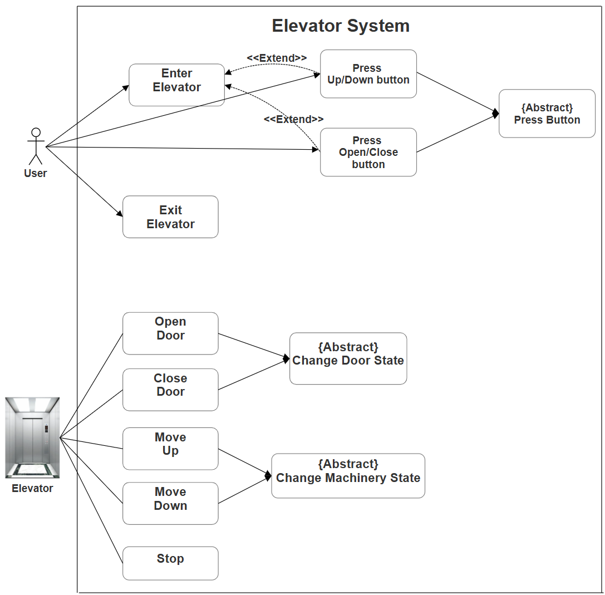
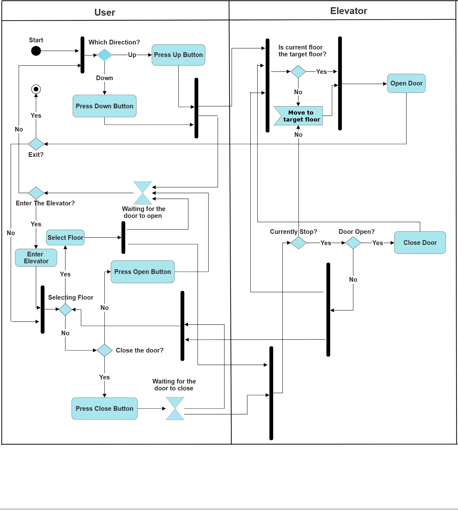

# Requirement Document

- Team 17
- Project：Elevator
- Made by : Guo YU

---

## Table of Contents

- [Introduction](#introduction)
  - [Overview](#overview)
  - [Basic Requirements](#basic-requirements)
  - [Product Line Analysis](#product-line-analysis)
- [UML](#uml)
  - [UML Use Case Diagram](#uml-use-case-diagram)
  - [UML Activity Diagram](#uml-activity-diagram)
- [Detailed Requirement](#detailed-requirement)
  - [General Requirement](#general-requirement)
  - [Passengers’ Perspective](#passengers-perspective)
  - [Elevator Compartment’s Requirement](#elevator-compartments-requirement)
  - [Elevator Control System’s Requirement](#elevator-control-systems-requirement)
  - [Visual Components](#visual-components)

---

## Introduction

### Overview

This project aims to develop a software which controls two elevators' movement under various user operations and system events.

### Product Line Analysis

The domain focuses on managing two elevators as they respond to user commands (open/close doors, call floors, select floors) and system events (door opened/closed, floor arrivals). Each elevator must track its state (location, door status) and handle incoming requests efficiently. The system must ensure correct scheduling of elevator movements, resolve conflicts when multiple commands are issued, and reset to first-floor-closed-door mode on demand.

---

## UML

### UML Use Case Diagram

The use case diagram consists of the following functions:

- **Enter Elevator**: The interaction starts when a user steps inside the elevator.
- **Exit Elevator**: The ride concludes once the user reaches their desired floor and exits the elevator.
- **Press Up/Down Button**: A passenger selects a floor by pressing the corresponding button to go up or down.
- **Press Open/Close Button**: The user manually opens or closes the elevator doors by pressing the respective button.
- **Open Door**: The system automatically or manually opens the doors upon arrival at a floor or in response to a user request.
- **Close Door**: The system automatically or manually closes the doors after a set delay or in response to a user request.
- **Move Up**: The elevator ascends to a higher targeted floor.
- **Move Down**: The elevator descends to a lower targeted floor.
- **Stop**: The elevator halts either at the initial state or when it reaches the target floor and the user steps out.

### UML Activity Diagram

- **Start**: The process begins when a passenger presses a call button.

- **Call Request**: The passenger presses Up/Down button which turns red when activated.

- **Elevator Dispatch**: System evaluates elevator positions and assigns the optimal elevator.

- **Waiting**: The passenger waits for the elevator to arrive at their floor.

- **Arrival Decision**: When elevator arrives, it enters IDLE state.

  - Door automatically changes to OPENING state (takes 1 second)
  - Call button resets to blue

- **Enter Elevator**: The passenger enters the elevator.

- **Floor Selection**: The passenger selects target floor and button turns red.

- **Door Operation**: Three possible paths occur simultaneously:

  - Auto-close: Door closes after 3 seconds if no button is pressed
  - Manual open: Door opens if Open button is pressed while elevator is IDLE
  - Manual close: Door closes if Close button is pressed while door is OPEN/OPENING

- **Movement**: When door is CLOSED and target floor is set:

  - Elevator moves UP or DOWN as needed
  - Position updates floor by floor until reaching target
- **Destination Arrival**:

  - Elevator enters IDLE state
  - Door automatically opens
  - Floor button resets to blue
- **Exit**: The passenger exits the elevator.

- **Process Repeat**: System continues running to handle new requests.

## Detailed Requirement

### General

The elevator system primarily involves two key entities: passengers and the elevator itself. Their interaction occurs through two main interfaces: the control panels (both inside the elevator and at floor landings) and the underlying elevator control system that manages movement and scheduling.

### R1: Passengers’ Perspective

A passenger should be able to:

1. See the elevator's current movement direction and current elevator location.
2. Request elevator service by pressing up/down buttons on external floor panels.
3. Control doors at their current floor by pressing door open/close buttons (such commands outrank automated door operations).
4. Select their destination floor using the internalelevator panel once inside.

### R2: Elevator Compartment’s Requirement

An elevator compartment should be able to:

1. Recieve commands from the passengers through buttons (i.e. open/close door, designate floors)
2. Automatically close/open door when passenger enters/exits the elevator
3. Take order from the control system and move to the target floor

### R3: Elevator Control System’s Requirement

The system should be able to:

1. Recieve signals from elevator compartments (i.e. open/close door, designate floors)
2. Dispatch and order the elevator compartments:
   1. Resolve the conflict when multiple passengers request elevator service
   2. Arrange optimal elevator route scheduling and dispatch the closest elevator.

### R4: Visual Components

The elevator control panel should be able to:

1. Display door status (open/closed) and current floor location of each each elevator.
2. Provide visual feedback when floor buttons are pressed (button illumination).
3. Offer an intuitive user interface with clear button labeling and accessibility features.
4. Show real-time updates of elevator status and location changes.
