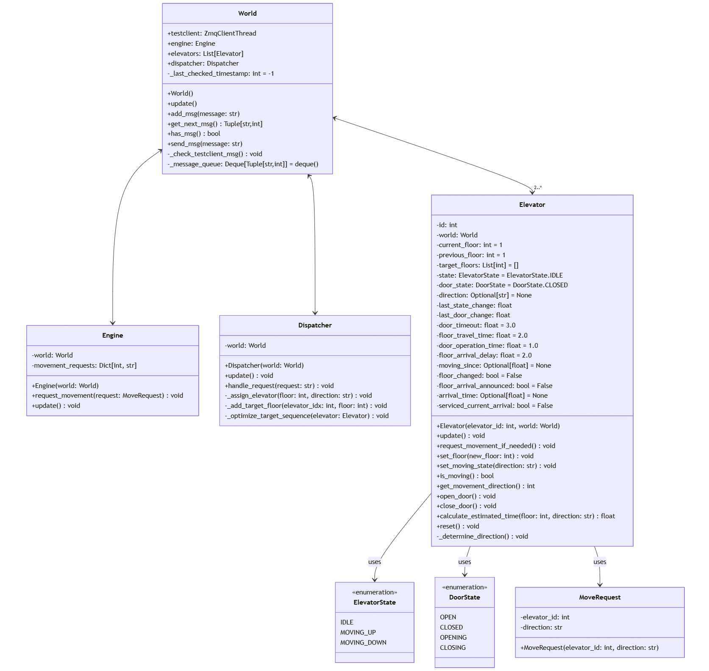
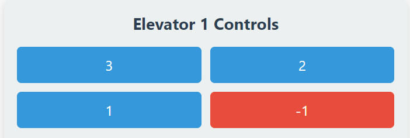
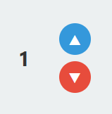
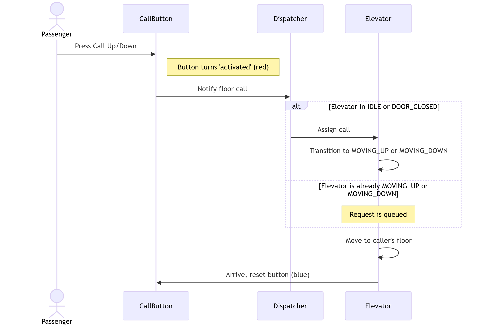
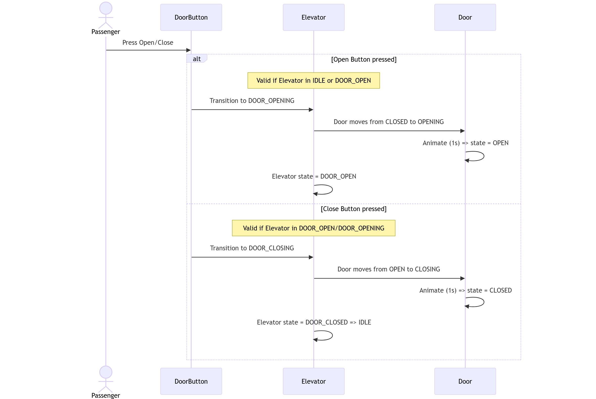
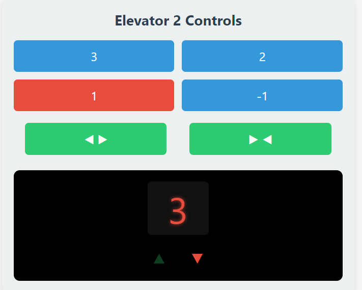

# Specification Documentation

- Team: 17
- Project: Elevator

## Elevator System

This documentation shows the specific development process, project structure and software APIs of the elevator system.

# Content

- [Project Introduction](#project-introduction)
- [System Class Structure](#system-class-structure)

## Project Introduction

This project aims to develop an application that simulates the real life usage of two elevators, which is capable of vertical movement on four floors (-1F to 3F).

The backend APIs are developed in python, the user interface is implemented with PyQt, the design and implementation detail will be described in the sections below.

## States Specification

The User interacts with the elevator compartment and its door directly, their possible states are defined below:

- For a single elevator compartment, it has to be in one of the following states:

  - **IDLE**: The elevator is stationary and waiting    or requests
  - **MOVING_UP**: The elevator is moving upward to    each a requested floor
  - **MOVING_DOWN**: The elevator is moving downward    o reach a requested floor
  - **DOOR_OPENING**: The elevator doors are in the    rocess of opening
  - **DOOR_OPEN**: The elevator doors are fully open
  - **DOOR_CLOSING**: The elevator doors are in the    rocess of closing
  - **DOOR_CLOSED**: The elevator doors are fully    losed
- For a single elevator door, it has to be in one of the following states:

  - **OPEN**: The door is completely open
  - **CLOSED**: The door is completely closed
  - **OPENING**: The door is in the process of opening
  - **CLOSING**: The door is in the process of closing
- Both elevators are initially **IDLE** at the ground floor with doors **CLOSED**.
- Upon reaching the target floor, floor buttons reset, doors open, and the trip ends.

## System Class Structure

The system consists of four major classes: `Dispatcher`, elevator, and `engine`, they run in the environment `World`. In the system's lifecycle, each block will update and evaluate the current status information. The detailed design will be shown through the UML class diagram below:

### General class design

- An `Elevator` class:

  - It will handle its own operation itself, including:
    - Handling user indoor floor selection.
    - Open and close door automatically besides manual control when target floor arrived.
  - It will execute transporting process according to a `target_floor` like list which is manipulated by the dispatcher.
    - In this part, the elevator should perform strictly follow the order of the floors in the list.
  - The elevator can't move itself, it has to sending moving request to the `Engine` class, the `Engine` class will handling the changes of the state indicates which floor the elevator are currently being.
  - It will sends event signal to the user test server, including:
    - `door_opened`
    - `door_closed`
    - `floor_arrived`

- A `Dispatcher` class:

  - It will receive and parse the request from the user test server, and assign the target called floor task to the most suitable elevator.
  - It will iterate the `target_floor` in `List[Elevator]`, including:
    - Adding floor
    - Removing floor
    - Sorting floor (Not neccessarily to be sorted numerically, for example [4, 5, 1] should be faster than [4, 1, 5], if 2 user calls the elevator in the floor 4 and want to get floor 1 and 5 separately)
  - All the decision should targeting making the system more efficently.
- An `Engine` class:

  - `Engine` will determine the changes of next floor state of each elevator according to a state like `MOVING_UP` or `STOPPED`.
  - The update of the floor state of each elevator should be floor by floor.
- A `World` class:

  - Simluate the world.
  - Call the `update` method of each instances.

## Components specifications

### S1: Target Floor Implementation

This part here will explain the implementation and click event of floor button in detail along with its graphical user interface.

#### S1.1 GUI

The four available floors are arranged symmetricly and are all initially **pale blue**, once a passenger selects the target floor, it highlights in **red** as shown below:

#### S1.2 Target floor state Logic Implementation
- The *floor button* can be selected during **all** elevator states, the elevator will head to the target floor after concluding the current business and enter **MOVING_UP** or **MOVING_DOWN** state.
- The different *floor button* can be stacked, the `Dispatcher` will organize the optimal route to stop at all target floors.

#### S1.3 Click Event

Once being clicked, the *floor button* is considered `'activated'` in **red** and will not respond to further clicking until the elevator has reached the target floor and the button turns back to the `'idle'` in **blue**, the specific click event will be presented in the UML sequence diagram below:

### S2：Call Up/Down Implementation

This part here will explain the implementation and click event of *call up/down button* in detail along with its graphical user interface.

#### S2.1: GUI
Floor 1 and 2 have both call up and down button while floor 3 only has call down and floor 1 only has call up. All buttons are initially **pale blue**, once a passenger presses, it highlights in **red** as shown below:

#### S2.2: Click Event
Same as floor button, the **call up/down** button is `'activated'` in **red** and will not respond until the elevator has arrived at the passenger's floor, the button will then turn back to `'idle'` in **blue**, the specific click event will be presented in the UML sequence diagram below:

### S3：Door Open/Close Implementation
This part here will explain the implementation and click event of *door open/close button* in detail along with its graphical user interface.

#### S3.1 GUI
**Open/Close** door buttons are placed inside Elevator 1 and 2,
the icon will **darken** once being pressed and begin to function.

#### S3.2 OPEN/CLOSE state Logic Implementation
**S3.2.1 Open Button**:
- The *Open Button* will only function when the elevator is in **IDLE** state and will not respond if pressed when elevator is in the state of **MOVING_UP** or **MOVING_DOWN**.
- When functioning properly, the elevator will enter the state of **DOOR_OPENING** and the door will enter the state of **OPENING**. 
- After **1s** of animation playing, the elevator will enter the state of 
**DOOR_OPEN** and the door will enter the state of **OPEN**.
- If no external action is posed when the elevator is in **DOOR_OPEN** state, after **3s**, the door wil automatically close, the **CLOSING** state detailed will be explained in *Close Button* section.
- Keep pushing the *Open Button* when the door is already in **OPEN** state will prolong its time in the state and will only be **CLOSING** when the *Open Button* is no long being pressed.

**S3.2.2 Close Button**:
- The *Close Button* will only function when the elevator is in **DOOR_OPEN** or **DOOR_OPENING** state and will not respond when the elevator is in other states.
- When functioning properly, the elevator will enter the state of **DOOR_CLOSING** and the door will enter the state of **CLOSING**.
- After **1s** of animation playing, the elevator will enter the state of
**DOOR_CLOSED**, then **immediately** switch to the state of **IDLE** and the door will enter the state of **CLOSED**.

#### S3.3 Click event
The specific click event of the `Open/Close button` will be presented in the UML sequence diagram below:

### S4: Status Display Panel Implementation: 

#### S4.1 GUI
The control panel is the interface passengers see inside a single elevator,  the following information are displayed:
- Current floor and status of this elevator
- Target floors which hasn't arrived
- Door status

The passenger can:
- Select the intended floor
- Open/Close door when the elevator is in **IDLE**, **DOOR_OPENING** or **DOOR_OPEN** state.

### S5: Animation Implementation

The system will visually mimic elevator movement and door operations in real time, ensuring a smooth and informative user experience.

#### S5.1 Elevator Movement
- Each elevator’s position is updated in response to requests from the backend or the built-in simulation. 

- The system applies *CSS* transitions to move the elevator’s container between floors, adjusting the `bottom` style based on the current floor. This approach produces a vertical motion within the elevator shaft.

#### S5.2 Door Animations
- The doors on each elevator use *CSS* class toggles—such as `doors-opening`, `doors-closing`, `doors-open`, and `doors-closed` to display a sliding effect.
- When an open or close command is received, the corresponding class is assigned, triggering a brief animation that visually reflects the door’s transition state.

### S6: Dispatcher Implementation

This section describes how the Dispatcher efficiently manages elevator operations, handling user requests and assigning them to the most suitable elevator based on real-time conditions.

#### S6.1 Dispatching Logic
The `Dispatcher` processes various requests—such as door operations, floor calls, and floor selections—and aligns them with the best elevator according to estimated service time. It also coordinates the addition and removal of target floors, ensuring each elevator’s travel path remains efficient.

#### S6.2 Elevator Assignment Strategy
When a passenger calls an elevator from a floor:
1. The `Dispatcher` calculates an estimated service time for each elevator.
2. The elevator with the shortest estimated time is assigned to the request.
3. The requested floor is added to that elevator’s queue.
4. The sequence of target floors is optimized according to the elevator’s current direction and position.

#### S6.3 Sequence Optimization Strategy
The `Dispatcher` employs a modified SCAN algorithm (elevator algorithm) to minimize wait times and reduce unnecessary direction changes:
- **MOVING_UP**: Serves floors above the current floor first in ascending order, then floors below in ascending order.
- **MOVING_DOWN**: Serves floors below the current floor first in descending order, then floors above in ascending order.
- **IDLE**: Chooses the nearest floor first, then proceeds through subsequent stops in an optimal sequence.

### S7 State Update Implementation

This section will show how each elevator’s state is updated in real-time, managing movement progress, door operations, and transitions to ensure they stay in sync with user interactions and operational logic.

#### S7.1 Timed Movement
The `Engine` regularly checks each elevator’s movement and calculates when a single-floor travel time has elapsed. It updates the elevator’s current floor accordingly and removes any completed movement requests. This keeps the elevator’s position and movement status accurate.

#### S7.2 Door and State Transitions
- When door operations are requested, the elevator transitions from **IDLE** to **DOOR_OPENING** or **DOOR_CLOSING**, then to **DOOR_OPEN** or **DOOR_CLOSED**. 
- If subsequent calls or target floors exist, the elevator switches to **MOVING_UP** or **MOVING_DOWN** until all destinations are served, ultimately returning to **IDLE**.

