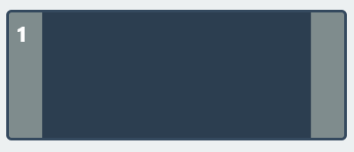

# Specification Documentation

- Team: 17
- Project: Elevator

## Elevator System

This documentation shows the specific development process, project structure and software APIs of the elevator system.

# Table of Contents

- [Project Introduction](#project-introduction)
- [States Specification](#states-specification)
- [System Class Structure](#system-class-structure)
  - [General Class Design](#general-class-design)
  - [Detailed Class and Method Specifications](#detailed-class-and-method-specifications)
    - [Elevator Class (`elevator.py`)](#elevator-class-elevatorpy)
    - [Dispatcher Class (`dispatcher.py`)](#dispatcher-class-dispatcherpy)
    - [Engine Class (`engine.py`)](#engine-class-enginepy)
    - [World Class (`world.py`)](#world-class-worldpy)
    - [ElevatorAPI Class (`api.py`)](#elevatorapi-class-apipy)
    - [WebSocketBridge Class (`bridge.py`)](#websocketbridge-class-bridgepy)
    - [WebSocketServer Class (`server.py`)](#websocketserver-class-serverpy)
    - [ZmqClientThread Class (`net_client.py`)](#zmqclientthread-class-net_clientpy)
    - [Data Models (`models.py`)](#data-models-modelspy)
- [Components Specifications](#components-specifications)
  - [S1: Target Floor Implementation](#s1-target-floor-implementation)
  - [S2: Call Up/Down Implementation](#s2-call-updown-implementation)
  - [S3: Door Open/Close Implementation](#s3-door-openclose-implementation)
  - [S4: Status Display Panel Implementation](#s4-status-display-panel-implementation)
  - [S5: Animation Implementation](#s5-animation-implementation)
  - [S6: Dispatcher Implementation](#s6-dispatcher-implementation)
  - [S7: State Update Implementation](#s7-state-update-implementation)
  - [Summary Table: Backend Commands and Events](#summary-table-backend-commands-and-events)

## Project Introduction

This project aims to develop an application that simulates the real life usage of two elevators, which is capable of vertical movement on four floors (-1F to 3F).

The backend APIs are developed in python, the user interface is implemented with PyQt, the design and implementation detail will be described in the sections below.

## States Specification

The User interacts with the elevator compartment and its door directly, their possible states are defined below:

- For a single elevator compartment, it has to be in one of the following states:

  - **IDLE**: The elevator is stationary and waiting    or requests
  - **MOVING_UP**: The elevator is moving upward to    each a requested floor
  - **MOVING_DOWN**: The elevator is moving downward    o reach a requested floor
- For a single elevator door, it has to be in one of the following states:

  - **OPEN**: The door is completely open
  - **CLOSED**: The door is completely closed
  - **OPENING**: The door is in the process of opening
  - **CLOSING**: The door is in the process of closing
- Both elevators are initially **IDLE** at the ground floor with doors **CLOSED**.
- Upon reaching the target floor, floor buttons reset, doors open, and the trip ends.

## System Class Structure

The system consists of four major classes: `Dispatcher`, `Elevator`, and `Engine`, they run in the environment `World`. In the system's lifecycle, each block will update and evaluate the current status information. The detailed design will be shown through the UML class diagram below:

### General Class Design

- An `Elevator` class:
  - It will handle its own operation itself, including:
    - Handling user indoor floor selection.
    - Open and close door automatically besides manual control when target floor arrived.
  - It will execute transporting process according to a `target_floor` like list which is manipulated by the dispatcher.
    - In this part, the elevator should perform strictly follow the order of the floors in the list.
  - The elevator can't move itself, it has to sending moving request to the `Engine` class, the `Engine` class will handling the changes of the state indicates which floor the elevator are currently being.
  - It will sends event signal to the user test server, including:
    - `door_opened`
    - `door_closed`
    - `floor_arrived`
- A `Dispatcher` class:
  - It will receive and parse the request from the user test server, and assign the target called floor task to the most suitable elevator.
  - It will iterate the `target_floor` in `List[Elevator]`, including:
    - Adding floor
    - Removing floor
  - All the decision should targeting making the system more efficently.
- An `Engine` class:
  - The update of the floor state of each elevator should be floor by floor.
- A `World` class:
  - Call the `update` method of each instances.

### Detailed Class and Method Specifications

This section provides a detailed breakdown of each class in the backend system and the functionality of its methods.

#### Elevator Class (`elevator.py`)

The `Elevator` class manages the state and behavior of a single elevator car.

- **`__init__(self, elevator_id: int, world: "World", api: "ElevatorAPI")`**
  - **Functional Description:** Initializes an elevator instance.
  - `elevator_id`: Unique identifier for the elevator.
  - `world`: A reference to the main `World` object, providing context.
  - `api`: A reference to the `ElevatorAPI` for sending messages.
  - Sets initial state: `current_floor` (1), `state` (IDLE), `door_state` (CLOSED), empty `target_floors`.

- **`update(self) -> None`**
  - **Functional Description:** This is the main update loop for the elevator, called periodically. It manages state transitions, door operations, and movement decisions based on current time and pending requests.
  - Handles floor arrival announcements and actions (stopping, opening doors).
  - Manages door opening/closing timers and transitions (OPENING -> OPEN, CLOSING -> CLOSED).
  - Initiates auto-close for open doors after a timeout.
  - Decides whether to open doors upon arrival at a target floor.
  - Requests new movement if idle, doors are closed, and target floors exist.

- **`request_movement_if_needed(self) -> None`**
  - **Functional Description:** If there are target floors and the door is closed, determines the next movement direction and sends a movement request to the `Engine`. If no targets, sets state to IDLE.

- **`set_floor(self, new_floor: int) -> None`**
  - **Functional Description:** Called by the `Engine` to update the elevator's current floor. Sets a `floor_changed` flag for processing in the `update` method.
  - `new_floor`: The new floor number the elevator has arrived at.

- **`set_moving_state(self, direction: str) -> None`**
  - **Functional Description:** Called by the `Engine` to set the elevator's movement state (MOVING_UP, MOVING_DOWN, or IDLE).
  - `direction`: A string ("up", "down") indicating the direction of movement.

- **`is_moving(self) -> bool`**
  - **Functional Description:** Returns `True` if the elevator's state is MOVING_UP or MOVING_DOWN, `False` otherwise.

- **`get_movement_direction(self) -> int`**
  - **Functional Description:** Returns an integer representing the current movement direction (1 for up, -1 for down, 0 for not moving).

- **`open_door(self) -> None`**
  - **Functional Description:** Initiates the door opening sequence if the door is not already open/opening and the elevator is not moving. Sets `door_state` to OPENING.

- **`close_door(self) -> None`**
  - **Functional Description:** Initiates the door closing sequence if the door is not already closed/closing and the elevator is not moving. Sets `door_state` to CLOSING.

- **`_determine_direction(self) -> None`**
  - **Functional Description:** (Private method) Determines the optimal `MoveDirection` (UP or DOWN) based on the `target_floors` list and the `current_floor`. Implements logic to continue in the current direction if possible, or pick the closest floor.

- **`calculate_estimated_time(self, floor: int, direction: Optional[MoveDirection]) -> float`**
  - **Functional Description:** Calculates the estimated time it would take for this elevator to service a call at a given `floor` and `direction`. This is used by the `Dispatcher` to assign the most suitable elevator.
  - `floor`: The floor of the call.
  - `direction`: The desired direction of travel from the call floor (UP, DOWN, or None if any direction is fine).
  - Considers current door state, travel time per floor, and existing target floors.

- **`reset(self) -> None`**
  - **Functional Description:** Resets the elevator to its initial state (floor 1, IDLE, doors CLOSED, no targets).

#### Dispatcher Class (`dispatcher.py`)

The `Dispatcher` class is responsible for assigning elevator calls to the most appropriate elevator and managing the target floors for each elevator.

- **`__init__(self, world: "World", api: "ElevatorAPI") -> None`**
  - **Functional Description:** Initializes the dispatcher.
  - `world`: A reference to the `World` object.
  - `api`: A reference to the `ElevatorAPI` for communication.

- **`assign_elevator(self, floor: int, direction: str) -> None`**
  - **Functional Description:** Assigns an incoming elevator call from a specific `floor` and `direction` to the most suitable elevator.
  - `floor`: The floor where the call originated.
  - `direction`: The desired direction ("up" or "down").
  - Iterates through all elevators, calls their `calculate_estimated_time` method, and assigns the call to the elevator with the minimum estimated time.

- **`add_target_floor(self, elevator_idx: int, floor: int, origin: str = "outside") -> None`**
  - **Functional Description:** Adds a `floor` to the target list of a specific elevator.
  - `elevator_idx`: The 0-based index of the elevator.
  - `floor`: The target floor number.
  - `origin`: A string indicating if the request came from "inside" the elevator (panel) or "outside" (floor call).
  - If the elevator is already at the target floor with doors closed, it opens the doors.
  - Avoids adding duplicate floors or if the elevator is already at the floor with doors open.
  - Calls `_optimize_target_sequence` after adding.
  - If doors are open, it requests them to close to start moving.

- **`_optimize_target_sequence(self, elevator: "Elevator") -> None`**
  - **Functional Description:** (Private method) Optimizes the order of `target_floors` for a given elevator to ensure efficient routing (e.g., SCAN algorithm variant).
  - If moving, prioritizes floors in the current direction.
  - If idle, picks the closest floor to determine initial direction.

#### Engine Class (`engine.py`)

The `Engine` class simulates the physical movement of the elevators between floors.

- **`__init__(self, world: "World") -> None`**
  - **Functional Description:** Initializes the engine.
  - `world`: A reference to the `World` object.
  - `movement_requests`: A dictionary to store active movement requests from elevators.

- **`request_movement(self, request: MoveRequest) -> None`**
  - **Functional Description:** Receives a `MoveRequest` from an `Elevator` instance. Stores the request and sets the elevator's moving state.
  - `request`: A `MoveRequest` object containing `elevator_id` and `direction`.

- **`update(self) -> None`**
  - **Functional Description:** Periodically updates the position of elevators that have active movement requests.
  - Checks if enough time (`floor_travel_time`) has passed since the elevator started moving from its previous floor.
  - If so, updates the elevator's `current_floor` via `elevator.set_floor()`.
  - Removes the movement request if the elevator has reached its next immediate target or has no more targets.

#### World Class (`world.py`)

The `World` class is the central orchestrator of the simulation. It holds instances of all major components (elevators, engine, dispatcher, API) and manages the main update loop and message passing.

- **`__init__(self) -> None`**
  - **Functional Description:** Initializes the simulation world.
  - Creates instances of `ZmqClientThread` (for test server communication), `ElevatorAPI`, `Engine`, `Elevator` (two instances), and `Dispatcher`.
  - Initializes a message queue (`_message_queue`) for incoming commands.

- **`update(self) -> None`**
  - **Functional Description:** The main update loop for the entire simulation.
  - Checks for new messages from the `ZmqClientThread`.
  - Processes messages from its internal queue using `api.parse_and_handle_message()`.
  - Calls `update()` on the `Engine`.
  - Calls `update()` on each `Elevator` instance.

- **`_check_testclient_msg(self) -> None`**
  - **Functional Description:** (Private method) Checks if the `ZmqClientThread` has received any new messages from the external test server. If so, adds them to the world's message queue.

- **`add_msg(self, message: str) -> None`**
  - **Functional Description:** Adds an incoming message string to the internal processing queue. Used by the API to inject commands from the frontend.

- **`get_next_msg(self) -> Tuple[str, int]`**
  - **Functional Description:** Retrieves the oldest message and its timestamp from the queue.

- **`has_msg(self) -> bool`**
  - **Functional Description:** Returns `True` if there are messages in the queue, `False` otherwise.

#### ElevatorAPI Class (`api.py`)

The `ElevatorAPI` class serves as the primary interface for external interactions with the elevator system, whether from a test client (via ZMQ) or a web frontend (via WebSocket). It parses incoming commands and delegates them to the appropriate backend components. It also formats and sends state updates back to clients.

- **`__init__(self, world: Optional["World"] = None)`**
  - **Functional Description:** Initializes the API.
  - `world`: An optional reference to the `World` object. Can be set later via `set_world`.
  - Initializes its own `ZmqClientThread` for communication.

- **`set_world(self, world: "World")`**
  - **Functional Description:** Sets or updates the reference to the `World` object.

- **`update(self)`**
  - **Functional Description:** Checks for new messages from its ZMQ client and adds them to the `World`'s message queue for processing.

- **`parse_and_handle_message(self, message_str: str) -> Optional[str]`**
  - **Functional Description:** Parses a raw message string (e.g., "call_up@1", "select_floor@3#1") and routes it to the appropriate internal handler function.
  - `message_str`: The command string.
  - Returns a JSON string indicating success or error.

- **`handle_call_elevator_internal(self, floor: int, direction: str) -> str`**
  - **Functional Description:** Internal handler for processing an elevator call from a floor. Delegates to `world.dispatcher.assign_elevator`.
  - Returns a JSON status message.

- **`handle_select_floor_internal(self, floor: int, elevator_id: int) -> str`**
  - **Functional Description:** Internal handler for processing a floor selection from inside an elevator. Delegates to `world.dispatcher.add_target_floor`.
  - Returns a JSON status message.

- **`handle_open_door_internal(self, elevator_id: int) -> str`**
  - **Functional Description:** Internal handler to request opening an elevator's door. Calls `elevator.open_door()`.
  - Returns a JSON status message.

- **`handle_close_door_internal(self, elevator_id: int) -> str`**
  - **Functional Description:** Internal handler to request closing an elevator's door. Calls `elevator.close_door()`.
  - Returns a JSON status message.

- **`handle_reset_internal(self) -> str`**
  - **Functional Description:** Internal handler to reset the simulation. Calls `reset()` on each elevator.
  - Returns a JSON status message.

- **`send_message_to_client(self, message: str)`**
  - **Functional Description:** Sends a generic message string to the connected ZMQ client.

- **`send_floor_arrived_message(self, elevator_id: int, floor: int, direction_str: str)`**
  - **Functional Description:** Formats and sends a "floor_arrived" message (e.g., "up_floor_arrived@2#1") to the ZMQ client.

- **`send_door_opened_message(self, elevator_id: int)`**
  - **Functional Description:** Formats and sends a "door_opened" message to the ZMQ client.

- **`send_door_closed_message(self, elevator_id: int)`**
  - **Functional Description:** Formats and sends a "door_closed" message to the ZMQ client.

- **`handle_call_elevator(self, data: Dict[str, Any]) -> str`**
  - **Functional Description:** Handles a "call elevator" request, typically from a frontend, received as a dictionary. Calls `handle_call_elevator_internal`.
  - `data`: Dictionary containing `floor` and `direction`.
  - Returns a JSON status message.

- **`handle_select_floor(self, data: Dict[str, Any]) -> str`**
  - **Functional Description:** Handles a "select floor" request from a frontend. Calls `handle_select_floor_internal`.
  - `data`: Dictionary containing `floor` and `elevatorId`.
  - Returns a JSON status message.

- **`handle_open_door(self, data: Dict[str, Any]) -> str`**
  - **Functional Description:** Handles an "open door" request from a frontend. Calls `handle_open_door_internal`.
  - `data`: Dictionary containing `elevatorId`.
  - Returns a JSON status message.

- **`handle_close_door(self, data: Dict[str, Any]) -> str`**
  - **Functional Description:** Handles a "close door" request from a frontend. Calls `handle_close_door_internal`.
  - `data`: Dictionary containing `elevatorId`.
  - Returns a JSON status message.

- **`fetch_elevator_states(self) -> List[Dict[str, Any]]`**
  - **Functional Description:** Collects the current state of all elevators in the `World` and returns it as a list of dictionaries, suitable for sending as a JSON response to a frontend.

#### WebSocketBridge Class (`bridge.py`)

The `WebSocketBridge` class facilitates communication between the Python backend (via `ElevatorAPI`) and a JavaScript frontend using WebSockets. It hosts a WebSocket server and translates messages between the two.

- **`__init__(self, world: "World" = None, host: str = '127.0.0.1', port: int = 8765)`**
  - **Functional Description:** Initializes the bridge.
  - `world`: A reference to the `World` object.
  - `host`, `port`: Network address and port for the WebSocket server.
  - Creates an `ElevatorAPI` instance and a `WebSocketServer` instance, then starts the server.

- **`_handle_message(self, message: str) -> str`**
  - **Functional Description:** (Private method, passed as a callback to `WebSocketServer`) Parses an incoming JSON message from a WebSocket client, calls the corresponding `ElevatorAPI` function, and returns the result as a JSON string.
  - `message`: The JSON string message from the client (expected to have "function" and "params" keys).

- **`_sync_elevator_state(...)`**
  - **Functional Description:** (Private method) Sends the state of a single elevator to all connected WebSocket clients. This is used by `sync_backend`.

- **`sync_backend(self)`**
  - **Functional Description:** Fetches the current state of all elevators from the `ElevatorAPI` and sends these states to all connected WebSocket clients. This is intended to be called periodically to keep the frontend updated.

- **`stop(self)`**
  - **Functional Description:** Stops the underlying `WebSocketServer`.

#### WebSocketServer Class (`server.py`)

The `WebSocketServer` class provides the actual WebSocket server implementation using the `websockets` library. It runs in a separate thread and manages client connections.

- **`__init__(self, host: str = '127.0.0.1', port: int = 8765, message_handler: Optional[Callable[[str], str]] = None)`**
  - **Functional Description:** Initializes the WebSocket server.
  - `host`, `port`: Network address and port.
  - `message_handler`: A callback function that will be invoked with incoming messages.

- **`_process_message(self, websocket, message: str) -> str`**
  - **Functional Description:** (Private async method) Processes an incoming message from a client by calling the registered `message_handler`.

- **`_handle_connection(self, websocket)`**
  - **Functional Description:** (Private async method) Manages a single client connection. Receives messages, processes them via `_process_message`, and sends responses back.

- **`broadcast(self, message: str)`**
  - **Functional Description:** (Async method) Sends a given `message` string to all currently connected WebSocket clients.

- **`_run_server(self)`**
  - **Functional Description:** (Private async method) The main coroutine that runs the `websockets.serve` loop.

- **`_run_in_thread(self)`**
  - **Functional Description:** (Private method) Sets up and runs the asyncio event loop for `_run_server` in a separate thread.

- **`start(self)`**
  - **Functional Description:** Starts the WebSocket server in a new daemon thread.

- **`stop(self)`**
  - **Functional Description:** Signals the server thread to stop and waits for it to join.

- **`is_running(self) -> bool`**
  - **Functional Description:** Returns `True` if the server is running, `False` if it has been stopped.

- **`send_elevator_states(self, data: Dict[str, Any])`**
  - **Functional Description:** Formats elevator state data as a JSON message with type "elevatorUpdated" and broadcasts it to all clients.

#### ZmqClientThread Class (`net_client.py`)

The `ZmqClientThread` class handles ZeroMQ communication with an external test server. It runs in a separate thread to continuously listen for messages.

- **`__init__(self, serverIp: str = "127.0.0.1", port: str = "19982", identity: str = "GroupX")`**
  - **Functional Description:** Initializes the ZMQ client.
  - `serverIp`, `port`: Address of the ZMQ server.
  - `identity`: Client identity string for the ZMQ DEALER socket.
  - Connects to the server and starts its own listener thread.

- **`messageTimeStamp(self) -> int` (property)**
  - **Functional Description:** Getter/setter for the timestamp of the last received message.

- **`receivedMessage(self) -> str` (property)**
  - **Functional Description:** Getter/setter for the content of the last received message.

- **`get_all_messages(self) -> List[Tuple[str, int]]`**
  - **Functional Description:** Returns a list of all messages currently in the internal queue.

- **`peek_latest_message(self) -> Tuple[str, int]`**
  - **Functional Description:** Returns the latest message from the queue without removing it.

- **`get_next_message(self) -> Tuple[str, int]`**
  - **Functional Description:** Retrieves and removes the oldest message (FIFO) from the queue.

- **`__launch(self, socket: zmq.Socket) -> None`**
  - **Functional Description:** (Private method) The core listening loop that runs in the thread. Receives messages from the ZMQ socket and adds them to an internal queue.

- **`run(self) -> None`**
  - **Functional Description:** (Overrides `threading.Thread.run`) Starts the `__launch` method.

- **`sendMsg(self, data: str) -> None`**
  - **Functional Description:** Sends a string `data` to the ZMQ server.

#### Data Models (`models.py`)

The `models.py` file defines simple data structures and enumerations used throughout the backend.

- **`ElevatorState(Enum)`**
  - **Functional Description:** Enumeration for the movement state of an elevator: `IDLE`, `MOVING_UP`, `MOVING_DOWN`.

- **`DoorState(Enum)`**
  - **Functional Description:** Enumeration for the state of an elevator's door: `OPEN`, `CLOSED`, `OPENING`, `CLOSING`.

- **`MoveDirection(Enum)`**
  - **Functional Description:** Enumeration for movement direction: `UP` ("up"), `DOWN` ("down").

- **`MoveRequest` (class)**
  - **Functional Description:** A simple class to encapsulate a movement request.
  - `elevator_id`: The ID of the elevator requesting movement.
  - `direction`: The `MoveDirection` requested.

## Components Specifications

### S1: Target Floor Implementation

This part here will explain the implementation and click event of floor button in detail along with its graphical user interface.

#### S1.1 GUI

The four available floors are arranged symmetricly and are all initially **pale blue**, once a passenger selects the target floor, it highlights in **red** as shown below:

#### S1.2 Target floor state Logic Implementation

- The *floor button* can be selected during **all** elevator states, the elevator will head to the target floor after concluding the current business and enter **MOVING_UP** or **MOVING_DOWN** state.
- The different *floor button* can be stacked, the `Dispatcher` will organize the optimal route to stop at all target floors.

#### S1.3 Click Event

Once being clicked, the *floor button* is considered `'activated'` in **red** and will not respond to further clicking until the elevator has reached the target floor and the button turns back to the `'idle'` in **blue**, the specific click event will be presented in the UML sequence diagram below:

#### S1.4 Backend Command

User Operation:
**"select_floor"**: ["-1#1", "-1#2", "1#1", "1#2", "2#1", "2#2", "3#1", "3#2"]

select_floor@i#k means a user in elevator #k selects to go to the i-th floor.

Corresponding System Events:
**"floor_arrived"**:["up","down",""],["-1","1","2","3"],["#1", "#2"]

"up_floor_i_arrived#k"， indicating that elevator #k has arrived at the i-th floor while moving upwards. "floor_i_arrived#k",indicating that elevator #k has stopped at the i-th floor.

### S2：Call Up/Down Implementation

This part here will explain the implementation and click event of *call up/down button* in detail along with its graphical user interface.

#### S2.1: GUI

Floor 1 and 2 have both call up and down button while floor 3 only has call down and floor 1 only has call up. All buttons are initially **pale blue**, once a passenger presses, it highlights in **red** as shown below:

#### S2.2: Click Event

Same as floor button, the **call up/down** button is `'activated'` in **red** and will not respond until the elevator has arrived at the passenger's floor, the button will then turn back to `'idle'` in **blue**, the specific click event will be presented in the UML sequence diagram below:

#### S2.3: Backend Command

User Operations:
**"call_down"**: ["3", "2", "1"]
**"call_up"**: ["-1", "1", "2"]

call_up/call_down@i signifies the user at floor i pressing the button to call the elevator to go upwards/downwards.

### S3：Door Open/Close Implementation

This part here will explain the implementation and click event of *door open/close button* in detail along with its graphical user interface.

#### S3.1 GUI

The Animation of door Open/Close will be played after recieved functioning signals.

**Open/Close** door buttons are placed inside Elevator 1 and 2,
the icon will **darken** once being pressed and begin to function.

#### S3.2 OPEN/CLOSE state Logic Implementation

**S3.2.1 Open Button**:

- The *Open Button* will only function when the elevator is in **IDLE** state and will not respond if pressed when elevator is in the state of **MOVING_UP** or **MOVING_DOWN**.
- When functioning properly, the door will enter the state of **OPENING**.
- After **1s** of animation playing, the door will enter the state of **OPEN**.
- If no external action is posed when the door is in **OPEN** state, after **3s**, the door wil automatically close, the **CLOSING** state detailed will be explained in *Close Button* section.
- Keep pushing the *Open Button* when the door is already in **OPEN** state will prolong its time in the state and will only be **CLOSING** when the *Open Button* is no long being pressed.

**S3.2.2 Close Button**:

- The *Close Button* will only function when the door is in **OPEN** or **OPENING** state and will not respond when the elevator is in other states.
- When functioning properly, the door will enter the state of **CLOSING**.
- After **1s** of animation playing, the door will enter the state of **CLOSED**.

#### S3.3 Click event

The specific click event of the `Open/Close button` will be presented in the UML sequence diagram below:

#### S3.4 Backend Command

User Operations:
**"open_door"**: ["#1", "#2"]
**"close_door"**: ["#1", "#2"]
open_door/close_door#i means open/close the doors of elevator #i

Corresponding System Events
**"door_opened"**: ["#1", "#2"]
**"door_closed"**: ["#1", "#2"]

door_opened/door_closed#i means the doors of elevator #i have opened/closed

### S4: Status Display Panel Implementation:

#### S4.1 GUI

The control panel is the interface passengers see inside a single elevator,  the following information are displayed:

- Current floor and status of this elevator
- Target floors which hasn't arrived

The passenger can:

- Select the intended floor
- Open/Close door when the elevator is in **IDLE**, the door is in **OPEN** or **OPENING** state.

### S5:  Animation Implementation

The system will visually mimic elevator movement and door operations in real time, ensuring a smooth and informative user experience.

#### S5.1 Elevator Movement

- Each elevator’s position is updated in response to requests from the backend or the built-in simulation.
- The system applies *CSS* transitions to move the elevator’s container between floors, adjusting the `bottom` style based on the current floor. This approach produces a vertical motion within the elevator shaft.

#### S5.2 Door Animations

- The doors on each elevator use *CSS* class toggles—such as `doors-opening`, `doors-closing`, `doors-open`, and `doors-closed` to display a sliding effect.
- When an open or close command is received, the corresponding class is assigned, triggering a brief animation that visually reflects the door’s transition state.

### S6:  Dispatcher Implementation

This section describes how the Dispatcher efficiently manages elevator operations, handling user requests and assigning them to the most suitable elevator based on real-time conditions.

#### S6.1 Dispatching Logic

The `Dispatcher` processes various requests—such as door operations, floor calls, and floor selections—and aligns them with the best elevator according to estimated service time. It also coordinates the addition and removal of target floors, ensuring each elevator’s travel path remains efficient.

#### S6.2 Elevator Assignment Strategy

When a passenger calls an elevator from a floor:

1. The `Dispatcher` calculates an estimated service time for each elevator.
2. The elevator with the shortest estimated time is assigned to the request.
3. The requested floor is added to that elevator’s queue.
4. The sequence of target floors is optimized according to the elevator’s current direction and position.

#### S6.3 Sequence Optimization Strategy

The `Dispatcher` employs a modified SCAN algorithm (elevator algorithm) to minimize wait times and reduce unnecessary direction changes:

- **MOVING_UP**: Serves floors above the current floor first in ascending order, then floors below in ascending order.
- **MOVING_DOWN**: Serves floors below the current floor first in descending order, then floors above in ascending order.
- **IDLE**: Chooses the nearest floor first, then proceeds through subsequent stops in an optimal sequence.

### S7:  State Update Implementation

This section will show how each elevator’s state is updated in real-time, managing movement progress, door operations, and transitions to ensure they stay in sync with user interactions and operational logic.

#### S7.1 Timed Movement

The `Engine` regularly checks each elevator’s movement and calculates when a single-floor travel time has elapsed. It updates the elevator’s current floor accordingly and removes any completed movement requests. This keeps the elevator’s position and movement status accurate.

#### S7.2 Door and State Transitions

- When door operations are requested, the door transitions from **CLOSED** to **OPENING** or from **OPEN** or **OPENING** to **CLOSING**.
- If subsequent calls or target floors exist, the elevator switches to **MOVING_UP** or **MOVING_DOWN** until all destinations are served, ultimately returning to **IDLE**.

### Summary Table: Backend Commands and Events

| Command/Event         | Description/When Emitted                                 |
|----------------------|----------------------------------------------------------|
| select_floor@i#k     | User in elevator #k selects floor i                      |
| call_up@i            | User at floor i calls elevator up                        |
| call_down@i          | User at floor i calls elevator down                      |
| open_door#k          | User requests to open door of elevator #k                |
| close_door#k         | User requests to close door of elevator #k               |
| reset                | System reset to initial state                            |
| floor_arrived@i#k    | Elevator #k arrived at floor i                           |
| up_floor_arrived@i#k | Elevator #k arrived at floor i moving up                 |
| down_floor_arrived@i#k| Elevator #k arrived at floor i moving down              |
| door_opened#k        | Elevator #k door opened                                  |
| door_closed#k        | Elevator #k door closed                                  |

---