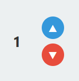
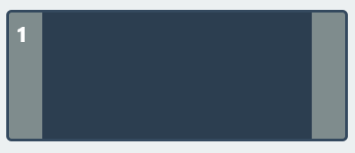
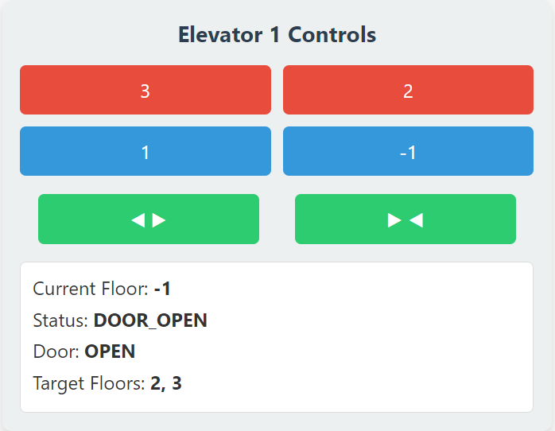

# User Manual 

- Team-17 
- Project: Elevator

## Elevator System 

This documentation shows how to set up the recommended environment configuration for the elevator system and demonstrates the detailed usage of the software .

## Content

- [Environment Setup](#environment-setup)
- [Detailed Usage](#detailed-usage)

## Environment Setup

- **Python:** Version 3.10 or higher.
- **Dependencies:** Install the required dependencies using pip:
  - `pip install -r requirements.txt`

## Detailed Usage

### User Interface Explaination

- **Floor Buttons**  
  Select any floor in the elevator panel. Once pressed, the button highlights and remains active until that floor is reached.

  
- **Call Up/Down Buttons**  
  Press these on a specific floor to request an elevator moving in the desired direction. Buttons stay active until an elevator arrives.

- **Door Open/Close Buttons**  
  Can only be used if the elevator is idle or the door is already opening/open. 

  The door takes about a second to change states, then automatically closes after a short delay unless held open.

- **Status Display Panel**  
  Shows current floor, current state (IDLE, MOVING_UP, MOVING_DOWN), target floors still in queue, and door status.

For further questions on configuration or troubleshooting, consult the [Specification Documentation](../../Specification/specification.md).

