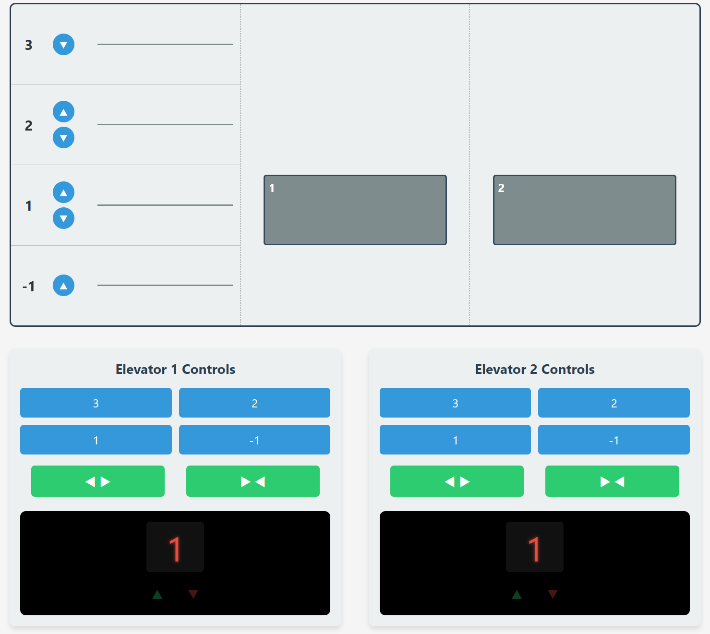

# User Manual 

- Team-17 
- Project: Elevator

## Elevator System 

This documentation shows how to set up the recommended environment configuration for the elevator system and demonstrates the detailed usage of the software .

## Content

- [Environment Setup](#environment-setup)
- [User Interface Introduction](#user-interface-introduction)
  - [Main Display](#main-display)
  - [Floor Buttons](#floor-buttons)
  - [Call Up/Down Buttons](#call-updown-buttons)
  - [Door Open/Close Buttons](#door-openclose-buttons)
  - [Status Display Panel](#status-display-panel)
- [Step-by-Step Workflows](#step-by-step-workflows)
  - [Workflow 1: Calling an Elevator and Selecting a Floor](#workflow-1-calling-an-elevator-and-selecting-a-floor)
  - [Workflow 2: Using Door Controls](#workflow-2-using-door-controls)
  - [Potential Errors and Cautions](#potential-errors-and-cautions)
- [Elevator States](#elevator-states)
- [Button Logic](#button-logic)

## Environment Setup

- **Python:** Version 3.10 or higher.
- **Dependencies:** Install the required dependencies using pip:
  - `pip install -r requirements.txt`

## Detailed Usage

### User Interface Introduction

The elevator system provides a visual interface to interact with and monitor the elevators.

#### Main Display
The main display shows the elevator shafts and the current position of each elevator car. You can see the elevators moving between floors in real-time.

#### Floor Buttons
- **Select any floor in the elevator panel.**  
  Once pressed, the button highlights and remains active until that floor is reached. 
- **Multiple floors can be selected**  
  and will be served in an optimized order.

  
#### Call Up/Down Buttons
- **Press these on a specific floor**  
  to request an elevator moving in the desired direction. 
- **Buttons stay active until an elevator arrives.**  
  Each floor has only the valid direction buttons (e.g., top floor has only "down").

#### Door Open/Close Buttons
- **Can only be used if the elevator is idle or the door is already opening/open.** 

  - The door takes about a second to change states, then automatically closes after a short delay unless held open.

#### Status Display Panel
- **Shows current floor, current state (IDLE, MOVING_UP, MOVING_DOWN), target floors still in queue, and door status.**

### Step-by-Step Workflows

This section provides step-by-step instructions for common user operations.

#### Workflow 1: Calling an Elevator and Selecting a Floor

1.  **Locate the Call Buttons**: On your current floor, find the Up or Down call buttons.
    
2.  **Press the Appropriate Call Button**:
    *   If you want to go up, press the "Up" button.
    *   If you want to go down, press the "Down" button.
    *   The button will illuminate (turn red) to indicate your request has been registered.
3.  **Wait for the Elevator**: The system will dispatch the nearest suitable elevator to your floor. You can monitor its approach on the main display.
4.  **Enter the Elevator**: When the elevator arrives, the doors will automatically open.
    *   The call button on the floor will reset (turn blue).
5.  **Select Your Destination Floor**: Inside the elevator, locate the panel with floor buttons.
6.  **Press Your Destination Floor Button**: The button for your selected floor will illuminate (turn red).
7.  **Ride to Your Destination**: The elevator doors will close, and the elevator will travel to your selected floor. You can see the progress on the Status Display Panel.
8.  **Exit the Elevator**: Upon arrival at your destination, the doors will automatically open, and the floor button inside the elevator will reset.

#### Workflow 2: Using Door Controls

1.  **Locate Door Control Buttons**: Inside the elevator, find the "Open Door" and "Close Door" buttons.
   
2.  **To Open Doors Manually (or Keep Them Open)**:
    *   Ensure the elevator is **IDLE** (not moving) and at a floor.
    *   Press the "Open Door" button. If doors are closed, they will begin opening. If already open, pressing this button can extend the time they remain open.
    *   **Caution**: The "Open Door" button will not function if the elevator is moving.
3.  **To Close Doors Manually**:
    *   Ensure the elevator is at a floor and the doors are currently **OPEN** or **OPENING**.
    *   Press the "Close Door" button. The doors will begin closing.
    *   **Caution**: The "Close Door" button will not function if the doors are already closed or the elevator is moving.
    *   If no buttons are pressed, doors will automatically close after a few seconds.

#### Potential Errors and Cautions

*   **Emergency Stop**: This simulation does not include an emergency stop button.

## Elevator States

Each elevator compartment can be in one of the following states:
- **IDLE:** Stationary, waiting for requests.
- **MOVING_UP:** Moving upward to a requested floor.
- **MOVING_DOWN:** Moving downward to a requested floor.

The elevator door can be in one of:
- **OPEN:** Door is fully open.
- **CLOSED:** Door is fully closed.
- **OPENING:** Door is in the process of opening.
- **CLOSING:** Door is in the process of closing.

Both elevators start IDLE at the ground floor with doors CLOSED.

## Button Logic

- **Floor Buttons:**  
  - Can be pressed at any time; each press adds a target floor to the elevator's queue.
  - Button lights up (red) when active, returns to idle (blue) after arrival.
  - Multiple selections are allowed; the elevator will serve all selected floors in an optimized sequence.

- **Call Up/Down Buttons:**  
  - Press to request an elevator in a specific direction from a floor.
  - Button lights up (red) and remains active until an elevator arrives.
  - Only valid direction buttons are shown per floor.

- **Door Open/Close Buttons:**  
  - Open: Only works when elevator is IDLE or door is already opening/open.
  - Close: Only works when door is OPEN or OPENING.
  - Door transitions take about 1 second; open doors auto-close after a short delay unless held open.

For further questions on configuration or troubleshooting, consult the [Specification Documentation](../../Specification/specification.md).

