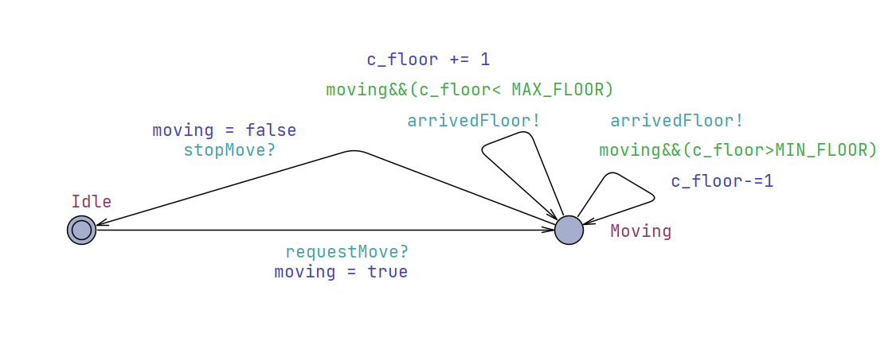
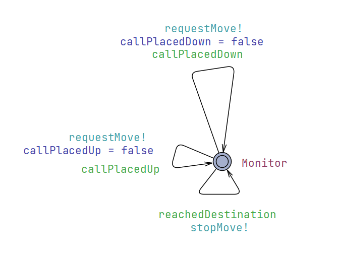
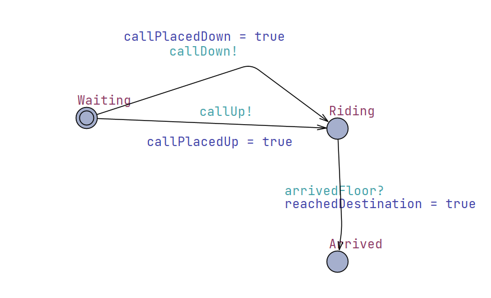
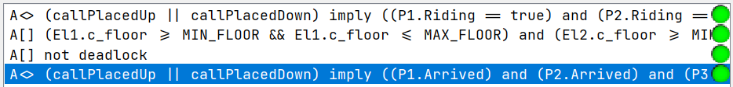

# Validation Documentation

- Team: 17
- Project: Elevator

## Table of Contents

- [Validation Documentation](#validation-documentation)
  - [Table of Contents](#table-of-contents)
  - [1. Testing](#1-testing)
    - [1.1 Unit Tests](#11-unit-tests)
      - [1.1.1 Code Snippets and Branch Marking](#111-code-snippets-and-branch-marking)
      - [1.1.2 Test Cases Design](#112-test-cases-design)
      - [1.1.3 Branch Coverage Results](#113-branch-coverage-results)
    - [1.2 Integration Tests](#12-integration-tests)
      - [1.2.1 Component Interaction Identification](#121-component-interaction-identification)
      - [1.2.2 Test Coverage Items (Equivalent Partitioning)](#122-test-coverage-items-equivalent-partitioning)
      - [1.2.3 Test Cases Design](#123-test-cases-design)
    - [1.3 System Tests](#13-system-tests)
      - [1.3.1 Common Workflows](#131-common-workflows)
      - [1.3.2 Rare Workflows and Risk-Linked Test Cases](#132-rare-workflows-and-risk-linked-test-cases)
  - [2. Model Checking](#2-model-checking)
    - [2.1 System Model](#21-system-model)
    - [2.2 Environment Model](#22-environment-model)
    - [2.3 Verification Queries and Results](#23-verification-queries-and-results)
  - [3. Risk Management](#3-risk-management)
    - [3.1 Risk Analysis](#31-risk-analysis)
    - [3.2 Risk Mitigation](#32-risk-mitigation)

## 1. Testing

This section introduces a comprehensive system verification approach ensuring application reliability and correctness through multiple testing levels.

### 1.1 Unit Tests

Unit tests verify each component's core functionality and state transitions with focus on critical logic paths.

#### 1.1.1 Code Snippets and Branch Marking

**Key Components for Unit Testing:**

1. **Elevator State Machine (`src/backend/elevator.py`)**
   - `update()` method with door state transitions (TC1-TC8)
   - `request_movement_if_needed()` logic (TC9-TC11)
   - `_determine_direction()` algorithm (TC12-TC15)

2. **Dispatcher Logic (`src/backend/dispatcher.py`)**
   - `assign_elevator()` selection algorithm (TC16-TC18)
   - `_optimize_task_queue()` ordering logic (TC19-TC22)
   - `add_target_task()` duplicate prevention (TC23-TC25)

3. **API Input Validation (`src/backend/api.py`)**
   - Command parsing and error handling (TC26-TC30)
   - Parameter validation logic (TC31-TC33)

4. **Engine Movement Processing (`src/backend/engine.py`)**
   - Floor transition logic (TC34-TC36)
   - Movement request handling (TC37-TC39)

#### 1.1.2 Test Cases Design

**Elevator State Machine Tests:**
- TC1: Door opening when CLOSED → OPENING → OPEN
- TC2: Door closing when OPEN → CLOSING → CLOSED
- TC3: Auto-close timeout behavior
- TC4: Door operations blocked while moving
- TC5: Floor arrival handling and door opening
- TC6: Task queue processing upon arrival
- TC7: Movement request generation
- TC8: State consistency during transitions

**Dispatcher Algorithm Tests:**
- TC16: Nearest elevator selection
- TC17: Load balancing with multiple requests
- TC18: Direction-aware assignment
- TC19: SCAN algorithm task ordering (up direction)
- TC20: SCAN algorithm task ordering (down direction)
- TC21: Idle state task prioritization
- TC22: Duplicate task prevention

**API Validation Tests:**
- TC26: Valid command parsing
- TC27: Malformed command handling
- TC28: Invalid parameter rejection
- TC29: Missing parameter detection
- TC30: Command type validation

#### 1.1.3 Branch Coverage Results

**Target Coverage:** ≥ 90% branch coverage for critical components
**Implementation Status:** *To be implemented with pytest framework*
**Coverage Tools:** `coverage.py` for Python code analysis

### 1.2 Integration Tests

Integration tests focus on component interactions and end-to-end workflows, ensuring proper synchronization across the system.

#### 1.2.1 Component Interaction Identification

**Critical Integration Points:**

1. **Dispatcher ↔ Elevator Coordination**
   - Task assignment and queue management
   - Movement request processing
   - State synchronization during operations

2. **API ↔ ZMQ Client Communication**
   - Command parsing and response formatting
   - Error handling and recovery
   - Message queue management

3. **Backend ↔ Frontend State Sync**
   - WebSocket message handling
   - Real-time state updates
   - UI consistency maintenance

4. **Engine ↔ Elevator Movement Control**
   - Floor transition coordination
   - State change notifications
   - Timing synchronization

#### 1.2.2 Test Coverage Items (Equivalent Partitioning)

**Input Validation Categories:**
- Valid floor ranges: [-1, 1, 2, 3]
- Invalid floor ranges: [<-1, >3, non-integers]
- Valid elevator IDs: [1, 2]
- Invalid elevator IDs: [<1, >2, non-integers]
- Valid directions: ["up", "down"]
- Invalid directions: [other strings, null]

**System State Categories:**
- Single elevator operations
- Multi-elevator coordination
- Concurrent request handling
- Empty vs. loaded task queues
- Different door states during operations

#### 1.2.3 Test Cases Design

**Multi-Component Workflow Tests:**
- IT1: Call → Dispatch → Movement → Arrival → Door Open
- IT2: Multiple simultaneous calls to different floors
- IT3: Floor selection while elevator is moving
- IT4: Door control during movement requests
- IT5: System reset with active operations
- IT6: WebSocket connection loss and recovery
- IT7: ZMQ client disconnect and reconnect
- IT8: Concurrent frontend and ZMQ commands

### 1.3 System Tests

System tests validate complete user workflows and rare edge cases linked to identified risks.

#### 1.3.1 Common Workflows

**Standard User Operations:**

1. **Basic Call and Ride (ST1)**
   - User calls elevator from floor 1 to go up
   - Elevator arrives and opens doors
   - User selects target floor 3
   - Elevator moves to floor 3 and opens doors

2. **Multi-Floor Journey (ST2)**
   - Multiple users call elevators from different floors
   - System efficiently dispatches and serves all requests
   - Verify optimal routing and minimal wait times

3. **Door Control Operations (ST3)**
   - Manual door open/close during normal operation
   - Verify door timeout behavior
   - Test door control precedence over automatic operations

4. **System Reset Functionality (ST4)**
   - Reset system during various operational states
   - Verify complete state restoration
   - Confirm no hanging operations

#### 1.3.2 Rare Workflows and Risk-Linked Test Cases

**Risk-Specific Test Scenarios:**

1. **Dispatcher Stress Testing (ST5) - Risk Category 1**
   - Rapid multiple calls from all floors simultaneously
   - Verify no call starvation occurs
   - Test system performance under high load
   - Expected: All calls eventually serviced within reasonable time

2. **State Synchronization Under Load (ST6) - Risk Category 2**
   - Multiple frontend clients with rapid state changes
   - Network latency simulation
   - WebSocket connection interruptions during operations
   - Expected: UI remains consistent, no lost state updates

3. **Concurrency Edge Cases (ST7) - Risk Category 3**
   - Simultaneous door control from ZMQ and WebSocket
   - Rapid sequence of conflicting commands
   - Multi-threaded stress testing
   - Expected: No race conditions, consistent final state

4. **Invalid Input Resilience (ST8) - Risk Category 4**
   - Malformed ZMQ commands and WebSocket messages
   - Out-of-range floor requests
   - Invalid elevator ID references
   - Unexpected command sequences
   - Expected: Graceful error handling, system stability maintained

5. **Boundary Condition Testing (ST9) - Additional Risk**
   - Requests for floors beyond defined range
   - Elevator movement validation at limits
   - Expected: System prevents out-of-bounds operations

**Performance and Reliability Tests:**
- Maximum concurrent users: 10+ simultaneous operations
- Continuous operation: 24-hour stress test
- Memory leak detection: Long-running stability analysis
- Response time requirements: <2 seconds for call response

## 2. Model Checking

This section will introduce a UPPAAL model which simulates the state machine in different situations. The model presented will go through some abstraction compare to the actual code implementation (i.e. specific dispatching Algorithm etc. are omitted).

### 2.1 System Model

**Elevator Model:**

<div align=center>

</div>

The states of the `Elevator` is abstracted to **IDLE** and **MOVING**, the direction edge will be determined by `Dispatcher`

**Dispatcher Model:**

<div align=center>

</div>

The `Dispatcher` orders the elevator to take the passenger to the destination

### 2.2 Environment Model

**Passenger Model:**

<div align=center>

</div>

**Global Instances (Multiple Passengers - Multiple Elevators):**

- 2 elevators and 3 passengers

```UPPAAL
// Instantiate processes
El1 = Elevator();
El2 = Elevator();
D = Dispatcher();
P1 = Passenger();
P2 = Passenger();
P3 = Passenger();
// Compose the system
system El1, El2, D, P1, P2, P3;
```

### 2.3 Verification Queries and Results

**Validation Queries (Multiple Passengers - Multiple Elevators):**

```UPPAAL
/*
every call is eventually serviced (all relevant passengers for the call type)
*/
A<> (callPlacedUp || callPlacedDown) imply ((P1.Riding == true) and (P2.Riding == true) and (P3.Riding == true))

/*
Elevator always goes within floor -1 to 3
*/
A[] (El1.c_floor >= MIN_FLOOR && El1.c_floor <= MAX_FLOOR) and (El2.c_floor >= MIN_FLOOR && El2.c_floor <= MAX_FLOOR)

/*
passenger eventually reaches the floor (all relevant passengers for the call type)
*/
A<> (callPlacedUp || callPlacedDown) imply ((P1.Arrived) and (P2.Arrived) and (P3.Arrived))

/*
System is free of deadlocks
*/
A[] not deadlock
```

- All validations are passed

<div align=center>

</div>

## 3. Risk Management

### 3.1 Risk Analysis

Based on comprehensive code analysis and the FTA diagram, we have identified four major risk categories that could lead to system malfunction:

| Risk ID | Description                                                                                                                                                                                         | Likelihood | Impact | Affected Components                                    |
| :------ | :-------------------------------------------------------------------------------------------------------------------------------------------------------------------------------------------------- | :--------- | :----- | :----------------------------------------------------- |
| R-001   | **Dispatcher Logic Failures:** Encompasses issues like inefficient dispatch algorithms (`dispatcher.py`) causing poor user experience and long wait times; potential dispatch deadlocks or starvation due to task queue optimization problems (`_optimize_task_queue()`), leading to some calls never being serviced; and incorrect task assignments resulting in suboptimal performance. | Medium     | High   | `src/backend/dispatcher.py`                            |
| R-002   | **GUI Desynchronization with Headless Operations:** If the elevator system is operated headlessly via ZMQ messages, the GUI may not reflect the current state, leading to inconsistencies. Maintaining two-way communication (JSON for UI, ZMQ for headless) requires careful synchronization. | Medium     | Medium | `src/backend/api.py`, `src/backend/server.py`, `src/frontend/bridge.py`, `src/backend/net_client.py` |
| R-003   | **Application Size/Distribution:** Standalone mode currently bundles a full browser kernel (e.g., QtWebEngine), adding significant size (~100 MB+) to installers. This results in inflated download sizes, slower installs/updates, higher disk usage, and potential user friction. | High     | Medium | `src/frontend/webview.py`, `release/packaging.spec`, `.github/workflows/release.yml` |
| R-004   | **Port Occupation:** The application may fail to start if the default WebSocket (WS) or HTTP ports are already in use by another process, potentially requiring manual intervention.                                                              | Low        | Medium | `src/backend/server.py`, `src/main.py`                 |
| R-005   | **Inconvenient Frontend Debugging:** Debugging on the frontend can be inconvenient.                                                                                                                             | High       | Low    | `src/frontend/ui/scripts/main.js`, `src/frontend/ui/index.html`, `src/main.py` |

**FTA Analysis:**

The detailed FTA diagram shows the hierarchical breakdown of failure modes:

<div align=center>

</div>

*Note: The FTA diagram is implemented in Mermaid format and shows the complete failure analysis tree with all identified risks and their relationships.*

### 3.2 Risk Mitigation

The following section outlines implemented and recommended mitigation strategies:

**1. Dispatcher Logic Failures (R-001)**

- **Current Mitigations:**
  - Efficient task queue optimization using SCAN-like algorithm in `_optimize_task_queue()` method
  - Distance-based elevator assignment in `assign_elevator()` using `calculate_estimated_time()`
  - Duplicate task prevention logic (checks existing queue before adding)
- **Evidence:**
  - **(Model Checking):** UPPAAL query `A<> (callPlacedUp || callPlacedDown) imply ((P1.Riding == true) and (P2.Riding == true) and (P3.Riding == true))` passed ✓
  - **(Implementation):** Task queue management prevents duplicate entries; optimization follows directional preference

**2. GUI Desynchronization with Headless Operations (R-002)**

- **Current Mitigations:**
  - Implemented a periodic state pusher to ensure the frontend state is consistently synchronized with the backend. This allows ZMQ operations to be reflected in the frontend.
  - The UI updater is triggered every time the states are synced, ensuring visual consistency.
  - Unified API handling to centralize command processing. Internal private methods provide core logic, which are then wrapped by public methods to handle both JSON (WebSocket) and ZMQ message formats, ensuring consistent behavior across both communication channels.
- **Evidence:**
  - **(Implementation):** `WebSocketBridge` in `c:\\Users\\USER\\Desktop\\CS132\\Projects\\cs132-elevator\\src\\frontend\\bridge.py` calls `sync_backend` periodically, which fetches states from `ElevatorAPI` and pushes them to the UI.
  - **(Implementation):** `ElevatorAPI` in `c:\\Users\\USER\\Desktop\\CS132\\Projects\\cs132-elevator\\src\\backend\\api.py` contains methods for both UI interaction (e.g., `ui_fetch_states`) and ZMQ command parsing (`parse_and_handle_message`), demonstrating unified logic.
  - **(Implementation):** The `main.py` update loop (`ElevatorApp.update`) processes ZMQ messages and calls `bridge.sync_backend()` to update the frontend.

**3. Application Size/Distribution (R-003)**
- **Current Mitigations:**
  - Replace QtWebEngine with **pywebview**, leveraging the OS-native WebView2 (Edge) on Windows
  - Offload the browser kernel to the system runtime, reducing the app bundle by ~70%
  - Maintain clean release requirement and use clean virtual environment to build (`.github\workflows\release.yml`)
- **Evidence:**
  - **(Implementation):** Packing size reduced to <= 20 MB

**4. Port Occupation (R-004)**
- **Current Mitigations:**
  - Implement automatic port detection for WS and HTTP ports.
  - The system will scan for available ports within a predefined range if the default ports are occupied.
  - User notification if no available ports are found in the range.
- **Evidence:**
  - **(Testing):** Unit tests for port scanning and selection logic.

**5. Inconvenient Frontend Debugging (R-005)**

- **Current Mitigations:**
  - Added a debug panel in the frontend UI that can be activated by passing the `--debug` command-line argument when running the application.
- **Evidence:**
  - **(Implementation):** Debug panel activation logic can be found in `src/frontend/ui/scripts/main.js`.
  - **(Implementation):** Command-line argument parsing for `--debug` is handled in `src/main.py`.
