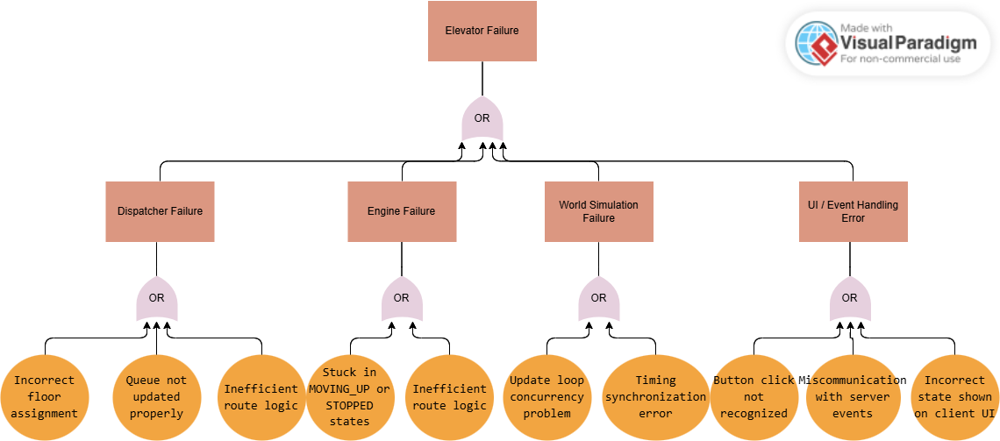
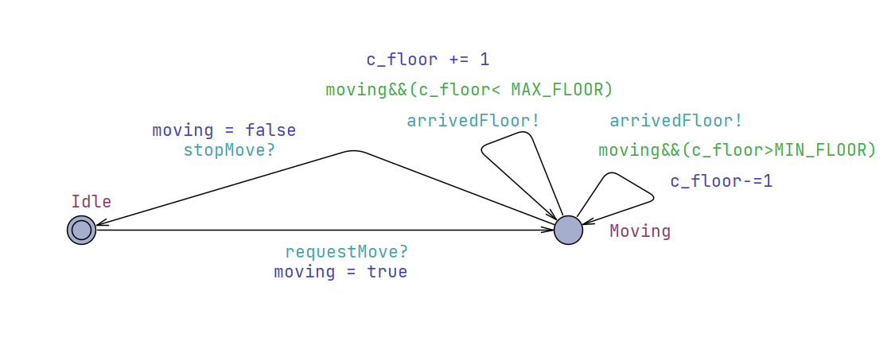
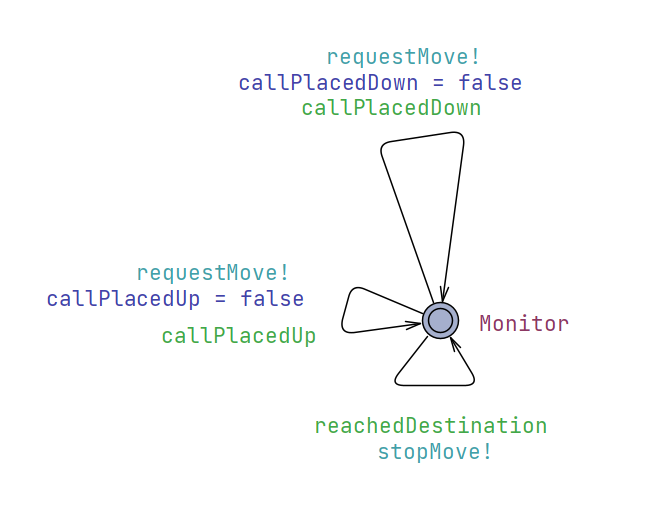
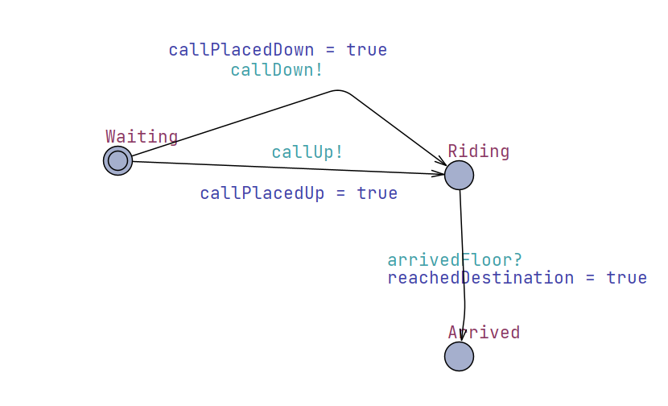
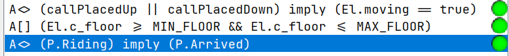
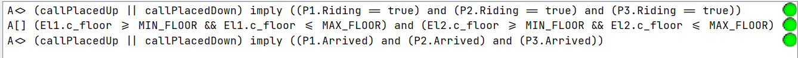

# Validation Documentation

- Team: 17
- Project: Elevator

## Table of Contents
- [1. General Contents](#1-general-contents)
- [2. Unit Tests](#2-unit-tests)
- [3. Functional Tests](#3-functional-tests)
- [4. Integration Tests](#4-integration-tests)
- [5. Risk Management](#5-risk-management)

## 1. General Contents
- This document introduces a set of system verification methods that ensure the application’s reliability and correctness. 
- Unit tests verify each component’s core functionality and state transitions.
- Functional tests validate expected interface interactions to confirm proper user-facing behavior.
- Integration tests center on how different parts cooperate, such as elevator logic and complex workflows, ensuring overall synchronization.
- Risk management examines the system’s performance under varied conditions to reduce possible hazards and bolster safety and correctness.

## 2. Unit Tests

## 3. Functional Tests

## 4. Integration Tests

## 5. Risk Management

### Major System Risks:

- Passenger's call up/down are not eventually responded
- Passenger can't eventually reach their target floor
- Elevator goes out of normal range (floor -1 to 3)

### FTA Aanalysis

The detailed FTA plot is given below:

<div align=center>

</div>

### UPPAAL model checking
- The model checking section will focus on the three major risks presented in the FTA plot
- This section will introduce a UPPAAL model which simulates the state machine in different situations. 
- The model presented will go through some abstraction compare to the actual code implementation (i.e. specific diapatching Algorithm etc. are omitted)
- All the above risks will be tested by its corresponding query. The detailed model will be demonstrated below:

#### 1. Single Passenger - Single Elevator

- Global Statements:

```UPPAAL
// Channels
broadcast chan callUp, callDown, requestMove, stopMove, arrivedFloor;

 // Track if passenger calls
bool callPlacedUp = false;
bool callPlacedDown = false;
bool reachedDestination = false;

 // Invariants to ensure floor is always within [-1..3]
const int MIN_FLOOR = -1;
const int MAX_FLOOR = 3;
 
// Global clocks
clock globalClock;
```

- Global Instances

```UPPAAL
// Instantiate processes
El = Elevator();
D = Dispatcher();
P = Passenger();
// Compose the system
system El, D, P;
```

- Elevator Statements

```UPPAAL
// Local states to handle movement and idle
bool moving = false;
  
int c_floor = 0;
```

- Elevator Model:

<div align=center>

</div>

The states of the `Elevator` is abstracted to **IDLE** and **MOVING**, the direction edge will be determined by `Dispatcher`

- Dispatcher Model:

<div align=center>

</div>

The `Dispatcher` orders the elevator to take the passenger to the destination

- Passenger Model:

<div align=center>

</div>

The `Passenger` is either waiting, riding the elevator or arrived at destination, its orders will be passed on by the `Dispatcher`

- Validation Queries

```UPPAAL
/*
every call is eventually serviced
*/
A<> (callPlacedUp || callPlacedDown) imply (P.Riding == true)

/*
Elevator always goes within floor -1 to 3
*/
A[] (El.c_floor >= MIN_FLOOR && El.c_floor <= MAX_FLOOR)

/*
passenger eventually reaches the floor
*/
A<> (callPlacedUp || callPlacedDown) imply (P.Arrived)
```
- All validations are passed
<div align=center>

</div>

#### 2. Multiple Passengers - Multiple Elevators
The basic model of this part is the same with single passengers, more passengers instances are added to simulate the real situation.
- Global Instances
  - 2 elevators and 3 passengers
```UPPAAL
// Instantiate processes
El1 = Elevator();
El2 = Elevator();
D = Dispatcher();
P1 = Passenger();
P2 = Passenger();
P3 = Passenger();
// Compose the system
system El1, El2, D, P1, P2, P3;
```

- Validation Queries
```UPPAAL
/*
every call is eventually serviced
*/
A<> (callPlacedUp || callPlacedDown) imply ((P1.Riding == true) and (P2.Riding == true) and (P3.Riding == true))

/*
Elevator always goes within floor -1 to 3
*/
A[] (El1.c_floor >= MIN_FLOOR && El1.c_floor <= MAX_FLOOR) and (El2.c_floor >= MIN_FLOOR && El2.c_floor <= MAX_FLOOR)

/*
passenger eventually reaches the floor
*/
A<> (callPlacedUp || callPlacedDown) imply ((P1.Arrived) and (P2.Arrived) and (P3.Arrived))
```
- All validations are passed
<div align=center>

</div>