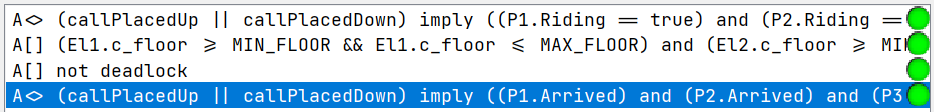

# Validation Documentation

- Team: 17
- Project: Elevator

## Table of Contents
- [1. Testing](#1-testing)
  - [1.1 Unit Tests](#11-unit-tests)
    - [1.1.1 Code Snippets and Branch Marking](#111-code-snippets-and-branch-marking)
    - [1.1.2 Test Cases Design](#112-test-cases-design)
    - [1.1.3 Branch Coverage Results](#113-branch-coverage-results)
  - [1.2 Integration Tests](#12-integration-tests)
    - [1.2.1 Component Interaction Identification](#121-component-interaction-identification)
    - [1.2.2 Test Coverage Items (Equivalent Partitioning)](#122-test-coverage-items-equivalent-partitioning)
    - [1.2.3 Test Cases Design](#123-test-cases-design)
  - [1.3 System Tests](#13-system-tests)
    - [1.3.1 Common Workflows](#131-common-workflows)
    - [1.3.2 Rare Workflows and Risk-Linked Test Cases](#132-rare-workflows-and-risk-linked-test-cases)
- [2. Model Checking](#2-model-checking)
  - [2.1 System Model](#21-system-model)
  - [2.2 Environment Model](#22-environment-model)
  - [2.3 Verification Queries and Results](#23-verification-queries-and-results)
- [3. Risk Management](#3-risk-management)
  - [3.1 Risk Analysis](#31-risk-analysis)
  - [3.2 Risk Mitigation](#32-risk-mitigation)

## 1. Testing

This section introduces a set of system verification methods that ensure the application’s reliability and correctness.

### 1.1 Unit Tests

Unit tests verify each component’s core functionality and state transitions.

#### 1.1.1 Code Snippets and Branch Marking
*(Placeholder: Paste code snippets of all functions with at least one branching logic. Mark each branch with a unique ID (e.g., TC1, TC2).)*

#### 1.1.2 Test Cases Design
*(Placeholder: Design test cases to cover all marked branches. Ensure consistency between test cases and the unit test code.)*

#### 1.1.3 Branch Coverage Results
*(Placeholder: Calculate and report branch coverage results (e.g., "12/15 branches covered").)*

### 1.2 Integration Tests

Integration tests center on how different parts cooperate, such as elevator logic and complex workflows, ensuring overall synchronization.

#### 1.2.1 Component Interaction Identification
*(Placeholder: Identify types of component interactions (e.g., data validation between modules).)*

#### 1.2.2 Test Coverage Items (Equivalent Partitioning)
*(Placeholder: Define test coverage items using equivalent partitioning (e.g., valid/invalid inputs).)*

#### 1.2.3 Test Cases Design
*(Placeholder: Design test cases to cover these items.)*

### 1.3 System Tests

System tests validate expected interface interactions to confirm proper user-facing behavior.

#### 1.3.1 Common Workflows
*(Placeholder: Describe common workflows (e.g., standard user operations) and design test cases.)*

#### 1.3.2 Rare Workflows and Risk-Linked Test Cases
*(Placeholder: Describe rare workflows (linked to risk management) and design corresponding test cases.)*

## 2. Model Checking

This section will introduce a UPPAAL model which simulates the state machine in different situations. The model presented will go through some abstraction compare to the actual code implementation (i.e. specific dispatching Algorithm etc. are omitted).

### 2.1 System Model


**Elevator Model:**

<div align=center>

</div>

The states of the `Elevator` is abstracted to **IDLE** and **MOVING**, the direction edge will be determined by `Dispatcher`

**Dispatcher Model:**

<div align=center>

</div>

The `Dispatcher` orders the elevator to take the passenger to the destination


### 2.2 Environment Model


**Passenger Model:**

<div align=center>

</div>

The `Passenger` is either waiting, riding the elevator or arrived at destination, its orders will be passed on by the `Dispatcher`

**Global Statements & Instances (Single Passenger - Single Elevator):**

- Global Statements:

```UPPAAL
// Channels
broadcast chan callUp, callDown, requestMove, stopMove, arrivedFloor;

 // Track if passenger calls
bool callPlacedUp = false;
bool callPlacedDown = false;
bool reachedDestination = false;

 // Invariants to ensure floor is always within [-1..3]
const int MIN_FLOOR = -1;
const int MAX_FLOOR = 3;
 
// Global clocks
clock globalClock;
```

- Global Instances

```UPPAAL
// Instantiate processes
El = Elevator();
D = Dispatcher();
P = Passenger();
// Compose the system
system El, D, P;
```

- Elevator Statements

```UPPAAL
// Local states to handle movement and idle
bool moving = false;
  
int c_floor = 0;
```

**Global Instances (Multiple Passengers - Multiple Elevators):**
  - 2 elevators and 3 passengers
```UPPAAL
// Instantiate processes
El1 = Elevator();
El2 = Elevator();
D = Dispatcher();
P1 = Passenger();
P2 = Passenger();
P3 = Passenger();
// Compose the system
system El1, El2, D, P1, P2, P3;
```

### 2.3 Verification Queries and Results


**Validation Queries (Single Passenger - Single Elevator):**

```UPPAAL
/*
every call is eventually serviced
*/
A<> (callPlacedUp || callPlacedDown) imply (P.Riding == true)

/*
Elevator always goes within floor -1 to 3
*/
A[] (El.c_floor >= MIN_FLOOR && El.c_floor <= MAX_FLOOR)

/*
passenger eventually reaches the floor
*/
A<> (callPlacedUp || callPlacedDown) imply (P.Arrived)
```
- All validations are passed
<div align=center>

</div>

**Validation Queries (Multiple Passengers - Multiple Elevators):**

```UPPAAL
/*
every call is eventually serviced
*/
A<> (callPlacedUp || callPlacedDown) imply ((P1.Riding == true) and (P2.Riding == true) and (P3.Riding == true))

/*
Elevator always goes within floor -1 to 3
*/
A[] (El1.c_floor >= MIN_FLOOR && El1.c_floor <= MAX_FLOOR) and (El2.c_floor >= MIN_FLOOR && El2.c_floor <= MAX_FLOOR)

/*
passenger eventually reaches the floor
*/
A<> (callPlacedUp || callPlacedDown) imply ((P1.Arrived) and (P2.Arrived) and (P3.Arrived))
```
- All validations are passed
<div align=center>

</div>

## 3. Risk Management

### 3.1 Risk Analysis

**Major System Risks:**

- Passenger's call up/down are not eventually responded
- Passenger can't eventually reach their target floor
- Elevator goes out of normal range (floor -1 to 3)

**FTA Analysis:**

The detailed FTA plot is given below:

<div align=center>

</div>

### 3.2 Risk Mitigation

The following section outlines the mitigation strategies implemented for the major system risks identified in Section 3.1. These mitigations are supported by evidence from model checking and system testing.

**1. Risk: Passenger's call up/down are not eventually responded.**
   - **Mitigation:** The system is designed to ensure that all passenger calls are eventually serviced.
   - **Justification (Model Checking):**
     - As detailed in Section 2.3, the UPPAAL model verification query `A<> (callPlacedUp || callPlacedDown) imply (P.Riding == true)` for a single passenger and `A<> (callPlacedUp || callPlacedDown) imply ((P1.Riding == true) and (P2.Riding == true) and (P3.Riding == true))` for multiple passengers confirm that if a call is placed, the passenger(s) will eventually be in the 'Riding' state. Both queries passed, indicating that the system model correctly handles call servicing.
   - **Justification (Testing):**
     - System tests focusing on common and rare workflows (Sections 1.3.1 and 1.3.2) include scenarios where passengers place calls. Successful execution of these test cases demonstrates that calls are responded to in the implemented system. *(Placeholder: Refer to specific system test case IDs if available once testing section is complete).*

**2. Risk: Passenger can't eventually reach their target floor.**
   - **Mitigation:** The elevator and dispatcher logic ensures that once a passenger is on board and a destination is registered, they will eventually arrive at their target floor.
   - **Justification (Model Checking):**
     - Section 2.3 presents the UPPAAL verification query `A<> (callPlacedUp || callPlacedDown) imply (P.Arrived)` for a single passenger and `A<> (callPlacedUp || callPlacedDown) imply ((P1.Arrived) and (P2.Arrived) and (P3.Arrived))` for multiple passengers. These queries, which passed, validate that passengers eventually reach the 'Arrived' state after placing a call.
   - **Justification (Testing):**
     - System test cases (Sections 1.3.1 and 1.3.2) cover end-to-end passenger journeys, from placing a call to reaching the destination. Successful outcomes of these tests confirm this functionality. *(Placeholder: Refer to specific system test case IDs if available once testing section is complete).*

**3. Risk: Elevator goes out of normal range (floor -1 to 3).**
   - **Mitigation:** The system incorporates constraints to prevent the elevator from moving beyond the predefined valid floor range.
   - **Justification (Specification & Model Checking):**
     - The system specification (referencing `specification.pdf`) defines the operational floor range.
     - In the UPPAAL model (Section 2.1), global constants `MIN_FLOOR = -1` and `MAX_FLOOR = 3` are defined.
     - The verification queries `A[] (El.c_floor >= MIN_FLOOR && El.c_floor <= MAX_FLOOR)` for a single elevator and `A[] (El1.c_floor >= MIN_FLOOR && El1.c_floor <= MAX_FLOOR) and (El2.c_floor >= MIN_FLOOR && El2.c_floor <= MAX_FLOOR)` for multiple elevators (Section 2.3) ensure that the elevator's current floor (`c_floor`) always remains within these bounds. These queries passed, confirming the model's adherence to floor constraints.
   - **Justification (Testing):**
     - Unit tests for the `Elevator` module (Section 1.1) would verify the logic that constrains floor movement.
     - System tests (Section 1.3), particularly those involving requests to extreme floors, would also validate this. *(Placeholder: Refer to specific unit/system test case IDs if available once testing section is complete).*
