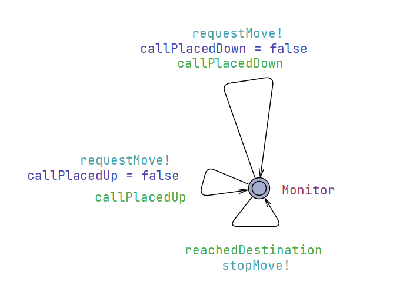
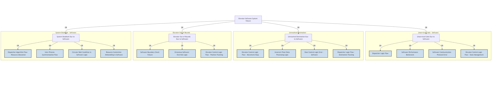

# Validation Documentation

- Team: 17
- Project: Elevator

## Table of Contents

- [1. Testing](#1-testing)
  - [1.1 Unit Tests](#11-unit-tests)
    - [1.1.1 Code Snippets and Branch Marking](#111-code-snippets-and-branch-marking)
    - [1.1.2 Test Cases Design](#112-test-cases-design)
    - [1.1.3 Branch Coverage Results](#113-branch-coverage-results)
  - [1.2 Integration Tests](#12-integration-tests)
    - [1.2.1 Component Interaction Identification](#121-component-interaction-identification)
    - [1.2.2 Test Coverage Items (Equivalent Partitioning)](#122-test-coverage-items-equivalent-partitioning)
    - [1.2.3 Test Cases Design](#123-test-cases-design)
  - [1.3 System Tests](#13-system-tests)
    - [1.3.1 Common Workflows](#131-common-workflows)
    - [1.3.2 Rare Workflows and Risk-Linked Test Cases](#132-rare-workflows-and-risk-linked-test-cases)
- [2. Model Checking](#2-model-checking)
  - [2.1 System Model](#21-system-model)
  - [2.2 Environment Model](#22-environment-model)
  - [2.3 Verification Queries and Results](#23-verification-queries-and-results)
- [3. Risk Management](#3-risk-management)
  - [3.1 Risk Analysis](#31-risk-analysis)
  - [3.2 Risk Mitigation](#32-risk-mitigation)

## 1. Testing

This section introduces a set of system verification methods that ensure the application’s reliability and correctness.

### 1.1 Unit Tests

Unit tests verify each component’s core functionality and state transitions.

#### 1.1.1 Code Snippets and Branch Marking

*(Placeholder: Paste code snippets of all functions with at least one branching logic. Mark each branch with a unique ID (e.g., TC1, TC2).)*

#### 1.1.2 Test Cases Design

*(Placeholder: Design test cases to cover all marked branches. Ensure consistency between test cases and the unit test code.)*

#### 1.1.3 Branch Coverage Results

*(Placeholder: Calculate and report branch coverage results (e.g., "12/15 branches covered").)*

### 1.2 Integration Tests

Integration tests center on how different parts cooperate, such as elevator logic and complex workflows, ensuring overall synchronization.

#### 1.2.1 Component Interaction Identification

*(Placeholder: Identify types of component interactions (e.g., data validation between modules).)*

#### 1.2.2 Test Coverage Items (Equivalent Partitioning)

*(Placeholder: Define test coverage items using equivalent partitioning (e.g., valid/invalid inputs).)*

#### 1.2.3 Test Cases Design

*(Placeholder: Design test cases to cover these items.)*

### 1.3 System Tests

System tests validate expected interface interactions to confirm proper user-facing behavior.

#### 1.3.1 Common Workflows

*(Placeholder: Describe common workflows (e.g., standard user operations) and design test cases.)*

#### 1.3.2 Rare Workflows and Risk-Linked Test Cases

*(Placeholder: Describe rare workflows (linked to risk management) and design corresponding test cases.)*

## 2. Model Checking

This section will introduce a UPPAAL model which simulates the state machine in different situations. The model presented will go through some abstraction compare to the actual code implementation (i.e. specific dispatching Algorithm etc. are omitted).

### 2.1 System Model

**Elevator Model:**

<div align=center>

</div>

The states of the `Elevator` is abstracted to **IDLE** and **MOVING**, the direction edge will be determined by `Dispatcher`

**Dispatcher Model:**

<div align=center>

</div>

The `Dispatcher` orders the elevator to take the passenger to the destination

### 2.2 Environment Model

**Passenger Model:**

<div align=center>

</div>

**Global Instances (Multiple Passengers - Multiple Elevators):**

- 2 elevators and 3 passengers

```UPPAAL
// Instantiate processes
El1 = Elevator();
El2 = Elevator();
D = Dispatcher();
P1 = Passenger();
P2 = Passenger();
P3 = Passenger();
// Compose the system
system El1, El2, D, P1, P2, P3;
```

### 2.3 Verification Queries and Results

**Validation Queries (Multiple Passengers - Multiple Elevators):**

```UPPAAL
/*
every call is eventually serviced (all relevant passengers for the call type)
*/
A<> (callPlacedUp || callPlacedDown) imply ((P1.Riding == true) and (P2.Riding == true) and (P3.Riding == true))

/*
Elevator always goes within floor -1 to 3
*/
A[] (El1.c_floor >= MIN_FLOOR && El1.c_floor <= MAX_FLOOR) and (El2.c_floor >= MIN_FLOOR && El2.c_floor <= MAX_FLOOR)

/*
passenger eventually reaches the floor (all relevant passengers for the call type)
*/
A<> (callPlacedUp || callPlacedDown) imply ((P1.Arrived) and (P2.Arrived) and (P3.Arrived))

/*
System is free of deadlocks
*/
A[] not deadlock
```

- All validations are passed

<div align=center>

</div>

## 3. Risk Management

### 3.1 Risk Analysis

**Major System Risks:**

- **1. Unserviced Calls:** Passenger's call (up/down) is not eventually responded to.
  - Frequency: Medium (if dispatcher logic is flawed or under high load)
  - Severity: Medium (user frustration, perceived unreliability)
- **2. Unreached Destination:** Passenger boards an elevator but never reaches their target floor.
  - Frequency: Low (if core movement and destination logic is sound)
  - Severity: High (user trapped or significantly delayed, safety concern)
- **3. Elevator Out of Bounds:** Elevator moves beyond the mechanically safe or specified operational floor range (e.g., floor -1 to 3).
  - Frequency: Very Low (if boundary checks and safety mechanisms are robust)
  - Severity: Critical (potential for physical damage to elevator/building, severe safety hazard)
- **4. System Deadlock:** Elevators and dispatcher become unresponsive, failing to process any pending passenger requests, potentially due to resource contention or synchronization flaws.
  - Frequency: Low (more likely in complex multi-elevator/multi-passenger scenarios)
  - Severity: High (system becomes unusable until reset, trapping passengers)

**FTA Analysis:**

The detailed FTA plot is given below:

<div align=center>

</div>

### 3.2 Risk Mitigation

The following section outlines the mitigation strategies for the major system risks.

**1. Risk: Unserviced Calls.**

- **Mitigation:** Dispatcher logic ensures all calls are queued and processed. Elevators are assigned to service pending calls based on an efficient algorithm.
- **Justification (Model Checking):** The query `A<> (callPlacedUp || callPlacedDown) imply ((P1.Riding == true) and (P2.Riding == true) and (P3.Riding == true))` for the multi-passenger model passed, showing calls lead to passengers riding.
- **Justification (Testing):** System tests (1.3.1, 1.3.2) verify call response under various load conditions. *(Placeholder: Specific test IDs)*

**2. Risk: Passenger not reaching target floor.**

- **Mitigation:** Elevator and dispatcher logic ensures journey completion once a passenger is aboard and a destination is registered.
- **Justification (Model Checking):** The query `A<> (callPlacedUp || callPlacedDown) imply ((P1.Arrived) and (P2.Arrived) and (P3.Arrived))` for the multi-passenger model passed, confirming arrival post-call.
- **Justification (Testing):** System tests (1.3.1, 1.3.2) cover end-to-end passenger journeys. *(Placeholder: Specific test IDs)*

**3. Risk: Elevator out of normal range.**

- **Mitigation:** Software-defined floor limits and boundary checks in elevator control logic prevent movement beyond the specified range.
- **Justification (Specification & Model Checking):** System specification defines the operational floor range. UPPAAL model includes `MIN_FLOOR`, `MAX_FLOOR` constants, and the query `A[] (El1.c_floor >= MIN_FLOOR && El1.c_floor <= MAX_FLOOR) and (El2.c_floor >= MIN_FLOOR && El2.c_floor <= MAX_FLOOR)` for the multi-elevator model passed.
- **Justification (Testing):** Unit tests for `Elevator` (1.1) verify floor constraint logic. System tests (1.3) include requests to extreme/invalid floors. *(Placeholder: Specific test IDs)*

**4. Risk: System Deadlock.**

- **Mitigation:** Careful design of synchronization primitives (e.g., locks, semaphores) and resource allocation in the dispatcher and elevator control logic. Use of proven scheduling/dispatching strategies that avoid circular waits.
- **Justification (Model Checking):** The UPPAAL query `A[] not deadlock` was verified for the multi-passenger, multi-elevator model (Section 2.3), indicating the model is free from deadlocks under the modeled conditions.
- **Justification (Testing):** Stress testing and integration tests (1.2) involving complex interaction scenarios with multiple elevators and passengers are designed to uncover potential deadlock conditions. *(Placeholder: Specific test IDs)*
