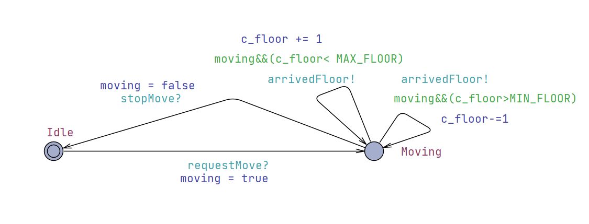
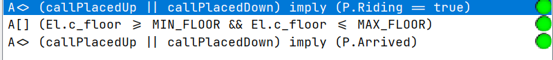

## Risk Management

### Major System Risks:

- Passenger's call up/down are not eventually responded
- Passenger can't eventually reach their target floor
- Elevator goes out of normal range (floor -1 to 3)

### FTA Aanalysis

The detailed FTA plot is given below:

<div align=center>

</div>

### UPPAAL model checking
- The model checking section will focus on the three major risks presented in the FTA plot

#### 1. Single Passenger

- This section will introduce a UPPAAL model which simulates the state machine in the situation of one passenger and one elevator. All the above risks will be tested by its corresponding query. The detailed model will be demonstrated below:

- Global Statements:

```UPPAAL
// Channels
broadcast chan callUp, callDown, requestMove, stopMove, arrivedFloor;

 // Track if passenger calls
bool callPlacedUp = false;
bool callPlacedDown = false;
bool reachedDestination = false;

 // Invariants to ensure floor is always within [-1..3]
const int MIN_FLOOR = -1;
const int MAX_FLOOR = 3;
 
// Global clocks
clock globalClock;
```

- Global Instances

```UPPAAL
// Instantiate processes
El = Elevator();
D = Dispatcher();
P = Passenger();
// Compose the system
system El, D, P;
```

- Elevator Statements

```UPPAAL
// Local states to handle movement and idle
bool moving = false;
  
int c_floor = 0;
```

- Elevator Model:

<div align=center>

</div>

The states of the `Elevator` is abstracted to **IDLE** and **MOVING**, the direction edge will be determined by `Dispatcher`

- Dispatcher Model:

<div align=center>

</div>

The `Dispatcher` orders the elevator to take the passenger to the destination

- Passenger Model:

<div align=center>

</div>

The `Passenger` is either waiting, riding the elevator or arrived at destination, its orders will be passed on by the `Dispatcher`

- Validation Queries

```UPPAAL
/*
every call is eventually serviced
*/
A<> (callPlacedUp || callPlacedDown) imply (P.Riding == true)

/*
Elevator always goes within floor -1 to 3
*/
A[] (El.c_floor >= MIN_FLOOR && El.c_floor <= MAX_FLOOR)

/*
passenger eventually reaches the floor
*/
A<> (callPlacedUp || callPlacedDown) imply (P.Arrived)
```
- All validations are passed
<div align=center>

</div>

#### 2. Multi Passengers
The basic model of this part is the same with single passengers, more passengers instances are added to simulate the real situation.
- Global Instances
  - 2 elevators and 3 passengers
```UPPAAL
// Instantiate processes
El1 = Elevator();
El2 = Elevator();
D = Dispatcher();
P1 = Passenger();
P2 = Passenger();
P3 = Passenger();
// Compose the system
system El1, El2, D, P1, P2, P3;
```

- Validation Queries
```UPPAAL
/*
every call is eventually serviced
*/
A<> (callPlacedUp || callPlacedDown) imply ((P1.Riding == true) and (P2.Riding == true) and (P3.Riding == true))

/*
Elevator always goes within floor -1 to 3
*/
A[] (El1.c_floor >= MIN_FLOOR && El1.c_floor <= MAX_FLOOR) and (El2.c_floor >= MIN_FLOOR && El2.c_floor <= MAX_FLOOR)

/*
passenger eventually reaches the floor
*/
A<> (callPlacedUp || callPlacedDown) imply ((P1.Arrived) and (P2.Arrived) and (P3.Arrived))
```
- All validations are passed
<div align=center>

</div>