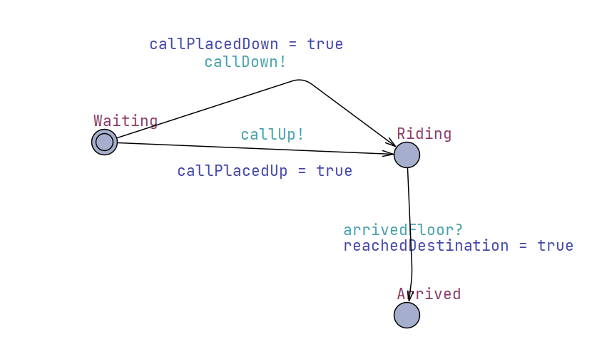

## Risk Management

### General System Risks:

- Passenger's call up/down are not eventually responded
- Passenger can't eventually reach their target floor
- Elevator goes out of normal range (floor -1 to 3)

### FTA Aanalysis

The detailed FTA result is given in the following diagram:

<div align=center>

</div>

### UPPAAL model checking

#### 1. Single Passenger

- This section will introduce a UPPAAL model which simulates the state machine in the situation of one passenger and one elevator. All the above risks will be tested by its corresponding query. The detailed model will be demonstrated below:
- Global Statement:

```UPPAAL
// Channels
broadcast chan callUp, callDown, requestMove, stopMove, arrivedFloor;

 // Track if passenger calls
bool callPlacedUp = false;
bool callPlacedDown = false;
bool reachedDestination = false;

 // Invariants to ensure floor is always within [-1..3]
const int MIN_FLOOR = -1;
const int MAX_FLOOR = 3;
 
// Global clocks
clock globalClock;
```

- Elevator Statement

```UPPAAL
// Local states to handle movement and idle
bool moving = false;
  
int c_floor = 0;
```

- Elevator model:

<div align=center>

</div>

The states of the `Elevator` is abstracted to **IDLE** and **MOVING**, the direction edge will be determined by `Dispatcher`

- Dispatcher model:

<div align=center>

</div>

The `Dispatcher` orders the elevator to take the passenger to the destination

- Passenger model:

<div align=center>

</div>

The `Passenger` is either waiting, riding the elevator or arrived at destination, its orders will be passed on by the `Dispatcher`

- Validation queries

```UPPAAL
/*
every call is eventually serviced
*/
A<> (callPlacedUp || callPlacedDown) imply (P.Riding == true)

/*
Elevator always goes within floor -1 to 3
*/
A[] (El.c_floor >= MIN_FLOOR && El.c_floor <= MAX_FLOOR)

/*
passenger eventually reaches the floor
*/
A<> (callPlacedUp || callPlacedDown) imply (P.Arrived)
```
- All validations passed
<div align=center>

</div>

2. Multi Passengers