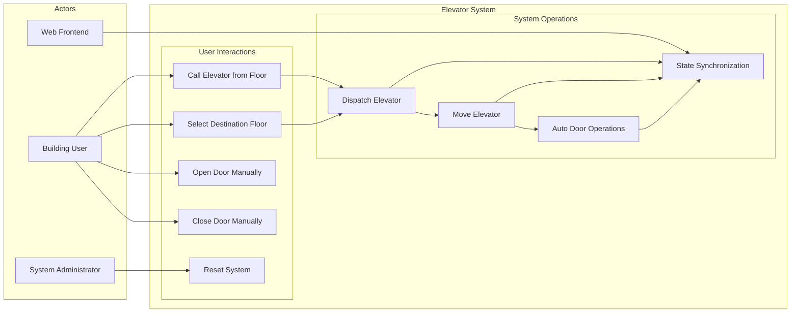
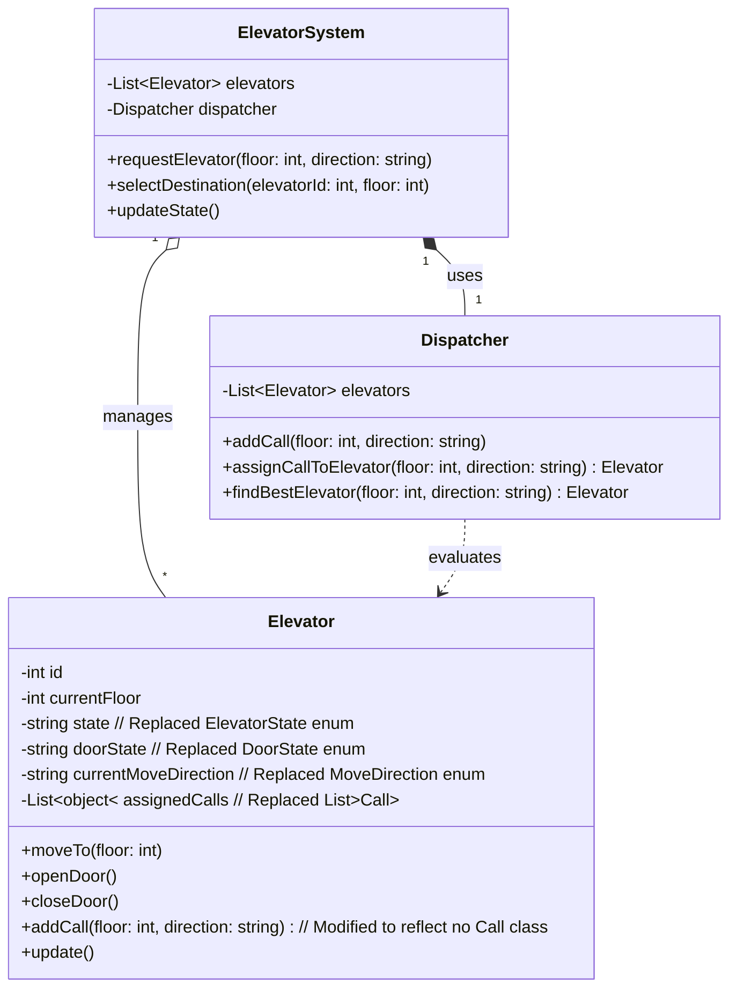
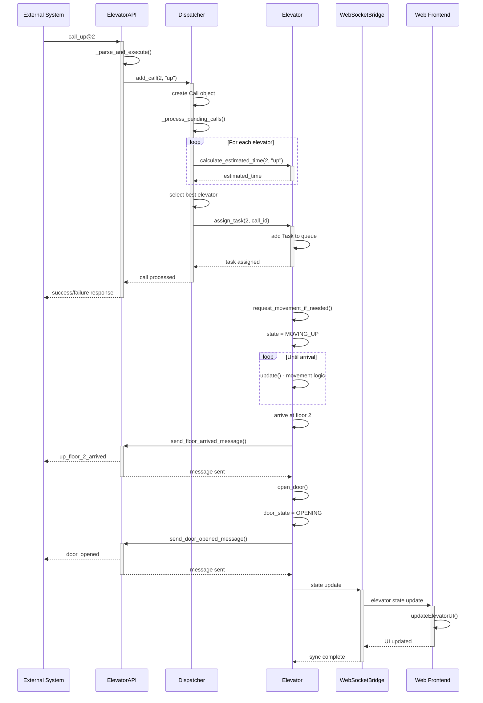

# Elevator System Requirements Documentation

## Table of Contents

- [Elevator System Requirements Documentation](#elevator-system-requirements-documentation)
  - [Table of Contents](#table-of-contents)
  - [System Overview](#system-overview)
    - [Key System Components:](#key-system-components)
  - [Use Case Diagram](#use-case-diagram)
    - [Use Case Descriptions:](#use-case-descriptions)
  - [Class Diagram](#class-diagram)
    - [Class Descriptions:](#class-descriptions)
  - [Activity Diagrams](#activity-diagrams)
    - [1. Elevator Call Processing Workflow](#1-elevator-call-processing-workflow)
    - [2. Door Operation Workflow](#2-door-operation-workflow)
  - [Sequence Diagrams](#sequence-diagrams)
    - [1. External System Elevator Call Sequence](#1-external-system-elevator-call-sequence)
    - [2. Frontend Floor Selection Sequence](#2-frontend-floor-selection-sequence)
    - [3. System State Synchronization Sequence](#3-system-state-synchronization-sequence)  - [Functional Requirements](#functional-requirements)
    - [FR1: Elevator Movement Management](#fr1-elevator-movement-management)
    - [FR2: Door Operation Management](#fr2-door-operation-management)
    - [FR3: Call Dispatching System](#fr3-call-dispatching-system)
    - [FR4: User Interface Requirements](#fr4-user-interface-requirements)

---

## System Overview

The Elevator Simulation System is a comprehensive multi-elevator management system that simulates real-world elevator operations. The system manages two elevators operating across four floors (-1, 1, 2, 3) and handles various user interactions including floor calls, destination selections, and manual door operations.

### Key System Components:

- **Backend Simulation Engine**: Python-based core simulation logic
- **Frontend Interface**: Web-based user interface with real-time updates
- **Communication Layer**: WebSocket and ZMQ protocols for real-time communication
- **External API**: ZMQ interface for external test server integration

---

## Use Case Diagram

### Use Case Descriptions:

**Primary Use Cases:**

- **UC1 - Call Elevator from Floor**: Users can call an elevator to their current floor with directional preference (up/down)
- **UC2 - Select Destination Floor**: Users inside an elevator can select their destination floor
- **UC3 - Open Door Manually**: Users can manually open elevator doors
- **UC4 - Close Door Manually**: Users can manually close elevator doors
- **UC5 - Reset System**: Administrators can reset the entire system to initial state

**System Operation Use Cases:**

- **UC6 - Dispatch Elevator**: System intelligently assigns the most suitable elevator to service calls
- **UC7 - Move Elevator**: System handles elevator movement between floors
- **UC8 - Auto Door Operations**: System automatically opens/closes doors based on arrival and timeout
- **UC9 - State Synchronization**: System maintains real-time state updates across all interfaces

---

## Class Diagram

### Class Descriptions:

**Core System Classes:**

- **ElevatorApp**: Main application orchestrator managing all system components
- **Simulator**: Central simulation engine coordinating elevators and dispatcher
- **Elevator**: Individual elevator entity with state management and door operations
- **Dispatcher**: Intelligent elevator assignment system optimizing service efficiency
- **ElevatorAPI**: Central API hub handling all external communications

**Data Model Classes:**

- **Task**: Represents elevator service requests with call tracking
- **Call**: Tracks outside call requests with state management
- **State Enumerations**: Define elevator states, door states, movement directions, and call states

**Communication Classes:**

- **WebSocketBridge**: Facilitates real-time frontend-backend communication
- **User Interfaces**: Web frontend and ZMQ client interfaces for system interaction

---

## Sequence Diagrams

### 1. External System Elevator Call Sequence

When an external system requests an elevator to floor A, the system first receives and parses the call command. The dispatcher evaluates all available elevators to calculate their estimated service times, then assigns the task to the elevator with the shortest wait time. Once assigned, the selected elevator begins moving upward, continuously updating its position until it reaches floor A. Upon arrival, the elevator automatically opens its doors and sends confirmation messages back to the external system. Throughout this process, the system maintains real-time synchronization with the web frontend to display current elevator status.

---

## Functional Requirements

### FR1: Elevator Movement Management

- **FR1.1**: System shall operate two elevators independently across floors -1, 1, 2, and 3
- **FR1.2**: Each elevator shall move at a rate of one floor per 2 seconds
- **FR1.3**: System shall skip floor 0 during movement calculations
- **FR1.4**: Elevators shall announce arrival at each floor with directional context

### FR2: Door Operation Management

- **FR2.1**: Elevator doors shall automatically open upon arrival at target floors
- **FR2.2**: Doors shall remain open for 3 seconds before automatically closing
- **FR2.3**: Users shall be able to manually open and close doors
- **FR2.4**: Door operations (opening/closing) shall take 1 second each
- **FR2.5**: System shall prevent movement while doors are not fully closed

### FR3: Call Dispatching System

- **FR3.1**: System shall accept floor calls with directional preference (up/down)
- **FR3.2**: Dispatcher shall assign calls to the elevator with minimum estimated service time
- **FR3.3**: System shall handle multiple simultaneous calls efficiently
- **FR3.4**: Inside elevator calls shall take priority over outside calls for the same elevator

### FR4: User Interface Requirements

- **FR4.1**: Web interface shall provide real-time elevator status updates
- **FR4.2**: Users shall be able to call elevators from any floor
- **FR4.3**: Users shall be able to select destination floors from inside elevators
- **FR4.4**: System shall provide visual feedback for all user interactions
- **FR4.5**: Debug panel shall display detailed elevator states when enabled
