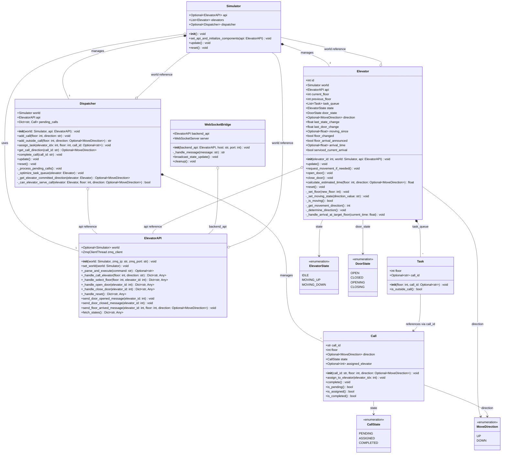
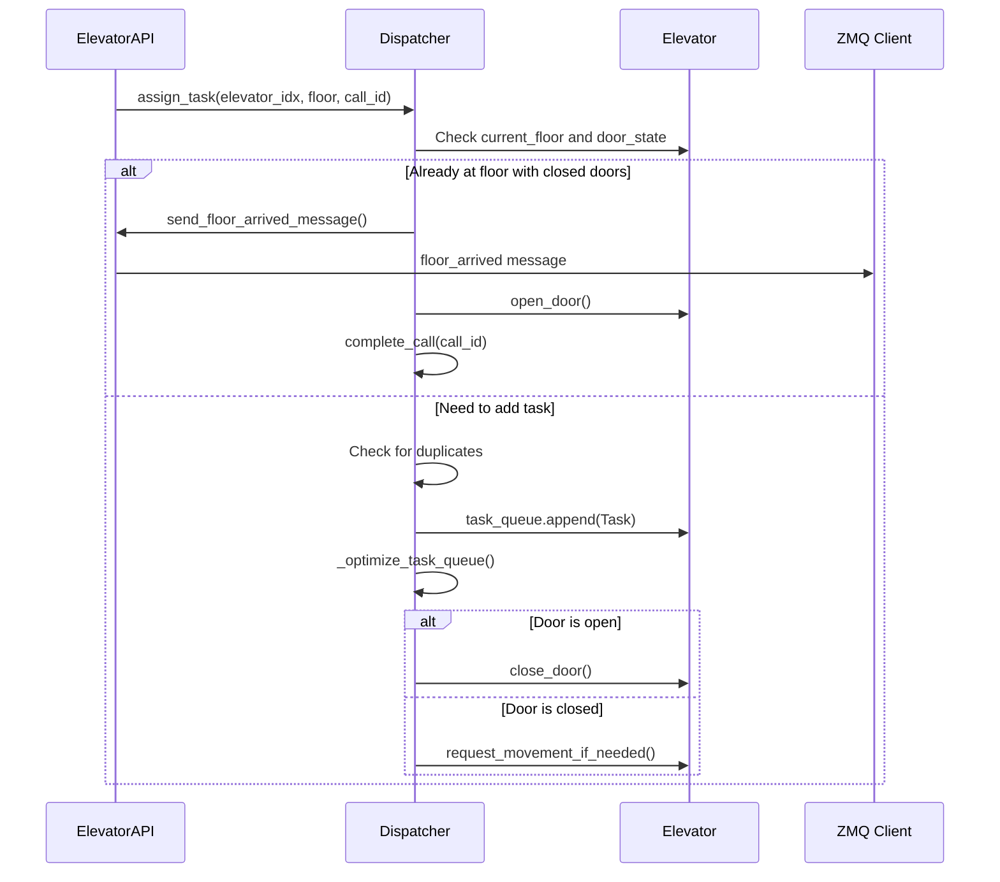
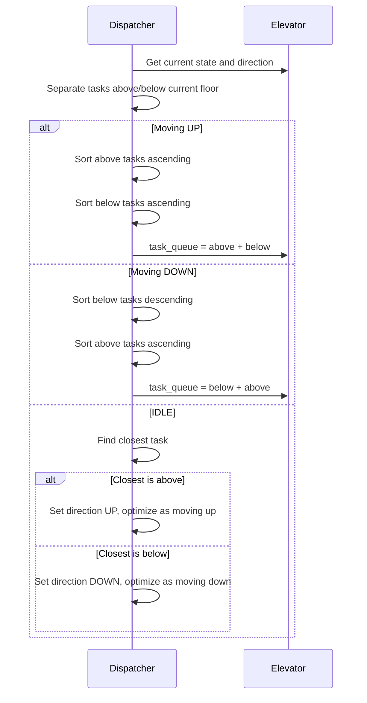
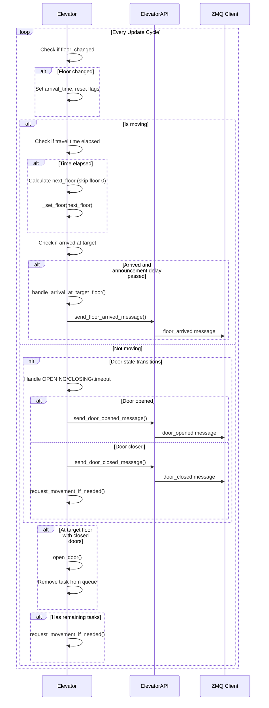
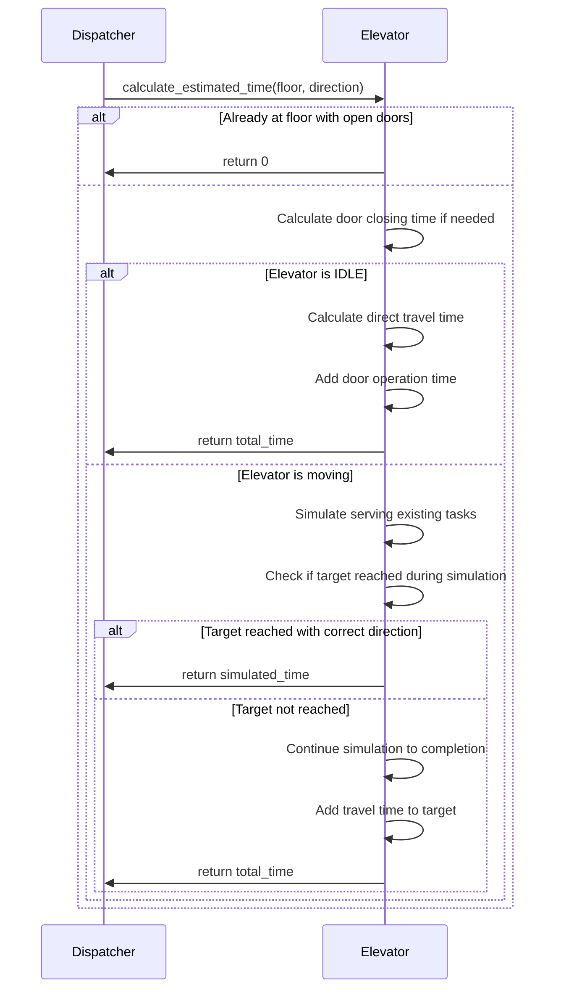

# Elevator System Specification

## Table of Contents
- [Elevator System Specification](#elevator-system-specification)
  - [Table of Contents](#table-of-contents)
  - [System Overview](#system-overview)
  - [System Architecture](#system-architecture)
    - [Backend Layer](#backend-layer)
    - [Communication Layer](#communication-layer)
    - [Frontend Layer](#frontend-layer)
  - [Class Diagram](#class-diagram)
  - [Core Components](#core-components)
    - [Simulator](#simulator)
    - [ElevatorAPI](#elevatorapi)
    - [Dispatcher](#dispatcher)
    - [Elevator](#elevator)
  - [Method Specifications](#method-specifications)
    - [Simulator Class](#simulator-class)
      - [`__init__(self) -> None`](#__init__self---none)
      - [`set_api_and_initialize_components(self, api: ElevatorAPI) -> None`](#set_api_and_initialize_componentsself-api-elevatorapi---none)
      - [`update(self) -> None`](#updateself---none)
      - [`reset(self) -> None`](#resetself---none)
    - [ElevatorAPI Class](#elevatorapi-class)
      - [`__init__(self, world: Optional[Simulator], zmq_ip: str = "127.0.0.1", zmq_port: str = "19982") -> None`](#__init__self-world-optionalsimulator-zmq_ip-str--127001-zmq_port-str--19982---none)
      - [`_parse_and_execute(self, command: str) -> Optional[str]`](#_parse_and_executeself-command-str---optionalstr)
      - [`_handle_call_elevator(self, floor: int, direction: str) -> Dict[str, Any]`](#_handle_call_elevatorself-floor-int-direction-str---dictstr-any)
      - [`_handle_select_floor(self, floor: int, elevator_id: int) -> Dict[str, Any]`](#_handle_select_floorself-floor-int-elevator_id-int---dictstr-any)
      - [`_handle_open_door(self, elevator_id: int) -> Dict[str, Any]`](#_handle_open_doorself-elevator_id-int---dictstr-any)
      - [`_handle_close_door(self, elevator_id: int) -> Dict[str, Any]`](#_handle_close_doorself-elevator_id-int---dictstr-any)
      - [`send_door_opened_message(self, elevator_id: int) -> None`](#send_door_opened_messageself-elevator_id-int---none)
      - [`send_door_closed_message(self, elevator_id: int) -> None`](#send_door_closed_messageself-elevator_id-int---none)
      - [`send_floor_arrived_message(self, elevator_id: int, floor: int, direction: Optional[MoveDirection]) -> None`](#send_floor_arrived_messageself-elevator_id-int-floor-int-direction-optionalmovedirection---none)
      - [`fetch_states(self) -> Dict[str, Any]`](#fetch_statesself---dictstr-any)
    - [Dispatcher Class](#dispatcher-class)
      - [`__init__(self, world: Simulator, api: ElevatorAPI) -> None`](#__init__self-world-simulator-api-elevatorapi---none)
      - [`add_call(self, floor: int, direction: str) -> None`](#add_callself-floor-int-direction-str---none)
      - [`add_outside_call(self, floor: int, direction: Optional[MoveDirection]) -> str`](#add_outside_callself-floor-int-direction-optionalmovedirection---str)
      - [`assign_task(self, elevator_idx: int, floor: int, call_id: Optional[str] = None) -> None`](#assign_taskself-elevator_idx-int-floor-int-call_id-optionalstr--none---none)
      - [`get_call_direction(self, call_id: str) -> Optional[MoveDirection]`](#get_call_directionself-call_id-str---optionalmovedirection)
      - [`complete_call(self, call_id: str) -> None`](#complete_callself-call_id-str---none)
      - [`_process_pending_calls(self) -> None`](#_process_pending_callsself---none)
      - [`_optimize_task_queue(self, elevator: Elevator) -> None`](#_optimize_task_queueself-elevator-elevator---none)
      - [`_get_elevator_committed_direction(self, elevator: Elevator) -> Optional[MoveDirection]`](#_get_elevator_committed_directionself-elevator-elevator---optionalmovedirection)
      - [`_can_elevator_serve_call(self, elevator: Elevator, floor: int, direction: Optional[MoveDirection]) -> bool`](#_can_elevator_serve_callself-elevator-elevator-floor-int-direction-optionalmovedirection---bool)
    - [Elevator Class](#elevator-class)
      - [`__init__(self, elevator_id: int, world: Simulator, api: ElevatorAPI) -> None`](#__init__self-elevator_id-int-world-simulator-api-elevatorapi---none)
      - [`update(self) -> None`](#updateself---none-1)
      - [`request_movement_if_needed(self) -> None`](#request_movement_if_neededself---none)
      - [`_set_floor(self, new_floor: int) -> None`](#_set_floorself-new_floor-int---none)
      - [`_set_moving_state(self, direction_value: str) -> None`](#_set_moving_stateself-direction_value-str---none)
      - [`_is_moving(self) -> bool`](#_is_movingself---bool)
      - [`_get_movement_direction(self) -> int`](#_get_movement_directionself---int)
      - [`open_door(self) -> None`](#open_doorself---none)
      - [`close_door(self) -> None`](#close_doorself---none)
      - [`_determine_direction(self) -> None`](#_determine_directionself---none)
      - [`calculate_estimated_time(self, floor: int, direction: Optional[MoveDirection]) -> float`](#calculate_estimated_timeself-floor-int-direction-optionalmovedirection---float)
      - [`_handle_arrival_at_target_floor(self, current_time: float) -> None`](#_handle_arrival_at_target_floorself-current_time-float---none)
      - [`reset(self) -> None`](#resetself---none-1)
    - [WebSocketBridge Class](#websocketbridge-class)
      - [`__init__(self, backend_api: ElevatorAPI, host: str = "127.0.0.1", port: int = 18675) -> None`](#__init__self-backend_api-elevatorapi-host-str--127001-port-int--18675---none)
      - [`_handle_message(self, message: str) -> str`](#_handle_messageself-message-str---str)
    - [Task Class](#task-class)
      - [`__init__(self, floor: int, call_id: Optional[str]) -> None`](#__init__self-floor-int-call_id-optionalstr---none)
      - [`is_outside_call(self) -> bool`](#is_outside_callself---bool)
    - [Call Class](#call-class)
      - [`__init__(self, call_id: str, floor: int, direction: Optional[MoveDirection]) -> None`](#__init__self-call_id-str-floor-int-direction-optionalmovedirection---none)
      - [`assign_to_elevator(self, elevator_idx: int) -> None`](#assign_to_elevatorself-elevator_idx-int---none)
      - [`complete(self) -> None`](#completeself---none)
      - [`is_pending(self) -> bool`](#is_pendingself---bool)
      - [`is_assigned(self) -> bool`](#is_assignedself---bool)
      - [`is_completed(self) -> bool`](#is_completedself---bool)

## System Overview

The Elevator Simulation System is a multi-elevator control system that manages the operation of two elevators serving floors -1, 1, 2, and 3 (note: floor 0 does not exist). The system handles user requests for calling elevators from floors and selecting destination floors from within elevators, implementing efficient dispatching algorithms to optimize service time.

## System Architecture

The system follows a layered architecture with clear separation of concerns:

### Backend Layer
- **Simulator**: Central orchestrator managing all simulation entities
- **Dispatcher**: Elevator assignment and task optimization logic  
- **Elevator**: Individual elevator control and state management
- **ElevatorAPI**: Central interface for external communication
- **Models**: Data structures and enumerations

### Communication Layer
- **WebSocket Bridge**: Real-time frontend communication
- **ZMQ Interface**: External test server communication

### Frontend Layer
- **Web UI**: HTML/CSS/JavaScript interface for visualization and interaction

## Class Diagram

## Core Components

### Simulator
The central orchestrator that manages all simulation entities and coordinates the main update loop.

### ElevatorAPI  
Central interface handling all external communication (ZMQ and WebSocket) and delegating commands to appropriate components.

### Dispatcher
Manages elevator call assignment using efficiency algorithms and optimizes task queues for each elevator.

### Elevator
Represents individual elevator units with autonomous operation including movement, door control, and task processing.

## Method Specifications

### Simulator Class

#### `__init__(self) -> None`
**Functional Description:** Initializes the simulator with empty references. Components are initialized later via `set_api_and_initialize_components`.

#### `set_api_and_initialize_components(self, api: ElevatorAPI) -> None`
**Functional Description:** Sets the ElevatorAPI instance and initializes dependent components (elevators and dispatcher) that require API access for communication.
- Creates 2 Elevator instances (IDs 1 and 2)
- Creates Dispatcher instance
- Validates API instance is not None

#### `update(self) -> None`
**Functional Description:** Main update loop that processes the simulation state by updating all elevators and the dispatcher.

#### `reset(self) -> None`
**Functional Description:** Resets all simulation components to their initial state.

### ElevatorAPI Class

#### `__init__(self, world: Optional[Simulator], zmq_ip: str = "127.0.0.1", zmq_port: str = "19982") -> None`
**Functional Description:** Initializes the API with ZMQ communication thread and world reference.

#### `_parse_and_execute(self, command: str) -> Optional[str]`
**Functional Description:** Parses incoming ZMQ commands and delegates to appropriate handler methods.
- Supports: `call_up@floor`, `call_down@floor`, `select_floor@floor#elevator_id`, `open_door#elevator_id`, `close_door#elevator_id`, `reset`
- Returns error messages for invalid commands or None for successful operations

#### `_handle_call_elevator(self, floor: int, direction: str) -> Dict[str, Any]`
**Functional Description:** Processes elevator call requests from floors by delegating to dispatcher.

#### `_handle_select_floor(self, floor: int, elevator_id: int) -> Dict[str, Any]`
**Functional Description:** Processes floor selection requests from within elevators.

#### `_handle_open_door(self, elevator_id: int) -> Dict[str, Any]`
**Functional Description:** Manually opens elevator doors if conditions allow.

#### `_handle_close_door(self, elevator_id: int) -> Dict[str, Any]`
**Functional Description:** Manually closes elevator doors if conditions allow.

#### `send_door_opened_message(self, elevator_id: int) -> None`
**Functional Description:** Sends `door_opened#elevator_id` message via ZMQ.

#### `send_door_closed_message(self, elevator_id: int) -> None`
**Functional Description:** Sends `door_closed#elevator_id` message via ZMQ.

#### `send_floor_arrived_message(self, elevator_id: int, floor: int, direction: Optional[MoveDirection]) -> None`
**Functional Description:** Sends floor arrival messages with appropriate direction prefix.
- Format: `{direction_prefix}floor_{floor}_arrived#elevator_id`
- Direction prefix: "up_", "down_", or empty

#### `fetch_states(self) -> Dict[str, Any]`
**Functional Description:** Returns current state of all elevators for frontend synchronization.

### Dispatcher Class

#### `__init__(self, world: Simulator, api: ElevatorAPI) -> None`
**Functional Description:** Initializes dispatcher with world and API references and empty pending calls dictionary.

#### `add_call(self, floor: int, direction: str) -> None`
**Functional Description:** Adds an outside call request and processes pending calls queue.

#### `add_outside_call(self, floor: int, direction: Optional[MoveDirection]) -> str`
**Functional Description:** Creates a new Call object with unique ID and adds to pending calls.

#### `assign_task(self, elevator_idx: int, floor: int, call_id: Optional[str] = None) -> None`
**Functional Description:** Assigns a task to a specific elevator, handling both outside calls (with call_id) and inside calls.
- Prevents duplicate tasks
- Handles immediate service if already at floor
- Optimizes task queue after assignment
- Initiates door closing if needed

**Supporting UML Sequence Diagram:**

#### `get_call_direction(self, call_id: str) -> Optional[MoveDirection]`
**Functional Description:** Retrieves the direction for a pending call by call_id.

#### `complete_call(self, call_id: str) -> None`
**Functional Description:** Marks a call as completed and removes it from pending calls to free memory.

#### `_process_pending_calls(self) -> None`
**Functional Description:** Processes all pending calls by finding suitable elevators and assigning tasks.
- Calculates estimated service time for each elevator
- Only assigns to elevators that can serve the call without direction conflicts
- Chooses elevator with minimum estimated time

#### `_optimize_task_queue(self, elevator: Elevator) -> None`
**Functional Description:** Optimizes elevator task queue using SCAN-like algorithm.
- If moving up: serves floors above first, then floors below
- If moving down: serves floors below first, then floors above  
- If idle: determines direction based on closest floor

**Supporting UML Sequence Diagram:**

#### `_get_elevator_committed_direction(self, elevator: Elevator) -> Optional[MoveDirection]`
**Functional Description:** Determines the direction an elevator is committed to based on current state and task queue.

#### `_can_elevator_serve_call(self, elevator: Elevator, floor: int, direction: Optional[MoveDirection]) -> bool`
**Functional Description:** Determines if an elevator can serve an outside call.
- For outside calls: only assigns to completely idle elevators (no tasks, doors closed, not moving)
- For inside calls: allows assignment with existing restrictions

### Elevator Class

#### `__init__(self, elevator_id: int, world: Simulator, api: ElevatorAPI) -> None`
**Functional Description:** Initializes elevator with ID, world reference, API instance, and default state values.
- Initial floor: 1
- Initial state: IDLE
- Initial door state: CLOSED
- Sets timing constants for movement and door operations

#### `update(self) -> None`
**Functional Description:** Main update method called every simulation cycle to handle elevator operations.

**Supporting UML Sequence Diagram:**

#### `request_movement_if_needed(self) -> None`
**Functional Description:** Initiates elevator movement if there are target floors and doors are closed.
- Determines direction using `_determine_direction()`
- Sets moving state via `_set_moving_state()`

#### `_set_floor(self, new_floor: int) -> None`
**Functional Description:** Updates elevator's current floor and sets floor_changed flag.

#### `_set_moving_state(self, direction_value: str) -> None`
**Functional Description:** Sets elevator's movement state and updates timestamps.

#### `_is_moving(self) -> bool`
**Functional Description:** Returns True if elevator is in MOVING_UP or MOVING_DOWN state.

#### `_get_movement_direction(self) -> int`
**Functional Description:** Returns movement direction as integer (1 for up, -1 for down, 0 for idle).

#### `open_door(self) -> None`
**Functional Description:** Opens elevator doors if not already open/closing and not moving.

#### `close_door(self) -> None`
**Functional Description:** Closes elevator doors if not already closed/opening and not moving.

#### `_determine_direction(self) -> None`
**Functional Description:** Determines optimal movement direction based on task queue.
- All floors above: UP direction
- All floors below: DOWN direction  
- Mixed floors: continues current direction if possible, otherwise chooses closest

#### `calculate_estimated_time(self, floor: int, direction: Optional[MoveDirection]) -> float`
**Functional Description:** Calculates estimated time to serve a floor request considering current state and existing tasks.

**Supporting UML Sequence Diagram:**

#### `_handle_arrival_at_target_floor(self, current_time: float) -> None`
**Functional Description:** Handles logic when elevator arrives at a target floor.
- Sets state to IDLE
- Sends floor arrival message with appropriate direction
- Completes outside calls via dispatcher

#### `reset(self) -> None`
**Functional Description:** Resets elevator to initial state (floor 1, idle, doors closed, empty task queue).

### WebSocketBridge Class

#### `__init__(self, backend_api: ElevatorAPI, host: str = "127.0.0.1", port: int = 18675) -> None`
**Functional Description:** Initializes WebSocket bridge with backend API reference and starts WebSocket server.

#### `_handle_message(self, message: str) -> str`
**Functional Description:** Parses JSON messages from frontend and delegates to appropriate API methods.
- Supports UI functions: `ui_call_elevator`, `ui_select_floor`, `ui_open_door`, `ui_close_door`
- Returns JSON responses with state updates

### Task Class

#### `__init__(self, floor: int, call_id: Optional[str]) -> None`
**Functional Description:** Initializes a Task object.
- `floor`: The target floor for this task.
- `call_id`: An optional identifier linking this task to an external call (e.g., a `Call` object). If `None`, it's an internal task (e.g., floor selection from within the elevator).

#### `is_outside_call(self) -> bool`
**Functional Description:** Determines if the task originated from an outside call (i.e., has an associated `call_id`).
- Returns `True` if `call_id` is not `None`, `False` otherwise.

### Call Class

#### `__init__(self, call_id: str, floor: int, direction: Optional[MoveDirection]) -> None`
**Functional Description:** Initializes a Call object representing a request from a floor.
- `call_id`: A unique identifier for the call.
- `floor`: The floor from which the call was made.
- `direction`: The desired direction of travel (UP or DOWN). Can be `None` if not specified, though typically present for floor calls.
- Initializes `state` to `PENDING` and `assigned_elevator` to `None`.

#### `assign_to_elevator(self, elevator_idx: int) -> None`
**Functional Description:** Assigns the call to a specific elevator.
- Sets `assigned_elevator` to the provided `elevator_idx`.
- Updates the call `state` to `ASSIGNED`.

#### `complete(self) -> None`
**Functional Description:** Marks the call as completed.
- Updates the call `state` to `COMPLETED`.

#### `is_pending(self) -> bool`
**Functional Description:** Checks if the call state is `PENDING`.
- Returns `True` if `state` is `CallState.PENDING`, `False` otherwise.

#### `is_assigned(self) -> bool`
**Functional Description:** Checks if the call state is `ASSIGNED`.
- Returns `True` if `state` is `CallState.ASSIGNED`, `False` otherwise.

#### `is_completed(self) -> bool`
**Functional Description:** Checks if the call state is `COMPLETED`.
- Returns `True` if `state` is `CallState.COMPLETED`, `False` otherwise.
