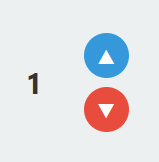
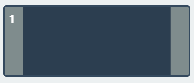

# System Specification

## Table of Contents
- [System Specification](#system-specification)
  - [Table of Contents](#table-of-contents)
  - [System Overview](#system-overview)
  - [System Architecture](#system-architecture)
    - [Backend Layer](#backend-layer)
    - [Communication Layer](#communication-layer)
  - [Class Diagram](#class-diagram)
  - [Core Components](#core-components)
    - [Simulator](#simulator)
    - [ElevatorAPI](#elevatorapi)
    - [Dispatcher](#dispatcher)
    - [Elevator](#elevator)
  - [Method Specifications](#method-specifications)
    - [Simulator Class](#simulator-class)
      - [`__init__(self) -> None`](#__init__self---none)
      - [`set_api_and_initialize_components(self, api: ElevatorAPI) -> None`](#set_api_and_initialize_componentsself-api-elevatorapi---none)
      - [`update(self) -> None`](#updateself---none)
      - [`reset(self) -> None`](#resetself---none)
    - [ElevatorAPI Class](#elevatorapi-class)
      - [`__init__(self, world: Optional[Simulator], zmq_ip: str = "127.0.0.1", zmq_port: str = "19982") -> None`](#__init__self-world-optionalsimulator-zmq_ip-str--127001-zmq_port-str--19982---none)
      - [`stop(self) -> None`](#stopself---none)
      - [`_parse_and_execute(self, command: str) -> Optional[str]`](#_parse_and_executeself-command-str---optionalstr)
      - [`_handle_call_elevator(self, floor: int, direction: str) -> Dict[str, Any]`](#_handle_call_elevatorself-floor-int-direction-str---dictstr-any)
      - [`_handle_select_floor(self, floor: int, elevator_id: int) -> Dict[str, Any]`](#_handle_select_floorself-floor-int-elevator_id-int---dictstr-any)
      - [`_handle_open_door(self, elevator_id: int) -> Dict[str, Any]`](#_handle_open_doorself-elevator_id-int---dictstr-any)
      - [`_handle_close_door(self, elevator_id: int) -> Dict[str, Any]`](#_handle_close_doorself-elevator_id-int---dictstr-any)
      - [`send_door_opened_message(self, elevator_id: int) -> None`](#send_door_opened_messageself-elevator_id-int---none)
      - [`send_door_closed_message(self, elevator_id: int) -> None`](#send_door_closed_messageself-elevator_id-int---none)
      - [`send_floor_arrived_message(self, elevator_id: int, floor: int, direction: Optional[MoveDirection]) -> None`](#send_floor_arrived_messageself-elevator_id-int-floor-int-direction-optionalmovedirection---none)
      - [`fetch_states(self) -> List[Dict[str, Any]]`](#fetch_statesself---listdictstr-any)
      - [`set_world(self, world: Simulator) -> None`](#set_worldself-world-simulator---none)
      - [`stop(self) -> None`](#stopself---none-1)
      - [`ui_call_elevator(self, data: Dict[str, Any]) -> str`](#ui_call_elevatorself-data-dictstr-any---str)
      - [`ui_select_floor(self, data: Dict[str, Any]) -> str`](#ui_select_floorself-data-dictstr-any---str)
      - [`ui_open_door(self, data: Dict[str, Any]) -> str`](#ui_open_doorself-data-dictstr-any---str)
      - [`ui_close_door(self, data: Dict[str, Any]) -> str`](#ui_close_doorself-data-dictstr-any---str)
    - [Dispatcher Class](#dispatcher-class)
      - [`__init__(self, world: Simulator, api: ElevatorAPI) -> None`](#__init__self-world-simulator-api-elevatorapi---none)
      - [`add_call(self, floor: int, direction: str) -> None`](#add_callself-floor-int-direction-str---none)
      - [`add_outside_call(self, floor: int, direction: Optional[MoveDirection]) -> str`](#add_outside_callself-floor-int-direction-optionalmovedirection---str)
      - [`assign_task(self, elevator_idx: int, floor: int, call_id: Optional[str] = None) -> None`](#assign_taskself-elevator_idx-int-floor-int-call_id-optionalstr--none---none)
      - [`get_call_direction(self, call_id: str) -> Optional[MoveDirection]`](#get_call_directionself-call_id-str---optionalmovedirection)
      - [`complete_call(self, call_id: str) -> None`](#complete_callself-call_id-str---none)
      - [`_process_pending_calls(self) -> None`](#_process_pending_callsself---none)
      - [`_optimize_task_queue(self, elevator: Elevator) -> None`](#_optimize_task_queueself-elevator-elevator---none)
      - [`_get_elevator_committed_direction(self, elevator: Elevator) -> Optional[MoveDirection]`](#_get_elevator_committed_directionself-elevator-elevator---optionalmovedirection)
      - [`_can_elevator_serve_call(self, elevator: Elevator, floor: int, direction: Optional[MoveDirection]) -> bool`](#_can_elevator_serve_callself-elevator-elevator-floor-int-direction-optionalmovedirection---bool)
    - [Elevator Class](#elevator-class)
      - [`__init__(self, elevator_id: int, world: Simulator, api: ElevatorAPI) -> None`](#__init__self-elevator_id-int-world-simulator-api-elevatorapi---none)
      - [`update(self) -> None`](#updateself---none-1)
      - [`request_movement_if_needed(self) -> None`](#request_movement_if_neededself---none)
      - [`_set_floor(self, new_floor: int) -> None`](#_set_floorself-new_floor-int---none)
      - [`_set_moving_state(self, direction_value: str) -> None`](#_set_moving_stateself-direction_value-str---none)
      - [`_is_moving(self) -> bool`](#_is_movingself---bool)
      - [`_get_movement_direction(self) -> int`](#_get_movement_directionself---int)
      - [`open_door(self) -> None`](#open_doorself---none)
      - [`close_door(self) -> None`](#close_doorself---none)
      - [`_determine_direction(self) -> None`](#_determine_directionself---none)
      - [`calculate_estimated_time(self, floor: int, direction: Optional[MoveDirection]) -> float`](#calculate_estimated_timeself-floor-int-direction-optionalmovedirection---float)
      - [`_handle_arrival_at_target_floor(self, current_time: float) -> None`](#_handle_arrival_at_target_floorself-current_time-float---none)
      - [`reset(self) -> None`](#resetself---none-1)
    - [Task Class](#task-class)
      - [`__init__(self, floor: int, call_id: Optional[str]) -> None`](#__init__self-floor-int-call_id-optionalstr---none)
      - [`is_outside_call(self) -> bool`](#is_outside_callself---bool)
    - [Call Class](#call-class)
      - [`__init__(self, call_id: str, floor: int, direction: Optional[MoveDirection]) -> None`](#__init__self-call_id-str-floor-int-direction-optionalmovedirection---none)
      - [`assign_to_elevator(self, elevator_idx: int) -> None`](#assign_to_elevatorself-elevator_idx-int---none)
      - [`complete(self) -> None`](#completeself---none)
      - [`is_pending(self) -> bool`](#is_pendingself---bool)
      - [`is_assigned(self) -> bool`](#is_assignedself---bool)
      - [`is_completed(self) -> bool`](#is_completedself---bool)
  - [Components Specifications](#components-specifications)
    - [G1: Overall GUI Design](#g1-overall-gui-design)
      - [G1.1 Main Interface Layout](#g11-main-interface-layout)
      - [G1.2 Visual Design Elements](#g12-visual-design-elements)
    - [S1: Target Floor Implementation](#s1-target-floor-implementation)
      - [S1.1 GUI](#s11-gui)
      - [S1.2 Target floor state Logic Implementation](#s12-target-floor-state-logic-implementation)
      - [S1.3 Click Event](#s13-click-event)
      - [S1.4 Backend Command](#s14-backend-command)
    - [S2：Call Up/Down Implementation](#s2call-updown-implementation)
      - [S2.1: GUI](#s21-gui)
      - [S2.2: Click Event](#s22-click-event)
      - [S2.3: Backend Command](#s23-backend-command)
    - [S3：Door Open/Close Implementation](#s3door-openclose-implementation)
      - [S3.1 GUI](#s31-gui)
      - [S3.2 OPEN/CLOSE state Logic Implementation](#s32-openclose-state-logic-implementation)
      - [S3.3 Click event](#s33-click-event)
      - [S3.4 Backend Command](#s34-backend-command)
    - [S4: Dispatcher Implementation](#s4-dispatcher-implementation)
      - [S4.1 GUI Visualization](#s41-gui-visualization)
      - [S4.2 Dispatching Logic](#s42-dispatching-logic)
      - [S4.3 Elevator Assignment Strategy](#s43-elevator-assignment-strategy)
      - [S4.4 Sequence Optimization Strategy](#s44-sequence-optimization-strategy)
    - [S5: State Update Implementation](#s5-state-update-implementation)
      - [S5.1 GUI State Visualization](#s51-gui-state-visualization)
      - [S5.2 Timed Movement](#s52-timed-movement)
      - [S5.3 Door and State Transitions](#s53-door-and-state-transitions)
    - [Summary Table: Backend Commands and Events](#summary-table-backend-commands-and-events)


## System Overview

The Elevator Simulation System is a multi-elevator control system that manages the operation of two elevators serving floors -1, 1, 2, and 3 (note: floor 0 does not exist). The system handles user requests for calling elevators from floors and selecting destination floors from within elevators, implementing efficient dispatching algorithms to optimize service time.

## System Architecture

The system follows a layered architecture with clear separation of concerns:

### Backend Layer
- **Simulator**: Central orchestrator managing all simulation entities
- **Dispatcher**: Elevator assignment and task optimization logic  
- **Elevator**: Individual elevator control and state management
- **ElevatorAPI**: Central interface for external communication
- **Models**: Data structures and enumerations

### Communication Layer
- **ZMQ Interface**: External test server communication for headless operation

## Class Diagram

```mermaid
classDiagram
    class Simulator {
        +Optional~ElevatorAPI~ api
        +List~Elevator~ elevators
        +Optional~Dispatcher~ dispatcher
        +__init__() void
        +set_api_and_initialize_components(api: ElevatorAPI) void
        +update() void
        +reset() void
    }

    class ElevatorAPI {
        +Optional~Simulator~ world
        +ZmqClientThread zmq_client
        +__init__(world: Optional~Simulator~, zmq_ip: str, zmq_port: str) void
        +set_world(world: Simulator) void
        +stop() void
        +_parse_and_execute(command: str) Optional~str~
        +_handle_call_elevator(floor: int, direction: str) Dict~str, Any~
        +_handle_select_floor(floor: int, elevator_id: int) Dict~str, Any~
        +_handle_open_door(elevator_id: int) Dict~str, Any~
        +_handle_close_door(elevator_id: int) Dict~str, Any~
        +_handle_reset() Dict~str, Any~
        +send_door_opened_message(elevator_id: int) void
        +send_door_closed_message(elevator_id: int) void
        +send_floor_arrived_message(elevator_id: int, floor: int, direction: Optional~MoveDirection~) void
        +fetch_states() List~Dict~str, Any~~
        +ui_call_elevator(data: Dict~str, Any~) str
        +ui_select_floor(data: Dict~str, Any~) str
        +ui_open_door(data: Dict~str, Any~) str
        +ui_close_door(data: Dict~str, Any~) str
    }

    class Dispatcher {
        +Simulator world
        +ElevatorAPI api
        +Dict~str, Call~ pending_calls
        +__init__(world: Simulator, api: ElevatorAPI) void
        +add_call(floor: int, direction: str) void
        +add_outside_call(floor: int, direction: Optional~MoveDirection~) str
        +assign_task(elevator_idx: int, floor: int, call_id: Optional~str~) void
        +get_call_direction(call_id: str) Optional~MoveDirection~
        +complete_call(call_id: str) void
        +update() void
        +reset() void
        -_process_pending_calls() void
        -_optimize_task_queue(elevator: Elevator) void
        -_get_elevator_committed_direction(elevator: Elevator) Optional~MoveDirection~
        -_can_elevator_serve_call(elevator: Elevator, floor: int, direction: Optional~MoveDirection~) bool
    }

    class Elevator {
        +int id
        +Simulator world
        +ElevatorAPI api
        +int current_floor
        +int previous_floor
        +List~Task~ task_queue
        +ElevatorState state
        +DoorState door_state
        +Optional~MoveDirection~ direction
        +float last_state_change
        +float last_door_change
        +Optional~float~ moving_since
        +bool floor_changed
        +bool floor_arrival_announced
        +Optional~float~ arrival_time
        +bool serviced_current_arrival
        +__init__(elevator_id: int, world: Simulator, api: ElevatorAPI) void
        +update() void
        +request_movement_if_needed() void
        +open_door() void
        +close_door() void
        +calculate_estimated_time(floor: int, direction: Optional~MoveDirection~) float
        +reset() void
        -_set_floor(new_floor: int) void
        -_set_moving_state(direction_value: str) void
        -_is_moving() bool
        -_get_movement_direction() int
        -_determine_direction() void
        -_handle_arrival_at_target_floor(current_time: float) void
    }    class Task {
        +int floor
        +Optional~str~ call_id
        +__init__(floor: int, call_id: Optional~str~) void
        +is_outside_call() bool
    }

    class Call {
        +str call_id
        +int floor
        +Optional~MoveDirection~ direction
        +CallState state
        +Optional~int~ assigned_elevator
        +__init__(call_id: str, floor: int, direction: Optional~MoveDirection~) void
        +assign_to_elevator(elevator_idx: int) void
        +complete() void
        +is_pending() bool
        +is_assigned() bool
        +is_completed() bool
    }

    class ElevatorState {
        <<enumeration>>
        IDLE
        MOVING_UP
        MOVING_DOWN
    }

    class DoorState {
        <<enumeration>>
        OPEN
        CLOSED
        OPENING
        CLOSING
    }

    class MoveDirection {
        <<enumeration>>
        UP
        DOWN
    }

    class CallState {
        <<enumeration>>
        PENDING
        ASSIGNED
        COMPLETED
    }

    Simulator *-- "2" Elevator : manages
    Simulator *-- "1" Dispatcher : manages
    Simulator o-- "1" ElevatorAPI : uses
    
    Dispatcher o-- Simulator : world reference
    Dispatcher o-- ElevatorAPI : api reference
    Dispatcher *-- "*" Call : manages
    
    Elevator o-- Simulator : world reference
    Elevator o-- ElevatorAPI : api reference
    Elevator *-- "*" Task : task_queue
    Elevator --> ElevatorState : state
    Elevator --> DoorState : door_state
    Elevator --> MoveDirection : direction
      Task --> Call : references via call_id
    Call --> MoveDirection : direction
    Call --> CallState : state
    
    ElevatorAPI o-- Simulator : world reference
```

## Core Components

### Simulator
The central orchestrator that manages all simulation entities and coordinates the main update loop.

### ElevatorAPI  
Central interface handling external ZMQ communication and delegating commands to appropriate components.

### Dispatcher
Manages elevator call assignment using efficiency algorithms and optimizes task queues for each elevator.

### Elevator
Represents individual elevator units with autonomous operation including movement, door control, and task processing.

## Method Specifications

### Simulator Class

#### `__init__(self) -> None`
**Functional Description:** Initializes the simulator with empty references. Components are initialized later via `set_api_and_initialize_components`.

#### `set_api_and_initialize_components(self, api: ElevatorAPI) -> None`
**Functional Description:** Sets the ElevatorAPI instance and initializes dependent components (elevators and dispatcher) that require API access for communication.
- Creates 2 Elevator instances (IDs 1 and 2)
- Creates Dispatcher instance
- Validates API instance is not None

#### `update(self) -> None`
**Functional Description:** Main update loop that processes the simulation state by updating all elevators and the dispatcher.

#### `reset(self) -> None`
**Functional Description:** Resets all simulation components to their initial state.

### ElevatorAPI Class

#### `__init__(self, world: Optional[Simulator], zmq_ip: str = "127.0.0.1", zmq_port: str = "19982") -> None`
**Functional Description:** Initializes the API with ZMQ communication thread and world reference.

#### `stop(self) -> None`
**Functional Description:** Stops the ZMQ communication thread and performs any necessary cleanup.

#### `_parse_and_execute(self, command: str) -> Optional[str]`
**Functional Description:** Parses incoming ZMQ commands and delegates to appropriate handler methods.
- Supports: `call_up@floor`, `call_down@floor`, `select_floor@floor#elevator_id`, `open_door@elevator_id` (e.g., `open_door@1` or `open_door@#1`), `close_door@elevator_id` (e.g., `close_door@1` or `close_door@#1`), `reset`
- Returns error messages for invalid commands. For successful `open_door` and `close_door` operations, it returns a confirmation message (e.g., `door_opened#elevator_id`). For other successful operations like calls, floor selections, or reset, it typically returns `None` if no error occurred that would prevent a standard ZMQ confirmation (if any is expected beyond the action itself).

#### `_handle_call_elevator(self, floor: int, direction: str) -> Dict[str, Any]`
**Functional Description:** Processes elevator call requests from floors by delegating to dispatcher.

#### `_handle_select_floor(self, floor: int, elevator_id: int) -> Dict[str, Any]`
**Functional Description:** Processes floor selection requests from within elevators.

#### `_handle_open_door(self, elevator_id: int) -> Dict[str, Any]`
**Functional Description:** Manually opens elevator doors if conditions allow.

#### `_handle_close_door(self, elevator_id: int) -> Dict[str, Any]`
**Functional Description:** Manually closes elevator doors if conditions allow.

#### `send_door_opened_message(self, elevator_id: int) -> None`
**Functional Description:** Sends `door_opened#elevator_id` message via ZMQ.

#### `send_door_closed_message(self, elevator_id: int) -> None`
**Functional Description:** Sends `door_closed#elevator_id` message via ZMQ.

#### `send_floor_arrived_message(self, elevator_id: int, floor: int, direction: Optional[MoveDirection]) -> None`
**Functional Description:** Sends floor arrival messages with appropriate direction prefix.
- Format: `{direction_prefix}floor_arrived@{floor}#{elevator_id}`
- Direction prefix: "up_", "down_", or empty

#### `fetch_states(self) -> List[Dict[str, Any]]`
**Functional Description:** Returns current state of all elevators for frontend synchronization. Each dictionary in the list represents an elevator and contains keys such as `elevator_id`, `floor`, `state` (e.g., "IDLE", "MOVING_UP"), `door_state` (e.g., "OPEN", "CLOSED"), `direction` (e.g., "UP", "DOWN", "none"), `target_floors` (a list of floor numbers), and `target_floors_origin` (a dictionary mapping floor numbers to "outside" or "inside").

#### `set_world(self, world: Simulator) -> None`
**Functional Description:** Updates the world reference in the API instance. This is useful if the Simulator instance is not available at the time of ElevatorAPI initialization.

#### `stop(self) -> None`
**Functional Description:** Stops the ZMQ client thread gracefully, ensuring all connections are closed and resources are released. This is typically called during application shutdown.

#### `ui_call_elevator(self, data: Dict[str, Any]) -> str`
**Functional Description:** Handles 'call elevator' requests originating from the UI (likely via WebSocketBridge). Parses `floor` and `direction` from the `data` dictionary and delegates to the internal `_handle_call_elevator` method. Returns a JSON string indicating the outcome of the operation (success or error).

#### `ui_select_floor(self, data: Dict[str, Any]) -> str`
**Functional Description:** Handles 'select floor' requests originating from the UI. Parses `floor` and `elevatorId` from the `data` dictionary and delegates to the internal `_handle_select_floor` method. Returns a JSON string indicating the outcome.

#### `ui_open_door(self, data: Dict[str, Any]) -> str`
**Functional Description:** Handles 'open door' requests originating from the UI. Parses `elevatorId` from the `data` dictionary and delegates to the internal `_handle_open_door` method. Returns a JSON string indicating the outcome.

#### `ui_close_door(self, data: Dict[str, Any]) -> str`
**Functional Description:** Handles 'close door' requests originating from the UI. Parses `elevatorId` from the `data` dictionary and delegates to the internal `_handle_close_door` method. Returns a JSON string indicating the outcome.

### Dispatcher Class

#### `__init__(self, world: Simulator, api: ElevatorAPI) -> None`
**Functional Description:** Initializes dispatcher with world and API references and empty pending calls dictionary.

#### `add_call(self, floor: int, direction: str) -> None`
**Functional Description:** Adds an outside call request and processes pending calls queue.

#### `add_outside_call(self, floor: int, direction: Optional[MoveDirection]) -> str`
**Functional Description:** Creates a new Call object with unique ID and adds to pending calls.

#### `assign_task(self, elevator_idx: int, floor: int, call_id: Optional[str] = None) -> None`
**Functional Description:** Assigns a task to a specific elevator, handling both outside calls (with call_id) and inside calls.
- Prevents duplicate tasks
- Handles immediate service if already at floor
- Optimizes task queue after assignment
- Initiates door closing if needed

**Supporting UML Sequence Diagram:**


#### `get_call_direction(self, call_id: str) -> Optional[MoveDirection]`
**Functional Description:** Retrieves the direction for a pending call by call_id.

#### `complete_call(self, call_id: str) -> None`
**Functional Description:** Marks a call as completed and removes it from pending calls to free memory.

#### `_process_pending_calls(self) -> None`
**Functional Description:** Processes all pending calls by finding suitable elevators and assigning tasks.
- Calculates estimated service time for each elevator
- Only assigns to elevators that can serve the call without direction conflicts
- Chooses elevator with minimum estimated time

#### `_optimize_task_queue(self, elevator: Elevator) -> None`
**Functional Description:** Optimizes elevator task queue using SCAN-like algorithm.
- If moving up: serves floors above first, then floors below
- If moving down: serves floors below first, then floors above  
- If idle: determines direction based on closest floor

**Supporting UML Sequence Diagram:**


#### `_get_elevator_committed_direction(self, elevator: Elevator) -> Optional[MoveDirection]`
**Functional Description:** Determines the direction an elevator is committed to based on current state and task queue.

#### `_can_elevator_serve_call(self, elevator: Elevator, floor: int, direction: Optional[MoveDirection]) -> bool`
**Functional Description:** Determines if an elevator can serve an outside call.
- For outside calls: only assigns to completely idle elevators (no tasks, doors closed, not moving)
- For inside calls: allows assignment with existing restrictions

### Elevator Class

#### `__init__(self, elevator_id: int, world: Simulator, api: ElevatorAPI) -> None`
**Functional Description:** Initializes elevator with ID, world reference, API instance, and default state values.
- Initial floor: 1
- Initial state: IDLE
- Initial door state: CLOSED
- Sets timing constants for movement and door operations

#### `update(self) -> None`
**Functional Description:** Main update method called every simulation cycle to handle elevator operations.

**Supporting UML Sequence Diagram:**


#### `request_movement_if_needed(self) -> None`
**Functional Description:** Initiates elevator movement if there are target floors and doors are closed.
- Determines direction using `_determine_direction()`
- Sets moving state via `_set_moving_state()`

#### `_set_floor(self, new_floor: int) -> None`
**Functional Description:** Updates elevator's current floor and sets floor_changed flag.

#### `_set_moving_state(self, direction_value: str) -> None`
**Functional Description:** Sets elevator's movement state and updates timestamps.

#### `_is_moving(self) -> bool`
**Functional Description:** Returns True if elevator is in MOVING_UP or MOVING_DOWN state.

#### `_get_movement_direction(self) -> int`
**Functional Description:** Returns movement direction as integer (1 for up, -1 for down, 0 for idle).

#### `open_door(self) -> None`
**Functional Description:** Opens elevator doors if not already open/closing and not moving.

#### `close_door(self) -> None`
**Functional Description:** Closes elevator doors if not already closed/opening and not moving.

#### `_determine_direction(self) -> None`
**Functional Description:** Determines optimal movement direction based on task queue.
- All floors above: UP direction
- All floors below: DOWN direction  
- Mixed floors: continues current direction if possible, otherwise chooses closest

#### `calculate_estimated_time(self, floor: int, direction: Optional[MoveDirection]) -> float`
**Functional Description:** Calculates estimated time to serve a floor request considering current state and existing tasks.

**Supporting UML Sequence Diagram:**


#### `_handle_arrival_at_target_floor(self, current_time: float) -> None`
**Functional Description:** Handles logic when elevator arrives at a target floor.
- Sets state to IDLE
- Sends floor arrival message with appropriate direction
- Completes outside calls via dispatcher

#### `reset(self) -> None`
**Functional Description:** Resets elevator to initial state (floor 1, idle, doors closed, empty task queue).

### Task Class

#### `__init__(self, floor: int, call_id: Optional[str]) -> None`
**Functional Description:** Initializes a task with target floor and optional call ID for outside calls.

#### `is_outside_call(self) -> bool`
**Functional Description:** Returns True if task represents an outside call (has call_id), False for inside calls.

### Call Class

#### `__init__(self, call_id: str, floor: int, direction: Optional[MoveDirection]) -> None`
**Functional Description:** Initializes a call with unique ID, target floor, and direction.

#### `assign_to_elevator(self, elevator_idx: int) -> None`
**Functional Description:** Assigns call to specified elevator and updates state to ASSIGNED.

#### `complete(self) -> None`
**Functional Description:** Marks call as completed.

#### `is_pending(self) -> bool`
**Functional Description:** Returns True if call state is PENDING.

#### `is_assigned(self) -> bool`
**Functional Description:** Returns True if call state is ASSIGNED.

#### `is_completed(self) -> bool`
**Functional Description:** Returns True if call state is COMPLETED.

## Components Specifications

### G1: Overall GUI Design

This section describes the graphical user interface design and layout of the elevator system.

#### G1.1 Main Interface Layout

The elevator system features a comprehensive control panel that displays both elevators and all floor controls in a single view:

<div align=center>

</div>

The interface includes:
- Two elevator shafts (Elevator #1 and Elevator #2) with visual representation of elevator cars
- Floor call buttons (up/down) positioned on each floor
- Internal elevator control panels with floor selection buttons
- Door open/close controls within each elevator
- Real-time status indicators showing elevator position and state

#### G1.2 Visual Design Elements

The interface uses a consistent color scheme and visual language:
- **Pale Blue**: Default state for inactive buttons
- **Red**: Active/selected state for pressed buttons
- **Dark Gray**: Pressed state for door control buttons
- **Elevator Cars**: Animated representation showing current floor position
- **Door Animation**: Visual feedback for door opening/closing operations

### S1: Target Floor Implementation

This part here will explain the implementation and click event of floor button in detail along with its graphical user interface.

#### S1.1 GUI

The four available floors are arranged symmetrically and are all initially **pale blue**, once a passenger selects the target floor, it highlights in **red** as shown below:

<div align=center>

</div>

#### S1.2 Target floor state Logic Implementation

- The *floor button* can be selected during **all** elevator states, the elevator will head to the target floor after concluding the current business and enter **MOVING_UP** or **MOVING_DOWN** state.
- The different *floor button* can be stacked, the `Dispatcher` will organize the optimal route to stop at all target floors.

#### S1.3 Click Event

Once being clicked, the *floor button* is considered `'activated'` in **red** and will not respond to further clicking until the elevator has reached the target floor and the button turns back to the `'idle'` in **blue**, the specific click event will be presented in the UML sequence diagram below:

<div align=center>

</div>

#### S1.4 Backend Command

User Operation:
**"select_floor"**: ["-1#1", "-1#2", "1#1", "1#2", "2#1", "2#2", "3#1", "3#2"]

select_floor@i#k means a user in elevator #k selects to go to the i-th floor.

Corresponding System Events:
**"floor_arrived"**:["up","down",""],["-1","1","2","3"],["#1", "#2"]

"up_floor_i_arrived#k"， indicating that elevator #k has arrived at the i-th floor while moving upwards. "floor_i_arrived#k",indicating that elevator #k has stopped at the i-th floor.

### S2：Call Up/Down Implementation

This part here will explain the implementation and click event of *call up/down button* in detail along with its graphical user interface.

#### S2.1: GUI

Floor 1 and 2 have both call up and down button while floor 3 only has call down and floor -1 only has call up. All buttons are initially **pale blue**, once a passenger presses, it highlights in **red** as shown below:

<div align=center>

</div>

#### S2.2: Click Event

Same as floor button, the **call up/down** button is `'activated'` in **red** and will not respond until the elevator has arrived at the passenger's floor, the button will then turn back to `'idle'` in **blue**, the specific click event will be presented in the UML sequence diagram below:

<div align=center>

</div>

#### S2.3: Backend Command

User Operations:
**"call_down"**: ["3", "2", "1"]
**"call_up"**: ["-1", "1", "2"]

call_up/call_down@i signifies the user at floor i pressing the button to call the elevator to go upwards/downwards.

### S3：Door Open/Close Implementation

This part here will explain the implementation and click event of *door open/close button* in detail along with its graphical user interface.

#### S3.1 GUI

The Animation of door Open/Close will be played after received functioning signals.

<div align=center>

</div>

**Open/Close** door buttons are placed inside Elevator 1 and 2,
the icon will **darken** once being pressed and begin to function.

<div align=center>

</div>

#### S3.2 OPEN/CLOSE state Logic Implementation

**S3.1.1 Open Button**:

- The *Open Button* will only function when the elevator is in **IDLE** state and will not respond if pressed when elevator is in the state of **MOVING_UP** or **MOVING_DOWN**.
- When functioning properly, the door will enter the state of **OPENING**.
- After **1s** of animation playing, the door will enter the state of **OPEN**.
- If no external action is posed when the door is in **OPEN** state, after **3s**, the door wil automatically close, the **CLOSING** state detailed will be explained in *Close Button* section.
- Pressing the *Open Button* when the door is already in the **OPEN** state has no effect on the auto-close timer based on the current backend implementation; the door will still auto-close after the standard 3-second timeout if no other actions are taken.

**S3.1.2 Close Button**:

- The *Close Button* will only function when the door is in the **OPEN** state and the elevator is not moving. It will not respond if the door is already **CLOSED**, **CLOSING**, or **OPENING**, or if the elevator is moving.
- When functioning properly, the door will enter the state of **CLOSING**.
- After **1s** of animation playing, the door will enter the state of **CLOSED**.

#### S3.3 Click event

The specific click event of the `Open/Close button` will be presented in the UML sequence diagram below:

<div align=center>

</div>

#### S3.4 Backend Command

User Operations:
**"open_door"**: ["#1", "#2"]
**"close_door"**: ["#1", "#2"]
open_door/close_door#i means open/close the doors of elevator #i

Corresponding System Events
**"door_opened"**: ["#1", "#2"]
**"door_closed"**: ["#1", "#2"]

door_opened/door_closed#i means the doors of elevator #i have opened/closed

### S4: Dispatcher Implementation

This section describes how the Dispatcher efficiently manages elevator operations, handling user requests and assigning them to the most suitable elevator based on real-time conditions, along with its visual representation in the GUI.

#### S4.1 GUI Visualization

The dispatcher's decision-making process is visualized through the elevator system's real-time display. Users can observe:

- **Elevator Position**: Real-time visual representation of each elevator's current floor
- **Direction Indicators**: Visual cues showing elevator movement direction (up/down arrows)
- **Active Calls**: Highlighted call buttons showing pending requests
- **Queue Status**: Floor buttons inside elevators showing selected destinations

The interface provides immediate visual feedback when the dispatcher assigns calls to elevators, with button states changing to reflect the assignment.

#### S4.2 Dispatching Logic

The `Dispatcher` is responsible for managing and assigning outside floor calls (e.g., call up/down from a landing) to the most suitable elevator. It calculates estimated service times and uses this to assign calls. For all assigned tasks, including internal floor selections made by passengers inside an elevator, the `Dispatcher` optimizes the elevator's task queue to ensure an efficient travel path. Manual door open/close requests, however, are handled directly by the `Elevator` objects (via the `ElevatorAPI`) and do not involve the `Dispatcher`'s assignment or optimization logic.

#### S4.3 Elevator Assignment Strategy

When a passenger calls an elevator from a floor:

1. The `Dispatcher` calculates an estimated service time for each elevator.
2. The elevator with the shortest estimated time is assigned to the request.
3. The requested floor is added to that elevator's queue.
4. The sequence of target floors is optimized according to the elevator's current direction and position.

#### S4.4 Sequence Optimization Strategy

The `Dispatcher` employs a modified SCAN algorithm (elevator algorithm) to minimize wait times and reduce unnecessary direction changes:

- **MOVING_UP**: Serves floors above the current floor first in ascending order, then floors below in ascending order.
- **MOVING_DOWN**: Serves floors below the current floor first in descending order, then floors above in ascending order.
- **IDLE**: Chooses the nearest floor first, then proceeds through subsequent stops in an optimal sequence.

### S5: State Update Implementation

This section will show how each elevator's state is updated in real-time, managing movement progress, door operations, and transitions to ensure they stay in sync with user interactions and operational logic, along with their visual representation.

#### S5.1 GUI State Visualization

The elevator system provides comprehensive visual feedback for all state changes:

- **Elevator Movement**: Smooth animation of elevator cars moving between floors
- **Door States**: Animated door opening/closing with visual indicators
- **Button States**: Real-time color changes reflecting button activation and completion
- **Floor Indicators**: Current floor highlighting and direction arrows
- **Queue Display**: Visual representation of pending floor requests within each elevator

#### S5.2 Timed Movement

The `Elevator` object's `update` method, called periodically by the `Simulator`, manages the elevator's movement. It tracks the time elapsed since movement started and, once a single-floor travel time is complete, updates the elevator's current floor. This process ensures the elevator's position and movement status are accurately reflected in the simulation.

#### S5.3 Door and State Transitions

- When door operations are initiated: The door transitions from **CLOSED** to **OPENING** if an open command is valid. It transitions from **OPEN** to **CLOSING** if a close command is valid (e.g., close button pressed while open and idle) or if the auto-close timer for an open door expires.
- If subsequent calls or target floors exist, the elevator switches to **MOVING_UP** or **MOVING_DOWN** until all destinations are served, ultimately returning to **IDLE**.


### Summary Table: Backend Commands and Events

| Command/Event         | Description/When Emitted                                 |
|----------------------|----------------------------------------------------------|
| select_floor@i#k     | User in elevator #k selects floor i                      |
| call_up@i            | User at floor i calls elevator up                        |
| call_down@i          | User at floor i calls elevator down                      |
| open_door#k          | User requests to open door of elevator #k                |
| close_door#k         | User requests to close door of elevator #k               |
| reset                | System reset to initial state                            |
| floor_arrived@i#k    | Elevator #k arrived at floor i                           |
| up_floor_arrived@i#k | Elevator #k arrived at floor i moving up                 |
| down_floor_arrived@i#k| Elevator #k arrived at floor i moving down              |
| door_opened#k        | Elevator #k door opened                                  |
| door_closed#k        | Elevator #k door closed                                  |
