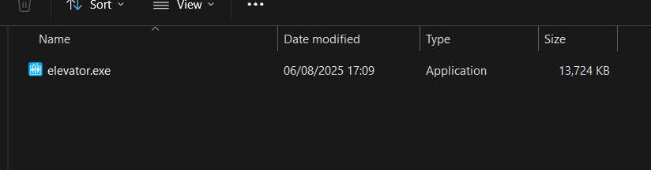
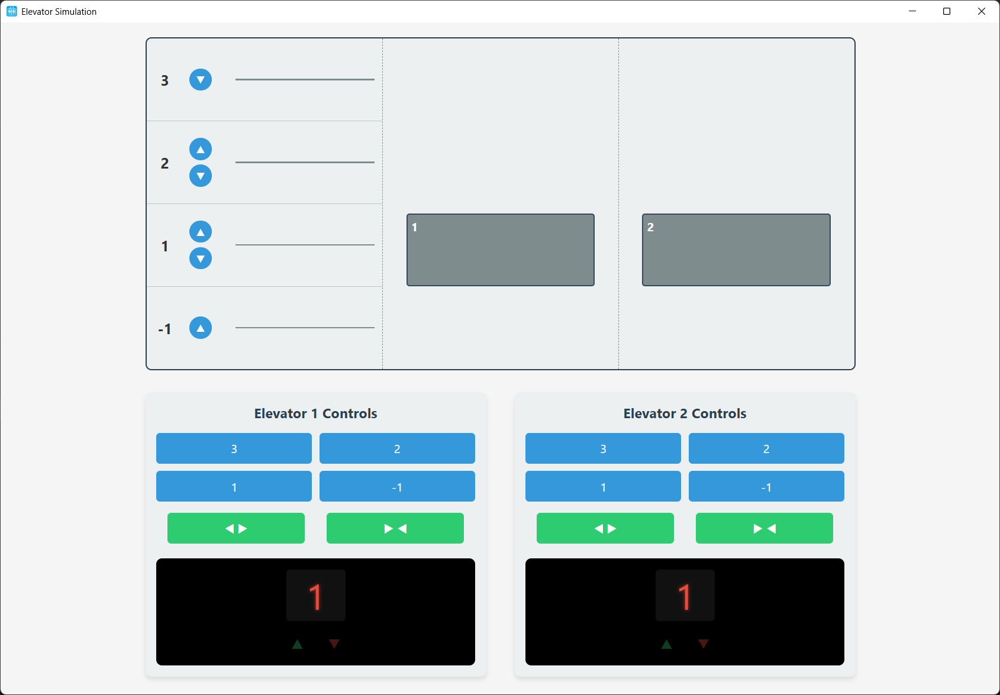
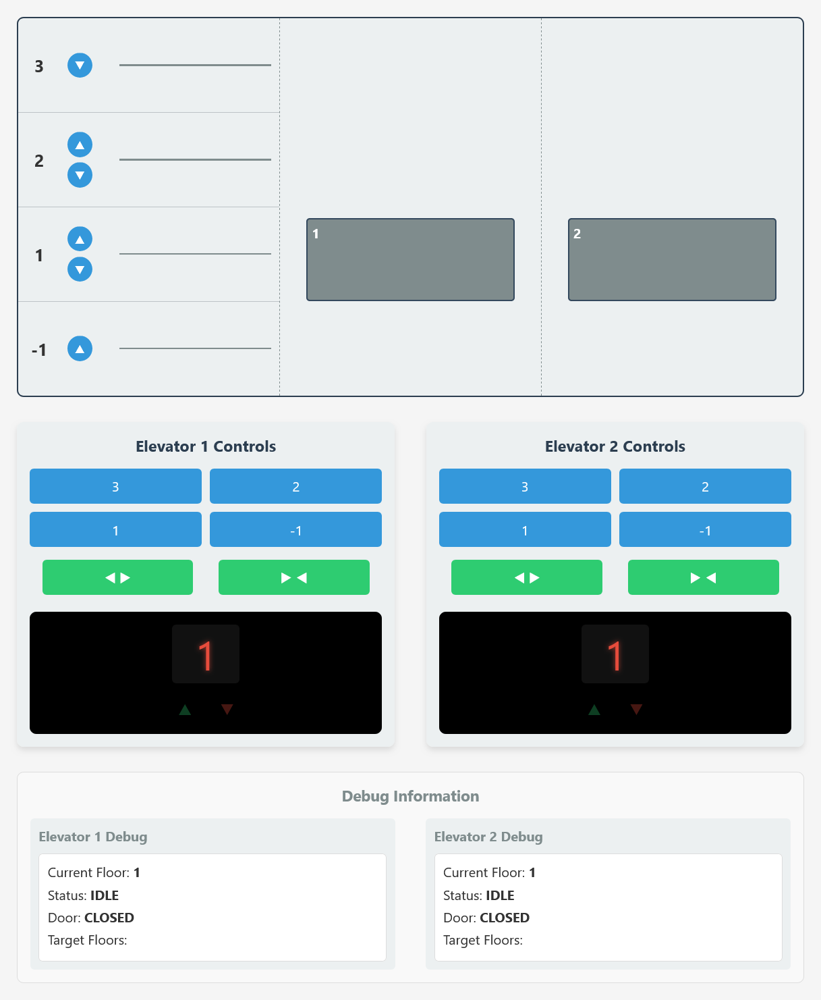
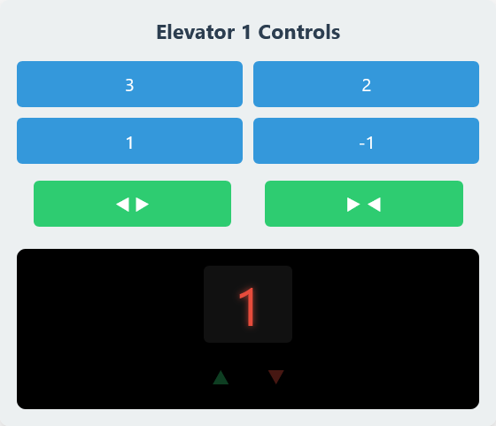
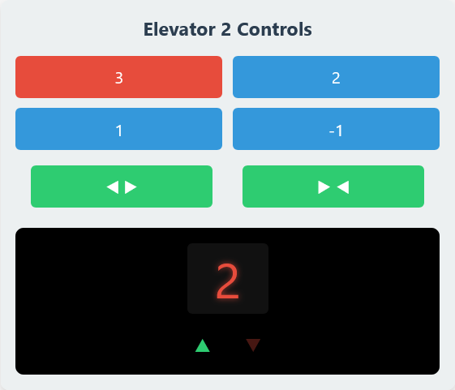

# CS132 Elevator Simulation System - User Manual

---

## Table of Contents

- [CS132 Elevator Simulation System - User Manual](#cs132-elevator-simulation-system---user-manual)
  - [Table of Contents](#table-of-contents)
  - [Introduction](#introduction)
    - [About the Elevator Simulation System](#about-the-elevator-simulation-system)
    - [Target Audience](#target-audience)
    - [Key Features](#key-features)
  - [System Requirements](#system-requirements)
    - [Minimum System Requirements](#minimum-system-requirements)
    - [Recommended System Requirements](#recommended-system-requirements)
  - [Installation \& Setup](#installation--setup)
    - [Packaged Version Installation (Recommended)](#packaged-version-installation-recommended)
    - [First-Time Setup](#first-time-setup)
  - [Getting Started](#getting-started)
    - [Launching the Application](#launching-the-application)
    - [Understanding the Initial State](#understanding-the-initial-state)
    - [Quick Start Tutorial](#quick-start-tutorial)
  - [User Interface Overview](#user-interface-overview)
    - [Main Window Layout](#main-window-layout)
    - [Building Visualization Details](#building-visualization-details)
    - [Control Panel Features](#control-panel-features)
    - [Debug Information Panel](#debug-information-panel)
  - [Basic Operations](#basic-operations)
    - [Calling an Elevator](#calling-an-elevator)
    - [Selecting Your Destination](#selecting-your-destination)
    - [Manual Door Control](#manual-door-control)
    - [Understanding Elevator Behavior](#understanding-elevator-behavior)
  - [Advanced Features](#advanced-features)
    - [Multi-Elevator Coordination](#multi-elevator-coordination)
    - [System Reset and Recovery](#system-reset-and-recovery)
    - [Real-Time Status Monitoring](#real-time-status-monitoring)
  - [Command Line Options](#command-line-options)
    - [Basic Command Line Usage](#basic-command-line-usage)
    - [Available Options](#available-options)
    - [Common Command Line Examples](#common-command-line-examples)
  - [Troubleshooting](#troubleshooting)
    - [Common Issues and Solutions](#common-issues-and-solutions)
    - [Performance Optimization](#performance-optimization)
    - [Error Messages Reference](#error-messages-reference)
    - [Getting Additional Help](#getting-additional-help)
  - [Frequently Asked Questions](#frequently-asked-questions)
    - [General Questions](#general-questions)
    - [Operation Questions](#operation-questions)
    - [Technical Questions](#technical-questions)
    - [Troubleshooting Questions](#troubleshooting-questions)


---

## Introduction

### About the Elevator Simulation System

The CS132 Elevator Simulation System is an interactive software application that simulates a multi-elevator building system. This application provides a realistic representation of elevator operations, including:

- Multiple elevator management (default: 2 elevators)
- Real-time elevator movement and positioning
- Interactive floor calling and destination selection
- Automatic door operations with manual override
- Visual feedback for elevator status and movement

### Target Audience

This software is designed for:
- **End Users**: Anyone who wants to experience or understand elevator system operations
- **Educational Use**: Students and educators studying system simulation and control
- **Demonstration**: Presenting elevator dispatching algorithms and system behavior

### Key Features

🔹 **Real-time Simulation**: Watch elevators move between floors in real-time  
🔹 **Interactive Controls**: Call elevators and select destinations using intuitive buttons  
🔹 **Visual Feedback**: Clear indicators for elevator position, direction, and door status  
🔹 **Automatic Operations**: Smart dispatching and automatic door closing  
🔹 **Debug Mode**: Optional technical information display for advanced users  

---

## System Requirements

### Minimum System Requirements

**Operating System:**
- Windows 10 or later (64-bit)
- Windows 11 (recommended)

**Hardware:**
- RAM: 512 MB minimum, 1 GB recommended
- Storage: 100 MB free disk space
- Display: 1024x768 resolution minimum
- Network: Internet connection for initial setup (if required)

**Software Dependencies:**
- Python 3.13 or later (automatically included in packaged version)
- Web browser compatibility for UI rendering

### Recommended System Requirements

**Hardware:**
- RAM: 2 GB or more
- Storage: 500 MB free disk space
- Display: 1920x1080 resolution or higher
- Multi-core processor for optimal performance

⚠️ **Important**: The packaged version (.exe) includes all necessary dependencies and does not require separate Python installation.

---

## Installation & Setup

### Packaged Version Installation (Recommended)

1. **Download the Application**
   - Locate the `elevator.exe` file provided by your instructor or system administrator
   - Ensure the file is saved to an easily accessible location (e.g., Desktop or Program Files)

2. **Verify File Integrity**
   - Check that the file size matches the expected distribution
   - Scan with antivirus software if required by your organization

3. **No Installation Required**
   - The application is portable and runs directly from the executable file
   - No system modifications or registry changes are made

<!-- Screenshot placeholder: Application executable file in Windows Explorer -->



### First-Time Setup

1. **Create a Working Directory** (Optional)
   - Create a dedicated folder for the application (e.g., `C:\ElevatorSimulation\`)
   - Move the executable to this folder for organization

2. **Initial Launch**
   - Right-click on `elevator.exe` and select "Run as administrator" if prompted
   - The application will automatically configure required ports and services

3. **Firewall Configuration**
   - Windows may prompt for firewall permissions
   - **Allow access** for both private and public networks to enable proper operation

⚠️ **Caution**: If Windows Defender or other security software blocks the application, add it to the exclusions list. The application uses network ports for internal communication.

---

## Getting Started

### Launching the Application

1. **Standard Launch**
   - Double-click `elevator.exe` to start the application
   - Wait for the loading screen to complete (typically 3-5 seconds)
   - The main simulation window will appear automatically

2. **Verifying Successful Launch**
   - Look for the building visualization with two elevator shafts
   - Confirm that floor call buttons are visible on the left side
   - Check that elevator control panels are displayed on the right side

<!-- Screenshot placeholder: Main application window upon startup -->


### Understanding the Initial State

When the application starts:
- Both elevators begin at Floor 1 (ground floor)
- All doors are closed
- No active calls or destinations are set
- The system is ready to receive commands

🟢 **Success Indicator**: You should see two elevator cars positioned at Floor 1 with closed doors and no directional arrows lit.

### Quick Start Tutorial

**Follow these steps for your first interaction:**

1. **Call an Elevator**
   - Click the "▲" (up) button next to Floor 2
   - Watch as one elevator begins moving upward
   - Observe the directional arrow indicator

2. **Select a Destination**
   - While the elevator is at Floor 2, click "3" in the elevator's control panel
   - The elevator will move to Floor 3 automatically

3. **Manual Door Control**
   - Click the "◀ ▶" button to open doors manually
   - Click the "▶ ◀" button to close doors

🔵 **Tip**: Doors will automatically close after a few seconds if left open.

---

## User Interface Overview

### Main Window Layout

The application window consists of four main sections arranged for optimal usability:

<!-- Screenshot placeholder: Annotated main window showing all four sections -->


**A. Building Visualization (Top)**
- Visual representation of the 5-floor building
- Elevator shafts with moving elevator cars
- Floor call buttons for summoning elevators

**B. Elevator Control Panels (Middle)**  
- Individual control panels for each elevator
- Destination selection buttons
- Manual door control buttons
- Real-time floor and direction indicators

**C. Status Information (Bottom)**
- Current elevator positions
- Active calls and destinations
- System status messages

**D. Debug Information (Bottom)** *[Optional]*
- Technical details about elevator states
- Target floor queues
- Detailed status information

### Building Visualization Details

**Floor Layout:**
- Floor 3: Top floor, down button only
- Floor 2: Middle floor, up and down buttons
- Floor 1: Ground floor, up and down buttons  
- Floor -1: Basement, up button only

**Elevator Cars:**
- Numbered "1" and "2" for identification
- Visual door animation (opening/closing)
- Position updates in real-time
- Color coding for different states

**Call Buttons:**
- **▲ Up Button**: Request elevator going upward
- **▼ Down Button**: Request elevator going downward
- **Active State**: Buttons light up when pressed
- **Reset**: Buttons return to normal when elevator arrives

### Control Panel Features

Each elevator has an identical control panel containing:

**Floor Selection Buttons:**
- Large, numbered buttons for each floor (3, 2, 1, -1)
- Buttons highlight when selected as destinations
- Multiple floors can be selected simultaneously

**Door Control Buttons:**
- **"◀ ▶" Open Doors**: Manually opens elevator doors
- **"▶ ◀" Close Doors**: Manually closes elevator doors
- Immediate response to button presses

**Status Display:**
- **Floor Indicator**: Shows current elevator floor
- **Direction Arrows**: Indicate movement direction (▲ up, ▼ down)
- **Real-time Updates**: Information updates continuously

<!-- Screenshot placeholder: Close-up of elevator control panel with labeled components -->


### Debug Information Panel

🔵 **Note**: Debug information is hidden by default. Enable it using the `--debug` command line option.

The debug panel provides technical details:
- **Current Floor**: Precise floor position
- **Status**: Operating state (IDLE, MOVING_UP, MOVING_DOWN, etc.)
- **Door**: Door state (OPEN, CLOSED, OPENING, CLOSING)
- **Target Floors**: Queue of destination floors

---

## Basic Operations

### Calling an Elevator

**Purpose**: Summon an elevator to your current floor

**Steps:**
1. Identify your current floor on the building visualization
2. Determine your intended direction (up or down)
3. Click the appropriate call button:
   - **▲** for going up to higher floors
   - **▼** for going down to lower floors
4. Wait for the elevator to arrive (button will remain lit)
5. The button will reset when an elevator reaches your floor

**Example Scenario:**
- You're on Floor 2 and want to go to Floor 3
- Click the "▲" button next to Floor 2
- Watch as the nearest available elevator moves to Floor 2
- The elevator doors will open automatically upon arrival

⚠️ **Important**: Always select the correct direction button. Elevators optimize their routes based on the direction of your call.

### Selecting Your Destination

**Purpose**: Choose which floor you want to visit

**Steps:**
1. Ensure you're "inside" an elevator (doors are open at your floor)
2. Look at the control panel for the appropriate elevator
3. Click the button corresponding to your destination floor
4. The button will light up to confirm your selection
5. The elevator will automatically close doors and move to your destination

**Multiple Destinations:**
- You can select multiple floors for one trip
- The elevator will visit floors in optimal order
- Each destination button will light up when selected

**Floor Button Reference:**
- **"3"**: Top floor
- **"2"**: Second floor  
- **"1"**: Ground floor (main entrance)
- **"-1"**: Basement level

<!-- Screenshot placeholder: Control panel with destination button highlighted -->


### Manual Door Control

**Purpose**: Override automatic door operations

**When to Use:**
- Hold doors open for additional passengers
- Close doors immediately without waiting
- Emergency situations requiring door control

**Open Doors Manually:**
1. Click the "◀ ▶" button in the elevator control panel
2. Doors will open immediately
3. Doors will remain open until manually closed or timeout occurs

**Close Doors Manually:**
1. Click the "▶ ◀" button in the elevator control panel  
2. Doors will close immediately
3. If elevator has destinations, movement will begin automatically

🔴 **Safety Note**: Manual door controls only work when the elevator is stopped at a floor. Moving elevators cannot have doors opened.

### Understanding Elevator Behavior

**Automatic Operations:**
- Doors open automatically when reaching a destination
- Doors close automatically after 5 seconds if no manual intervention
- Elevators return to idle state when all destinations are completed

**Smart Dispatching:**
- The system selects the most efficient elevator for each call
- Considerations include: distance, current direction, existing destinations
- Both elevators can operate simultaneously for different calls

**Visual Feedback:**
- Elevator position updates smoothly during movement
- Door animations show opening and closing states
- Direction arrows indicate active movement direction

---

## Advanced Features

### Multi-Elevator Coordination

The system intelligently manages two elevators to optimize service:

**Automatic Dispatch Logic:**
- Calls are assigned to the most efficient elevator
- Factors considered: current location, direction, existing destinations
- Load balancing prevents one elevator from handling all requests

**Simultaneous Operations:**
- Both elevators can move independently
- Different calls can be serviced concurrently
- Smart routing minimizes wait times

**Example Scenarios:**

*Scenario 1: Efficient Dispatching*
- Elevator 1 is at Floor 3, Elevator 2 is at Floor 1
- Call from Floor 2 going up → Elevator 2 responds (closer)
- Call from Floor 3 going down → Elevator 1 responds (already there)

*Scenario 2: Queue Management*
- Multiple destinations selected in one elevator
- Floors are visited in optimal order (e.g., 1→2→3, not 1→3→2)
- Other elevator remains available for new calls

### System Reset and Recovery

**Automatic Recovery:**
- System handles temporary network interruptions
- Elevator states are preserved during brief disconnections
- Automatic reconnection when services are restored

**Manual Reset:** *(If implemented)*
- Use command line options to restart services
- System returns to initial state (both elevators at Floor 1)
- All active calls and destinations are cleared

### Real-Time Status Monitoring

**Visual Indicators:**
- Elevator position updates every 100ms for smooth animation
- Door state changes are immediately reflected
- Call button states update in real-time

**Status Information:**
- Current floor display shows exact elevator position
- Direction arrows activate during movement
- Door status visible through animation

---

## Command Line Options

The application supports several command line parameters for advanced users and system administrators.

### Basic Command Line Usage

**Opening Command Prompt:**
1. Press `Windows + R` to open Run dialog
2. Type `cmd` and press Enter
3. Navigate to the application directory using `cd` command
4. Run the application with desired options

**Basic Syntax:**
```
elevator.exe [OPTIONS]
```

### Available Options

**--debug**
- **Purpose**: Enable debug information display
- **Usage**: `elevator.exe --debug`
- **Effect**: Shows technical details in the bottom panel
- **Recommended for**: Troubleshooting, technical demonstrations

**--headless**
- **Purpose**: Run without graphical interface
- **Usage**: `elevator.exe --headless`
- **Effect**: Starts backend services only, no GUI window
- **Use case**: Server deployments, automated testing

**--ws-port [PORT]**
- **Purpose**: Specify WebSocket communication port
- **Usage**: `elevator.exe --ws-port 18675`
- **Default**: Automatically finds available port (18675-18775 range)
- **Use case**: Avoiding port conflicts, network restrictions

**--http-port [PORT]**
- **Purpose**: Specify HTTP server port
- **Usage**: `elevator.exe --http-port 19090`
- **Default**: Automatically finds available port (19090-19190 range)
- **Use case**: Custom web server configuration

**--zmq-port [PORT]**
- **Purpose**: Set ZMQ communication port for external systems
- **Usage**: `elevator.exe --zmq-port 19982`
- **Default**: 19982
- **Use case**: Integration with external test systems

**--console**
- **Purpose**: Force console output visibility
- **Usage**: `elevator.exe --console`
- **Effect**: Shows terminal window with application messages
- **Useful for**: Monitoring system status, debugging

### Common Command Line Examples

**Debug Mode for Troubleshooting:**
```
elevator.exe --debug --console
```

**Headless Mode for Server:**
```
elevator.exe --headless --http-port 8080
```

**Custom Port Configuration:**
```
elevator.exe --ws-port 18680 --http-port 19095
```

**Full Debug with Custom Ports:**
```
elevator.exe --debug --console --ws-port 18675 --http-port 19090
```

🔵 **Tip**: Command line options are particularly useful for system administrators or when running multiple instances of the application.

---

## Troubleshooting

### Common Issues and Solutions

**Issue: Application Won't Start**

*Symptoms:*
- Double-clicking the executable has no effect
- Error messages about missing files
- Application crashes immediately

*Solutions:*
1. **Check Windows Compatibility:**
   - Ensure you're running Windows 10 or later
   - Try running as administrator (right-click → "Run as administrator")

2. **Verify File Integrity:**
   - Re-download the application if file size seems incorrect
   - Check that the executable is not corrupted

3. **Security Software Interference:**
   - Add the application to antivirus exclusions
   - Temporarily disable real-time protection to test

4. **Use Console Mode for Diagnosis:**
   ```
   elevator.exe --console
   ```
   Check error messages in the console window

**Issue: GUI Window Doesn't Appear**

*Symptoms:*
- Application starts but no window is visible
- Process visible in Task Manager but no interface

*Solutions:*
1. **Check Window Position:**
   - Try Alt+Tab to switch between windows
   - The window might be off-screen or minimized

2. **Force Console Mode:**
   ```
   elevator.exe --debug --console
   ```

3. **Restart with Clean State:**
   - Close all instances of the application
   - Wait 10 seconds and restart

**Issue: Elevators Don't Respond to Calls**

*Symptoms:*
- Call buttons can be pressed but don't light up
- Elevators remain stationary
- No response to destination selections

*Solutions:*
1. **Check Network Connectivity:**
   - Application uses internal network ports
   - Restart the application to reinitialize connections

2. **Verify Port Availability:**
   ```
   elevator.exe --console
   ```
   Look for port allocation messages

3. **Manual Port Specification:**
   ```
   elevator.exe --ws-port 18676 --http-port 19091 --console
   ```

**Issue: Visual Display Problems**

*Symptoms:*
- Elevator animation is jerky or frozen
- Interface elements are misaligned
- Colors or graphics appear incorrect

*Solutions:*
1. **Display Scaling Issues:**
   - Right-click desktop → Display settings
   - Set scaling to 100% temporarily
   - Restart the application

2. **Browser Compatibility:**
   - The application uses embedded web browser technology
   - Ensure Windows is updated for latest browser components

3. **Graphics Driver:**
   - Update graphics drivers to latest version
   - Restart computer after driver update

### Performance Optimization

**Improving Application Performance:**

1. **Close Unnecessary Programs:**
   - Free up system memory by closing unused applications
   - Disable background programs that consume CPU

2. **Network Optimization:**
   - Ensure stable network connectivity
   - Close applications that use significant network bandwidth

3. **System Resources:**
   - Monitor CPU and memory usage
   - Restart computer if system has been running for extended periods

**Monitoring System Performance:**
```
elevator.exe --debug --console
```
Watch for performance-related messages in the console output.

### Error Messages Reference

**"Could not find available port"**
- *Cause*: Required network ports are in use
- *Solution*: Specify alternative ports or close conflicting applications

**"Failed to initialize WebSocket connection"**
- *Cause*: Network configuration issues
- *Solution*: Restart application, check firewall settings

**"Frontend not initialized"**
- *Cause*: GUI components failed to load
- *Solution*: Try headless mode to isolate the issue

**Connection timeout errors**
- *Cause*: Internal communication problems
- *Solution*: Restart application, check system resources

### Getting Additional Help

**Self-Diagnosis Steps:**
1. Run application with `--debug --console` options
2. Take note of any error messages
3. Try basic operations (call elevator, select floor)
4. Document what works and what doesn't

**Information to Collect:**
- Windows version and edition
- Exact error messages (copy from console)
- Steps that lead to the problem
- Whether issue occurs consistently

**Before Seeking Support:**
- Try restarting the application
- Reboot your computer
- Verify you're using the latest version
- Test with different command line options

---

## Frequently Asked Questions

### General Questions

**Q: How many elevators does the system simulate?**
A: The system simulates 2 elevators by default. Both elevators operate independently and can handle different calls simultaneously.

**Q: How many floors are in the building?**
A: The building has 5 floors total: Basement (-1), Ground Floor (1), Second Floor (2), and Third Floor (3). The numbering follows standard building conventions.

**Q: Can I run multiple instances of the application?**
A: Yes, but you must specify different ports for each instance to avoid conflicts:
```
elevator.exe --ws-port 18676 --http-port 19091
```

**Q: Does the application require internet access?**
A: No, the application runs entirely offline. It only uses local network ports for internal communication between components.

### Operation Questions

**Q: Why doesn't the elevator come when I press the call button?**
A: This can happen for several reasons:
- Another elevator is already assigned to your call
- The system is prioritizing other calls based on efficiency
- There may be a temporary communication issue (try pressing the button again)

**Q: Can I cancel a destination after selecting it?**
A: Currently, destinations cannot be cancelled once selected. The elevator will visit all selected floors in optimal order.

**Q: Why do doors close automatically?**
A: Doors automatically close after 5 seconds to simulate realistic elevator behavior. You can manually close doors sooner using the "▶ ◀" button.

**Q: What happens if I select the same floor the elevator is already on?**
A: Selecting the current floor will cause the doors to open immediately. This is useful for testing door controls.

### Technical Questions

**Q: What technology does the application use?**
A: The application is built with Python for the backend simulation and uses web technologies (HTML/CSS/JavaScript) for the user interface, packaged into a standalone executable.

**Q: Why does the application use network ports?**
A: The application uses a client-server architecture internally. Network ports enable communication between the simulation engine and the user interface.

**Q: Can I modify the application settings?**
A: Settings can be modified through command line options. The application does not currently support configuration files or persistent settings.

**Q: Is the source code available?**
A: The source code availability depends on your course instructor's policies. Check with your instructor for access to development materials.

### Troubleshooting Questions

**Q: The application window is too small/large. Can I resize it?**
A: The application window size is fixed for optimal display. However, you can adjust your Windows display scaling settings if needed.

**Q: Can I run this on Mac or Linux?**
A: The provided executable is designed for Windows only. Cross-platform support would require running from source code with appropriate dependencies.

**Q: What should I do if the application freezes?**
A: If the application becomes unresponsive:
1. Try clicking elsewhere on the interface
2. Wait a few seconds for the system to catch up
3. If still frozen, close the application and restart
4. Use `--console` mode to monitor for error messages
